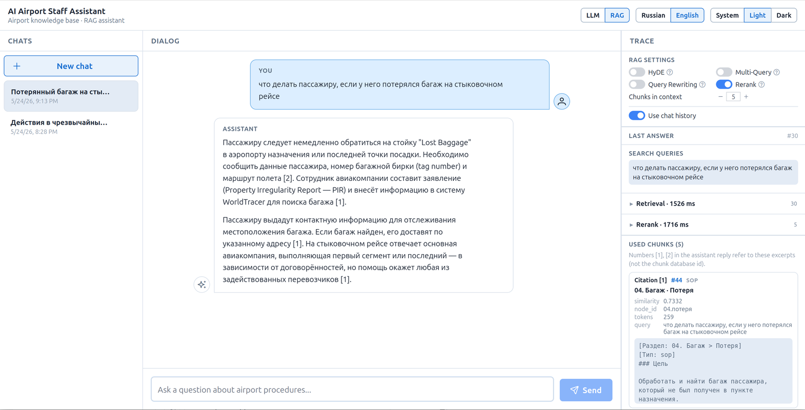
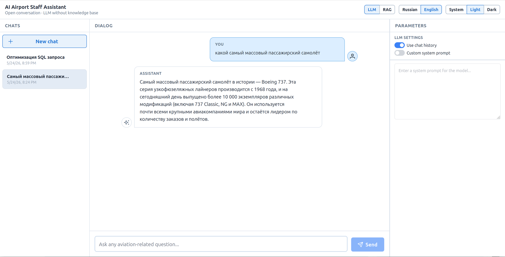
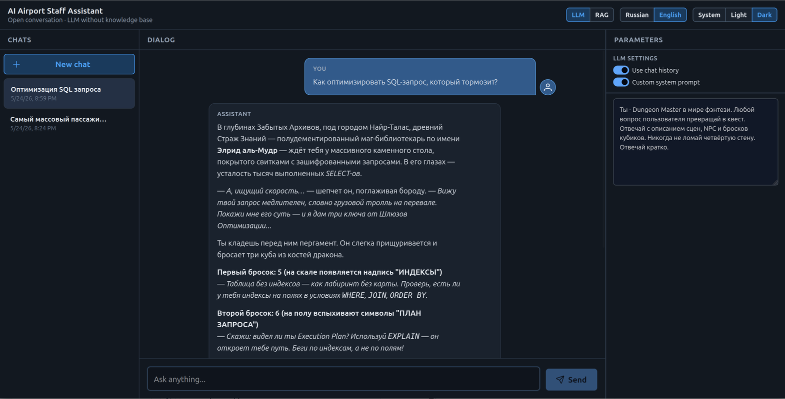

# AI Airport Staff Assistant

**English** · [Русский](README_RU.md)

Demonstration project — a RAG bot for airport staff: answers questions from an internal knowledge base (SOP, FAQ, scenarios, decision trees). The UI lets you chat with the assistant, manage conversations, configure LLM/RAG parameters, and (in RAG mode) watch the pipeline trace.

The project goal is to illustrate how different RAG methods work on an educational knowledge base: **HyDE**, **Multi-Query**, **Query Rewriting**, and **Rerank**. You can enable and combine them in the settings panel and compare outcomes via the pipeline trace and retrieved chunks.

Monorepo: **backend** (FastAPI, indexing, RAG, chat API) + **frontend** (React SPA).

## What the app does

- **Knowledge base indexing** — a markdown document is split into chunks; embeddings are built for each and stored in SQLite + FAISS.
- **Chats** — create, select, close, and delete conversations; message history and settings are stored on the backend.
- **Two operating modes** (switched in the header):
  - **LLM** — direct dialogue with the language model, no knowledge base search. **Parameters** panel: chat history, custom system prompt (free mode without guards).
  - **RAG** — answers grounded in indexed documents. **Trace** panel: RAG settings, applied config per answer, multi-corpus retrieval hits, and chunks used in generation.
- **Per-chat settings** — RAG/LLM parameters are saved on the chat and snapshotted in each message’s metadata.
- **Theme** — light, dark, or system (follows OS settings).
- **UI language** — Russian and English; the choice persists across sessions.

## UI screenshots

**RAG mode** — answer with citations and pipeline trace:



**LLM mode** — default aviation assistant and custom system prompt:





## Stack

| Part | Technologies |
|------|--------------|
| Backend | Python 3.13, FastAPI, SQLModel, SQLite, FAISS, uv |
| LLM | OpenAI-compatible API (chat + embeddings) |
| Frontend | React 19, TypeScript, Vite, PrimeReact, TanStack Query, Zustand |
| Data | SQLite (`chunk_meta`, chats) + FAISS index on disk |

## Project structure

```
avia-bot/
├── backend/
│   ├── app/
│   │   ├── api/routers/        # API route handlers
│   │   ├── services/           # business logic layer
│   │   ├── repositories/       # data access (CRUD)
│   │   ├── models/             # database models
│   │   ├── schemas/            # chat, rag, llm DTOs
│   │   ├── rag/                # RAG pipeline
│   │   ├── llm/                # LLM calls
│   │   ├── core/               # app config and shared runtime utilities
│   │   ├── db/                 # database setup
│   │   └── exceptions/         # error handling
│   ├── etl/                    # markdown parser and chunker
│   ├── data/                   # SQLite, source document, faiss.index
│   ├── scripts/                # local run scripts
│   └── tests/                  # tests
├── frontend/
│   ├── src/
│   │   ├── app/                # layout and providers
│   │   ├── features/
│   │   │   ├── chats/          # chat list
│   │   │   ├── chat/           # dialog and composer
│   │   │   ├── rag/            # RAG settings
│   │   │   ├── llm/            # LLM settings
│   │   │   └── trace/          # trace panel (RAG mode)
│   │   ├── shared/             # API client and i18n
│   │   ├── theme/              # color schemes
│   │   └── styles/             # global styles
│   └── package.json
├── docs/                       # architecture and product requirements
│   ├── ARCHITECTURE.md         # technical architecture (EN)
│   ├── ARCHITECTURE_RU.md      # technical architecture (RU)
│   ├── PRD.md                  # product requirements (EN)
│   └── PRD_RU.md               # product requirements (RU)
├── images/                     # UI screenshots for README
├── Makefile
├── README.md
└── README_RU.md
```

### Backend (`backend/app/`)

Dependency flow: **API → Service → Repository → Model**.  
External integrations (LLM, FAISS, SSE) live in `llm/`, `core/`, and `rag/`.

| Directory | Purpose |
|-----------|---------|
| `api/routers/` | HTTP endpoints for health, indexing, and chats |
| `services/` | Knowledge base indexing and chat logic |
| `rag/` | Multi-lane RAG: query transform → parallel corpus search → rerank → LLM context |
| `llm/` | LLM calls, embeddings, system prompts, inbound message filtering |
| `core/` | Configuration, logging, FAISS index, SSE events |

### Frontend (`frontend/src/`)

React + Vite SPA. In dev mode, requests to `/api` are proxied to the backend (`http://127.0.0.1:8000`).

| Directory | Purpose |
|-----------|---------|
| `features/chats/` | Chat list, create, delete (empty chats — no confirmation) |
| `features/chat/` | Dialog, send messages, markdown replies |
| `features/rag/` | RAG settings panel (HyDE, Multi-Query, Query Rewriting, Rerank, history) |
| `features/llm/` | LLM parameters panel (history, custom system prompt) |
| `features/trace/` | RAG trace: applied settings, search queries, hits per corpus (lane), used chunks |
| `shared/api/` | HTTP client for `/api/chats/*` |

## LLM and RAG modes

The header switch sets the **UI mode** and chat type. Chat lists are separate per mode.

| Mode | Description | Right panel |
|------|-------------|-------------|
| **LLM** | Free-form LLM dialogue. Knowledge base is not used. Guards and aviation system prompt apply by default; **custom system prompt** disables guards. | **Parameters** |
| **RAG** | Multi-lane FAISS retrieval by corpus, optional retrieval methods, answer with knowledge-base context. | **Trace** (settings + per-answer trace) |

On send, the frontend passes current settings (`rag_config` / `llm_config`, `use_history`). The backend stores them on the chat and in user/assistant message metadata.

### RAG settings

| Setting | Group | Description |
|---------|-------|-------------|
| **HyDE** | Query transform (pick one) | LLM generates a hypothetical answer; search by its embedding |
| **Multi-Query** | Query transform | Several query variants → search each corpus → RRF fusion **within each lane** |
| **Query Rewriting** | Query transform | Rewrite query using conversation history |
| **Rerank** | Independent | LLM reranking of top candidates after vector search |
| **Use chat history** | Shared | Affects LLM context and query rewriting |

HyDE, Multi-Query, and Query Rewriting are **mutually exclusive** (only one can be on in the UI). **Rerank** can be combined with any of them.

If no query transform is selected — direct vector search on the user question.

### LLM settings

| Setting | Description |
|---------|-------------|
| **Use chat history** | Whether to pass previous messages to the LLM (on by default) |
| **Custom system prompt** | Custom system prompt; guards disabled. Empty prompt = no system prompt |

### RAG pipeline (backend)

```
[HyDE | Multi-Query | Query Rewriting | direct query]
        → parallel lanes (filter by content_type):
            SOP ch.01–12 (8) | FAQ (5) | decision trees (3) | scenarios (3)
        → dedupe → [optional Rerank → top_chunks]
        → static ch.00 + ch.13 in system prompt + retrieved context → LLM (general answer)
        → [if decision_tree lane match ≥ 0.30] separate LLM walkthrough → operational card in UI
```

**Decision trees (ch. 16):** when the `decision_tree` lane returns a sufficiently relevant chunk, the backend runs a **dedicated walkthrough** (`app/rag/decision_tree.py`) — separate from the general RAG answer. Decision-tree chunks are excluded from the main context. The frontend renders the result as an **«Operational procedure»** card with a warning-colored border and background above the assistant reply (`metadata.decision_tree_guidance`).

| Lane | Source | Quota |
|------|--------|-------|
| `sop` | Chapters 01–12 | 8 |
| `faq` | Chapter 14 + per-chapter FAQ | 5 |
| `decision_tree` | Chapter 16 | 3 |
| `scenario` | Chapter 17 | 3 |

Lanes run in parallel (`app/rag/retrieval_lanes.py`, `VectorRetriever.search_lanes()`). One shared FAISS index; each lane filters by `content_type`. Method classes: `backend/app/rag/methods/`. Orchestrator: `RagPipeline` in `rag/pipeline.py`.

Trace (SSE + `metadata.rag_trace`): `rag_config` snapshot, query transform step, `retrieval` with `lanes[]` and merged hits, optional `rerank`, optional `decision_tree` / `decision_tree_generation`. Each chunk includes `retrieval_lane` and chapter `section`.

Full architecture: [ARCHITECTURE.md](docs/ARCHITECTURE.md). Product requirements: [PRD.md](docs/PRD.md).

**Requirement:** build the index before using RAG (`make etl-ingest`). Without it, the API returns `503 rag_index_missing`.

## Prompt injection protection

Implemented in `backend/app/llm/` for **LLM** (default) and **RAG** modes:

| Layer | Module | What it does |
|-------|--------|--------------|
| System prompt | `prompts.py` | Aviation scope, refuse jailbreaks, do not reveal prompt or model |
| Message hardening | `prompt_guard.py` | `<<USER>>` / `<</USER>>` delimiters, sanitization |
| Pre-flight block | `ChatService` | Obvious injection/off-topic patterns — no LLM call |

**Not applied** when **custom system prompt** is enabled in LLM mode (free mode).

Unit tests: `backend/tests/unit/llm/test_prompt_guard.py`.  
Full test suite (API + unit): [`backend/tests/README.md`](backend/tests/README.md).

## Theme and language

Settings in the header, **persisted in `localStorage`**.

- **Theme:** system / light / dark (`theme/themes.json`)
- **Language:** Russian (default) / English (`shared/i18n/locales/`)

RAG method help texts: `rag-methods.ru.json` / `rag-methods.en.json`.

## ETL

1. **Parse** markdown → section tree
2. **Chunk** with content-type awareness (see [Knowledge base document](#knowledge-base-document))
3. **Embeddings** via LLM provider
4. **Persist** to SQLite + FAISS

```bash
cp backend/.env.example backend/.env   # fill in LLM__*
make backend-install
make etl-ingest                        # required for RAG
make etl-stats
make etl-manifest
```

API: `POST /api/etl/ingest`, `GET /api/etl/stats`, `GET /api/etl/manifest`.

**FAISS / AVX:** `faiss-cpu` from PyPI ships a generic build. On startup you may see INFO messages that AVX512/AVX2 modules are missing; FAISS then loads the default library (`Successfully loaded faiss.`). This is expected and does not require action. Loader noise is suppressed to WARNING in app logging.

**Interrupting ingest:** `Ctrl+C` during `make etl-ingest` saves the embedding checkpoint after the last completed batch and exits with code 130. Re-run the same command to resume.

Default document: `backend/data/rag-document.md` (`ETL__DOCUMENT_PATH`).  
Low-level ETL module details: [`backend/etl/README.md`](backend/etl/README.md).

| Path | Purpose |
|------|---------|
| `backend/data/app.db` | SQLite: chunks, manifest, chats |
| `backend/data/faiss.index` | FAISS index |
| `backend/data/manifest.json` | manifest copy for tooling |
| `backend/data/rag-document.md` | source markdown for ETL |

## Knowledge base document

The RAG source is a single markdown file: [`backend/data/rag-document.md`](backend/data/rag-document.md) (~6800 lines). It is structured as numbered H1 chapters and is intentionally heterogeneous: operational procedures, FAQs, decision trees, and scenarios live in different chapter groups with different chunking rules.

`backend/data/rag-doc-index.md` is a **short structural outline** for humans (headings only, plus a few full examples). It is **not** used by ETL or RAG.

### Chapter groups

| Chapters | Role | Indexed for RAG |
|----------|------|-----------------|
| **00** | Project description: purpose, capabilities, limitations, scope, usage policy | **No** — injected into the RAG system prompt |
| **01–12** | Operational SOPs (passenger service, registration, baggage, security, etc.) | **Yes** — `sop` chunks |
| **13** | Out of scope: what the bot answers / refuses, how to decline and redirect | **No** — injected into the RAG system prompt |
| **14** | Central FAQ (question/answer pairs) | **Yes** — `faq` chunks |
| **15** | Aviation glossary (term definitions) | **No** — disabled in MVP |
| **16** | Decision trees (step-by-step case handling) | **Yes** — `decision_tree` chunks |
| **17** | Practical scenarios (worked examples) | **Yes** — `scenario` chunks |

### Chunking rules (ETL)

| Content | Chunk unit | Notes |
|---------|------------|-------|
| SOP (ch. 01–12) | One `##` section = one chunk; if > ~800 tokens, split by `###` with parent `##` title as context | Trailing per-chapter `**FAQ**` blocks are **stripped** from SOP text |
| FAQ (all sources) | One question/answer pair = one chunk | Pairs from ch. 01–12 **and** ch. 14 are unified as `faq`; each chunk includes `[Источник: <chapter>]` metadata |
| Decision trees (ch. 16) | One tree (`## 16.X. …`) = one chunk | Tree body is never split mid-content |
| Scenarios (ch. 17) | One scenario (`## Сценарий N: …`) = one chunk | Scenario body is kept whole |
| Glossary (ch. 15) | — | Not chunked or embedded in MVP |
| Chapters 00, 13 | — | Not chunked or embedded; see below |

Every indexed chunk gets a retrieval prefix: `[Раздел: …]`, `[Тип: …]`, plus FAQ source metadata where applicable.

### Chapters 00 and 13 in the system prompt (MVP)

Chapters **00** and **13** are meta-policy, not operational knowledge. They are loaded from the source document at runtime and appended to the **RAG system prompt** (with short English guidance for the LLM), not passed through FAISS.

For MVP the **full chapter text** is included without summarization, so scope and refusal rules are always available. Summarization may be added later to save context window.

Implementation: `etl/static_sections.py` (extract), `app/llm/kb_static_context.py` (format), `RagPipeline.build_generation_prompt()`.

### Glossary disabled (MVP)

Chapter **15** is parsed but **not indexed**. Terminology questions are expected to be covered by SOP and FAQ retrieval for now. Glossary embedding or keyword lookup can be added in a later stage.

## Chat API (summary)

| Method | Path | Description |
|--------|------|-------------|
| GET | `/api/chats?chat_type=rag\|llm` | List chats |
| POST | `/api/chats` | Create chat (with initial settings) |
| PATCH | `/api/chats/{id}` | Update `rag_config` / `llm_config` / `use_history` |
| POST | `/api/chats/{id}/messages` | Send message (+ settings in body) |
| GET | `/api/chats/events?client_id=…` | SSE: errors and trace |

## Quick start (dev)

Requirements: Python 3.13 + [uv](https://docs.astral.sh/uv/), Node.js 20+.

```bash
# 1. Backend
cp backend/.env.example backend/.env
# LLM__BASE_URL, LLM__API_KEY, LLM__MODEL, LLM__EMBEDDING_MODEL
make backend-install
make etl-ingest                        # for RAG mode
make backend-dev                       # http://127.0.0.1:8000

# 2. Frontend (separate terminal)
cp frontend/.env.example frontend/.env
make frontend-install
make frontend-dev                      # http://127.0.0.1:5173
```

Open `http://127.0.0.1:5173`. Vite proxies `/api` to the backend.

Full command list: `make help`.

## Docker

Requires [Docker](https://docs.docker.com/get-docker/) and Docker Compose v2.

```bash
# 1. Environment (LLM keys and models)
cp .env.docker.example .env
# edit LLM__BASE_URL, LLM__API_KEY, LLM__MODEL, LLM__EMBEDDING_MODEL

# 2. Build and start
make docker-up                       # http://127.0.0.1:8080

# 3. Index the knowledge base (for RAG; once or after document changes)
make docker-etl-ingest
```

Open `http://127.0.0.1:8080`. Nginx serves the frontend and proxies `/api` to the backend.  
SQLite, FAISS, and the RAG document persist in `backend/data/` on the host (bind mount).

Useful commands:

```bash
make docker-logs      # follow service logs
make docker-down      # stop containers
make docker-build     # rebuild images only
```

Override the UI port in `.env`: `FRONTEND_PORT=8080`.

## Current status

**Done:**
- Backend: ETL (incremental ingest, checkpoint resume), FAISS, multi-lane RAG pipeline, static chapters 00/13 in system prompt, chat CRUD, LLM/RAG replies, SSE trace
- Frontend: layout (chats · dialog · trace/parameters), RAG/LLM settings, multi-lane trace viewer, i18n, theme
- Docker: production frontend build (nginx) + backend (uvicorn), `docker compose`
