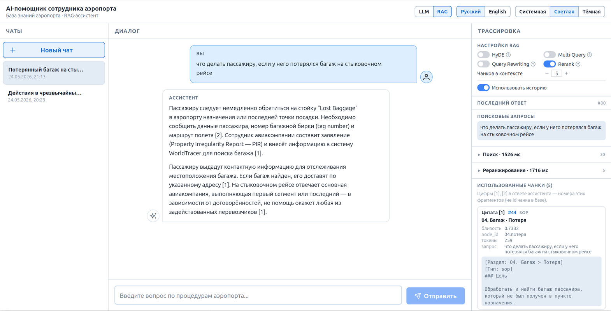
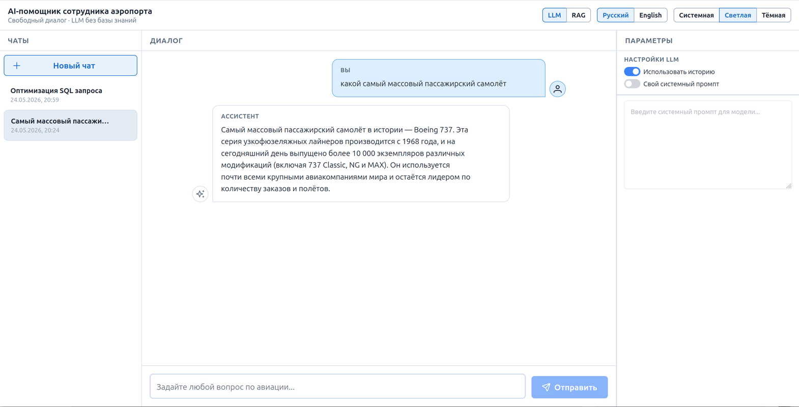
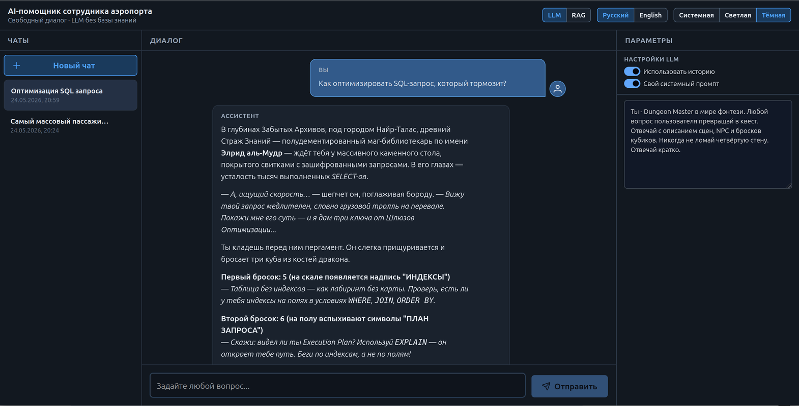

# AI-помощник сотрудника аэропорта

[English](README.md) · **Русский**

Демонстрационный проект — RAG-бот для сотрудников аэропорта: ответы на вопросы по внутренней базе знаний (SOP, FAQ, сценарии, decision trees). Интерфейс позволяет вести диалог с ассистентом, управлять списком чатов, настраивать параметры LLM/RAG и (в режиме RAG) наблюдать трассировку пайплайна.

Цель проекта — показать на учебной базе знаний принципы работы различных методов RAG: **HyDE**, **Multi-Query**, **Query Rewriting** и **Rerank**. Их можно включать и комбинировать в панели настроек и сравнивать результат по трассировке пайплайна и использованным чанкам.

Monorepo: **backend** (FastAPI, индексация, RAG, API чатов) + **frontend** (React SPA).

## Что умеет приложение

- **Индексация базы знаний** — markdown-документ разбивается на чанки, для каждого строятся embeddings и сохраняются в SQLite + FAISS.
- **Чаты** — создание, выбор, закрытие и удаление диалогов; история сообщений и настройки хранятся на backend.
- **Два режима работы** (переключаются в шапке UI):
  - **LLM** — прямой диалог с языковой моделью без поиска по базе знаний. Панель **Параметры**: история диалога, свой системный промпт (свободный режим без guard).
  - **RAG** — ответы с опорой на проиндексированные документы. Панель **Трассировка**: настройки RAG, снимок настроек для ответа, hits по корпусам (lane) и использованные чанки.
- **Настройки на уровне чата** — RAG/LLM-параметры сохраняются в чате и снимком попадают в metadata каждого сообщения.
- **Тема оформления** — светлая, тёмная или системная (следует настройкам ОС).
- **Язык интерфейса** — русский и английский; выбор сохраняется между сессиями.

## Скриншоты интерфейса

**Режим RAG** — ответ с цитатами и трассировка пайплайна:



**Режим LLM** — ассистент по умолчанию и свой системный промпт:





## Стек

| Часть | Технологии |
|-------|------------|
| Backend | Python 3.13, FastAPI, SQLModel, SQLite, FAISS, uv |
| LLM | OpenAI-compatible API (chat + embeddings) |
| Frontend | React 19, TypeScript, Vite, PrimeReact, TanStack Query, Zustand |
| Данные | SQLite (`chunk_meta`, чаты) + FAISS-индекс на диске |

## Структура проекта

```
avia-bot/
├── backend/
│   ├── app/
│   │   ├── api/routers/        # api-роутеры
│   │   ├── services/           # слой бизнес-логики
│   │   ├── repositories/       # CRUD
│   │   ├── models/             # модели БД
│   │   ├── schemas/            # chat, rag, llm DTO
│   │   ├── rag/                # RAG-пайплайн
│   │   ├── llm/                # вызов LLM
│   │   ├── core/               # настройки, контекстные менеджеры
│   │   ├── db/                 # настройки БД
│   │   └── exceptions/         # исключения
│   ├── etl/                    # парсер и chunker markdown
│   ├── data/                   # SQLite, RAG-документ, faiss.index
│   ├── scripts/                # скрипты для локального запуска
│   └── tests/                  # тесты
├── frontend/
│   ├── src/
│   │   ├── app/                # layout, провайдеры
│   │   ├── features/
│   │   │   ├── chats/          # список чатов
│   │   │   ├── chat/           # диалог, composer
│   │   │   ├── rag/            # настройки RAG
│   │   │   ├── llm/            # настройки LLM
│   │   │   └── trace/          # панель трассировки (RAG)
│   │   ├── shared/             # API, i18n
│   │   ├── theme/              # цветовые схемы
│   │   └── styles/             # глобальные стили
│   └── package.json
├── images/                     # скриншоты UI для README
├── Makefile
├── README.md
└── README_RU.md
```

### Backend (`backend/app/`)

Поток зависимостей: **API → Service → Repository → Model**.  
Внешние интеграции (LLM, FAISS, SSE) — в `llm/`, `core/` и `rag/`.

| Каталог | Назначение |
|---------|------------|
| `api/routers/` | HTTP-эндпоинты health, индексации и чатов |
| `services/` | Индексация базы знаний и логика чатов |
| `rag/` | Multi-lane RAG: query transform → параллельный поиск по корпусам → rerank → контекст для LLM |
| `llm/` | Вызов LLM, эмбеддинги, системные промпты, фильтрация запросов |
| `core/` | Конфигурация, логирование, FAISS-индекс, SSE-события |

### Frontend (`frontend/src/`)

SPA на React + Vite. В dev-режиме запросы к `/api` проксируются на backend (`http://127.0.0.1:8000`).

| Каталог | Назначение |
|---------|------------|
| `features/chats/` | Список чатов, создание, удаление (пустые — без подтверждения) |
| `features/chat/` | Диалог, отправка сообщений, markdown-ответы |
| `features/rag/` | Панель настроек RAG (HyDE, Multi-Query, Query Rewriting, Rerank, история) |
| `features/llm/` | Панель параметров LLM (история, свой системный промпт) |
| `features/trace/` | Трассировка RAG: применённые настройки, запросы, hits по корпусу (lane), чанки в ответе |
| `shared/api/` | HTTP-клиент для `/api/chats/*` |

## Режимы LLM и RAG

Переключатель в шапке задаёт **режим интерфейса** и тип создаваемых чатов. Списки чатов разделены по режиму.

| Режим | Описание | Правая панель |
|-------|----------|---------------|
| **LLM** | Свободный диалог с LLM. База знаний не используется. Guard и авиационный system prompt — по умолчанию; при включённом **своём системном промпте** guard отключается. | **Параметры** |
| **RAG** | Multi-lane поиск по FAISS с разделением по корпусам, опциональные методы retrieval, ответ с контекстом из базы знаний. | **Трассировка** (настройки + trace по ответу) |

При отправке сообщения frontend передаёт на backend актуальные настройки (`rag_config` / `llm_config`, `use_history`). Backend сохраняет их в чате и в `metadata` user/assistant сообщений.

### Настройки RAG

| Параметр | Группа | Описание |
|----------|--------|----------|
| **HyDE** | Query transform (один из трёх) | LLM генерирует гипотетический ответ; поиск по его embedding |
| **Multi-Query** | Query transform | Несколько вариантов запроса → поиск в каждом корпусе → RRF **внутри каждого lane** |
| **Query Rewriting** | Query transform | Переписывание запроса с учётом истории диалога |
| **Rerank** | Независимо | LLM-реранжирование top-кандидатов после vector search |
| **Использовать историю** | Общее | Влияет на LLM-контекст и query rewriting |

HyDE, Multi-Query и Query Rewriting **взаимоисключающие** (в UI может быть включён только один). **Rerank** можно совмещать с любым из них.

Если query transform не выбран — прямой vector search по вопросу пользователя.

### Настройки LLM

| Параметр | Описание |
|----------|----------|
| **Использовать историю** | Передавать ли предыдущие сообщения в LLM (по умолчанию включено) |
| **Свой системный промпт** | Кастомный system prompt; guard отключается. Пустой промпт = без system prompt |

### RAG-пайплайн (backend)

```
[HyDE | Multi-Query | Query Rewriting | прямой запрос]
        → параллельные lane (фильтр по content_type):
            SOP гл.01–12 (8) | FAQ (5) | деревья решений (3) | сценарии (3)
        → dedupe → [опциональный Rerank → top_chunks]
        → статические гл.00 + гл.13 в system prompt + контекст из retrieval → LLM
```

| Lane | Источник | Квота |
|------|----------|-------|
| `sop` | Главы 01–12 | 8 |
| `faq` | Глава 14 + FAQ по главам | 5 |
| `decision_tree` | Глава 16 | 3 |
| `scenario` | Глава 17 | 3 |

Lane выполняются параллельно (`app/rag/retrieval_lanes.py`, `VectorRetriever.search_lanes()`). Один общий FAISS-индекс; каждый lane фильтрует по `content_type`. Классы методов: `backend/app/rag/methods/`. Оркестратор: `RagPipeline` в `rag/pipeline.py`.

Трассировка (SSE + `metadata.rag_trace`): снимок `rag_config`, шаг query transform, `retrieval` с `lanes[]` и объединёнными hits, опциональный `rerank`. У каждого чанка — `retrieval_lane` и глава в `section`.

Подробная архитектура: [ARCHITECTURE_RU.md](ARCHITECTURE_RU.md).

**Требование:** перед использованием RAG нужен построенный индекс (`make etl-ingest`). Без индекса API вернёт `503 rag_index_missing`.

## Защита от промпт-инъекций

Реализована в `backend/app/llm/` для режимов **LLM** (по умолчанию) и **RAG**:

| Уровень | Модуль | Что делает |
|---------|--------|------------|
| Системный промпт | `prompts.py` | Авиационная тематика, отказ от jailbreak, не раскрывать промпт и модель |
| Изоляция сообщений | `prompt_guard.py` | Маркеры `<<USER>>` / `<</USER>>`, санитизация |
| Блокировка до LLM | `ChatService` | Явные паттерны инъекций и оффтопик — без вызова LLM |

**Не применяется**, когда в режиме LLM включён **свой системный промпт** (свободный режим).

Unit-тесты: `backend/tests/unit/llm/test_prompt_guard.py`.  
Полный набор тестов (API + unit): [`backend/tests/README_RU.md`](backend/tests/README_RU.md).

## Тема и язык

Настройки в шапке, **сохраняются в `localStorage`**.

- **Тема:** системная / светлая / тёмная (`theme/themes.json`)
- **Язык:** русский (по умолчанию) / English (`shared/i18n/locales/`)

Справка по методам RAG: `rag-methods.ru.json` / `rag-methods.en.json`.

## ETL

1. **Парсинг** markdown → дерево разделов
2. **Chunking** с учётом типа контента (см. [База знаний](#база-знаний))
3. **Embeddings** через LLM-провайдер
4. **Сохранение** в SQLite + FAISS

```bash
cp backend/.env.example backend/.env   # заполнить LLM__*
make backend-install
make etl-ingest                        # обязательно для RAG
make etl-stats
make etl-manifest
```

API: `POST /api/etl/ingest`, `GET /api/etl/stats`, `GET /api/etl/manifest`.

**FAISS / AVX:** пакет `faiss-cpu` с PyPI поставляется с generic-сборкой. При старте могут появляться INFO-сообщения об отсутствии модулей AVX512/AVX2; затем FAISS загружает стандартную библиотеку (`Successfully loaded faiss.`). Это нормально, ничего делать не нужно. Шум `faiss.loader` подавлен до уровня WARNING в настройках логирования.

**Прерывание ingest:** `Ctrl+C` во время `make etl-ingest` сохраняет checkpoint после последнего завершённого batch и завершает процесс с кодом 130. Повторный запуск той же команды продолжит с места остановки.

Документ по умолчанию: `backend/data/rag-document.md` (`ETL__DOCUMENT_PATH`).  
Детали модуля ETL: [`backend/etl/README_RU.md`](backend/etl/README_RU.md).

| Путь | Назначение |
|------|------------|
| `backend/data/app.db` | SQLite: чанки, манифест, чаты |
| `backend/data/faiss.index` | FAISS-индекс |
| `backend/data/manifest.json` | копия манифеста |
| `backend/data/rag-document.md` | исходный markdown для ETL |

## База знаний

Источник RAG — один markdown-файл: [`backend/data/rag-document.md`](backend/data/rag-document.md) (~6800 строк). Документ разбит на пронумерованные главы (H1) и намеренно неоднороден: процедуры, FAQ, деревья решений и сценарии относятся к разным группам глав и чанкуются по разным правилам.

`backend/data/rag-doc-index.md` — **сокращённый структурный оглавление** для человека (в основном заголовки и несколько полных примеров). В ETL и RAG **не используется**.

### Группы глав

| Главы | Назначение | Индексируется для RAG |
|-------|------------|------------------------|
| **00** | Описание проекта: назначение, возможности, ограничения, scope, политика использования | **Нет** — попадает в системный промпт RAG |
| **01–12** | Операционные SOP (обслуживание, регистрация, багаж, безопасность и т.д.) | **Да** — чанки `sop` |
| **13** | Out of scope: на что отвечает / не отвечает бот, как отказывать и перенаправлять | **Нет** — попадает в системный промпт RAG |
| **14** | Общий FAQ (пары вопрос/ответ) | **Да** — чанки `faq` |
| **15** | Глоссарий авиационных терминов | **Нет** — отключён в MVP |
| **16** | Деревья решений (пошаговая обработка кейсов) | **Да** — чанки `decision_tree` |
| **17** | Практические сценарии (разобранные примеры) | **Да** — чанки `scenario` |

### Правила чанкования (ETL)

| Контент | Единица чанка | Примечания |
|---------|---------------|------------|
| SOP (гл. 01–12) | Один раздел `##` = один чанк; при > ~800 токенов — split по `###` с контекстом родительского `##` | Хвостовые блоки `**FAQ**` в конце главы **вырезаются** из SOP-текста |
| FAQ (все источники) | Одна пара вопрос/ответ = один чанк | FAQ из гл. 01–12 и гл. 14 объединяются как `faq`; в каждом чанке метаданные `[Источник: <глава>]` |
| Деревья решений (гл. 16) | Одно дерево (`## 16.X. …`) = один чанк | Тело дерева не режется |
| Сценарии (гл. 17) | Один сценарий (`## Сценарий N: …`) = один чанк | Тело сценария сохраняется целиком |
| Глоссарий (гл. 15) | — | Не чанкуется и не векторизуется в MVP |
| Главы 00, 13 | — | Не чанкуются и не векторизуются; см. ниже |

Каждый индексируемый чанк получает prefix для retrieval: `[Раздел: …]`, `[Тип: …]`, для FAQ — также метаданные источника.

### Главы 00 и 13 в системном промпте (MVP)

Главы **00** и **13** — мета-политика, а не операционные знания. Они загружаются из исходного документа при ответе в режиме RAG и добавляются в **системный промпт** (с краткими пояснениями для LLM на английском), минуя FAISS.

На этапе MVP в промпт попадает **полный текст** глав без суммаризации, чтобы scope и правила отказа всегда были доступны. Сжатие текста можно добавить позже.

Реализация: `etl/static_sections.py` (извлечение), `app/llm/kb_static_context.py` (форматирование), `RagPipeline.build_generation_prompt()`.

### Глоссарий отключён (MVP)

Глава **15** парсится, но **не индексируется**. Терминологические вопросы на данном этапе закрываются через SOP и FAQ. Подключение глоссария (embedding или keyword lookup) — в следующих итерациях.

## API чатов (кратко)

| Метод | Путь | Описание |
|-------|------|----------|
| GET | `/api/chats?chat_type=rag\|llm` | Список чатов |
| POST | `/api/chats` | Создать чат (с начальными настройками) |
| PATCH | `/api/chats/{id}` | Обновить `rag_config` / `llm_config` / `use_history` |
| POST | `/api/chats/{id}/messages` | Отправить сообщение (+ настройки в body) |
| GET | `/api/chats/events?client_id=…` | SSE: ошибки и trace |

## Быстрый старт (dev)

Нужны: Python 3.13 + [uv](https://docs.astral.sh/uv/), Node.js 20+.

```bash
# 1. Backend
cp backend/.env.example backend/.env
# LLM__BASE_URL, LLM__API_KEY, LLM__MODEL, LLM__EMBEDDING_MODEL
make backend-install
make etl-ingest                        # для режима RAG
make backend-dev                       # http://127.0.0.1:8000

# 2. Frontend (отдельный терминал)
cp frontend/.env.example frontend/.env
make frontend-install
make frontend-dev                      # http://127.0.0.1:5173
```

Откройте `http://127.0.0.1:5173`. Vite проксирует `/api` на backend.

Полный список команд: `make help`.

## Запуск в Docker

Нужны: [Docker](https://docs.docker.com/get-docker/) и Docker Compose v2.

```bash
# 1. Переменные окружения (LLM-ключи и модели)
cp .env.docker.example .env
# отредактируйте LLM__BASE_URL, LLM__API_KEY, LLM__MODEL, LLM__EMBEDDING_MODEL

# 2. Сборка и запуск
make docker-up                       # http://127.0.0.1:8080

# 3. Индексация базы знаний (для RAG; один раз или после смены документа)
make docker-etl-ingest
```

Откройте `http://127.0.0.1:8080`. Nginx отдаёт frontend и проксирует `/api` на backend.  
Данные SQLite, FAISS и RAG-документ сохраняются в `backend/data/` на хосте (bind mount).

Полезные команды:

```bash
make docker-logs      # логи сервисов
make docker-down      # остановить
make docker-build     # только пересобрать образы
```

Порт UI можно переопределить в `.env`: `FRONTEND_PORT=8080`.

## Текущий статус

**Готово:**
- Backend: ETL (инкрементальный ingest, resume по checkpoint), FAISS, multi-lane RAG, статические главы 00/13 в system prompt, CRUD чатов, LLM/RAG ответы, SSE trace
- Frontend: layout (чаты · диалог · трассировка/параметры), настройки RAG/LLM, просмотр trace по lane, i18n, theme
- Docker: production-сборка frontend (nginx) + backend (uvicorn), `docker compose`
