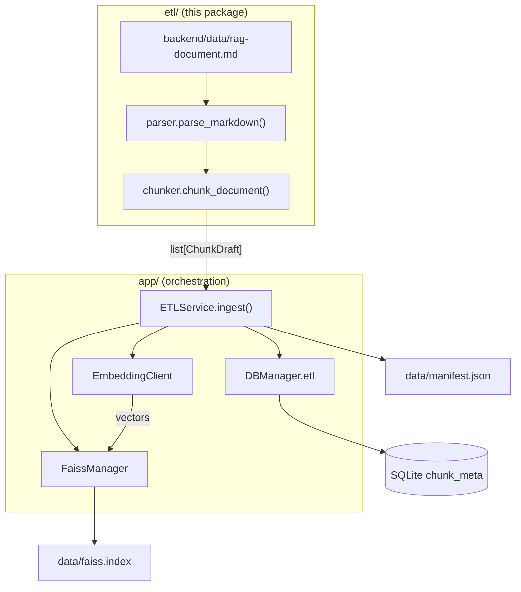
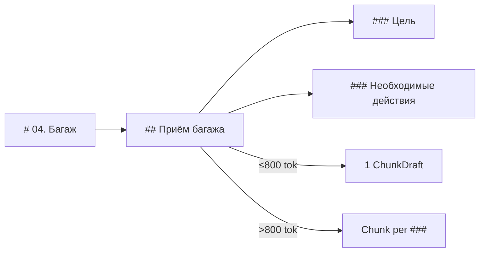

# ETL: Knowledge Base Parsing and Indexing

**English** · [Русский](README_RU.md)

The `backend/etl/` module is a **pure bounded context** for transforming the markdown document `backend/data/rag-document.md` into a set of retrieval chunks. It knows nothing about FastAPI, SQLite, or FAISS — only parsing, classification, and text splitting.

Full pipeline orchestration (embeddings → DB → FAISS → manifest) lives in `app/services/etl.py` (`ETLService`). HTTP endpoints are in `app/api/routers/etl.py`.

---

## Table of Contents

1. [Why a Separate Package](#why-a-separate-package)
2. [How It Works](#how-it-works)
3. [Module Structure](#module-structure)
4. [Source Document](#source-document)
5. [Data Types](#data-types)
6. [Parser (`parser.py`)](#parser-parserpy)
7. [Chunker (`chunker.py`)](#chunker-chunkerpy)
8. [Service Layer Integration](#service-layer-integration)
9. [On-Disk Artifacts](#on-disk-artifacts)
10. [API and Running](#api-and-running)
11. [Configuration](#configuration)
12. [Testing](#testing)
13. [Limitations and Known Behavior](#limitations-and-known-behavior)

---

## Why a Separate Package

| Layer | Package | Responsibility |
|-------|---------|----------------|
| **ETL (this module)** | `etl/` | Parse + chunk, no DB or LLM I/O |
| **Service** | `app/services/etl.py` | Use case: ingest, stats, manifest |
| **Repository** | `app/repositories/chunk.py`, `index_manifest.py` | CRUD in SQLite (via `DBManager`) |
| **Infrastructure** | `app/llm/`, `app/core/faiss_manager.py` | Embeddings API, FAISS index |
| **API** | `app/api/routers/etl.py` | HTTP |

Benefits of the split:

- unit tests for parser/chunker do not require FastAPI or a database;
- CLI (`scripts/run_etl.py`, `make etl-ingest`) reuses the same `ETLService` as the HTTP API;
- the service layer stays a thin orchestrator.

---

## How It Works



**Full ingest pipeline** (`ETLService.ingest`):

1. Read markdown, compute SHA-256 (`doc_hash`).
2. Call `chunk_document()` → list of `ChunkDraft`.
3. Batch embed via `POST /v1/embeddings` (model `LLM__EMBEDDING_MODEL`).
4. Delete old `chunk_meta` and `index_manifest` (full rebuild only).
5. Insert chunks with explicit `id = 0..N-1` (matches FAISS position).
6. Write `IndexManifest` to SQLite, `commit`.
7. Build `IndexFlatIP`, L2-normalize, save `data/faiss.index` (directory `FAISS__DIR`, default `backend/data/`).
8. Write `data/manifest.json` (directory `DATA__DIR`, default `backend/data/`).

---

## Module Structure

```
backend/etl/
├── README.md       # this file
├── README_RU.md    # Russian version
├── __init__.py
├── types.py        # ContentType, DocumentNode, ChunkDraft
├── parser.py       # parse_markdown() — header tree
└── chunker.py      # chunk_document() — nodes → retrieval chunks
```

Public entry points:

```python
from etl.parser import parse_markdown
from etl.chunker import chunk_document
from etl.types import ContentType, DocumentNode, ChunkDraft
```

---

## Source Document

Default source: `backend/data/rag-document.md` (~6800 lines, 18 `#` sections). Path is set by `ETL__DOCUMENT_PATH` (relative to the repository root; recommended value: `backend/data/rag-document.md`).

| # | H1 Title | `content_type` |
|---|----------|----------------|
| 00 | Project Description | `meta` |
| 01–12 | Operational sections (check-in, baggage, security…) | `sop` |
| 13 | Out of Scope | `out_of_scope` |
| 14 | FAQ | `faq` |
| 15 | Glossary | `glossary` |
| 16 | Decision Trees | `decision_tree` |
| 17 | Practical Scenarios | `scenario` |

Header hierarchy in SOP sections:

```
# 03. Passenger Check-in           ← H1, section
## General Check-in Rules            ← H2, SOP procedure
### Purpose                          ← H3, SOP subsection
### Required Actions
```

---

## Data Types

### `ContentType` (`types.py`)

String enum — chunk classification for retrieval and routing:

| Value | Description |
|-------|-------------|
| `sop` | Standard operating procedures |
| `faq` | Question/answer pairs |
| `glossary` | Term + definition |
| `decision_tree` | Decision tree (not split) |
| `scenario` | Full practical scenario |
| `meta` | Project description, scope, policies |
| `out_of_scope` | Topics the bot does not answer |

### `DocumentNode`

Intermediate node after parsing (not yet an index chunk):

| Field | Type | Description |
|-------|------|-------------|
| `id` | `str` | Stable identifier, e.g. `03.общие_правила_регистрации` |
| `section` | `str` | H1 section title |
| `title` | `str` | Current node title (H1/H2/H3) |
| `level` | `int` | 1 = `#`, 2 = `##`, 3 = `###` |
| `content_type` | `ContentType` | Section type |
| `text` | `str` | Node text without the header |
| `parent_id` | `str \| None` | Parent node `id` |
| `metadata` | `dict` | Extra fields (`source_path`) |

### `ChunkDraft`

Chunk ready for embedding and storage:

| Field | Type | Description |
|-------|------|-------------|
| `content` | `str` | Text with prefix context (see below) |
| `content_type` | `ContentType` | Chunk type |
| `section` | `str` | H1 section |
| `title` | `str` | Short title (question, term, H2…) |
| `node_id` | `str` | Origin in the document tree |
| `parent_chunk_index` | `int \| None` | Parent chunk index on SOP split |
| `token_count` | `int` | Token estimate (`len(text) // 4`) |
| `source_path` | `str` | Path to the source file |

---

## Parser (`parser.py`)

### `parse_markdown(text, source_path="") -> list[DocumentNode]`

**Step 1. Split by H1**

The document is split on lines matching `^# <title>$`. Each block is one top-level section.

**Step 2. Determine `content_type`**

By section number (`00`, `13`, `14`…) and keywords in the title (`faq`, `глоссарий`, `decision tree`…). Everything else is `sop`.

**Step 3. Build nodes**

Behavior depends on type:

| Section type | Node structure |
|--------------|----------------|
| `meta`, `faq`, `glossary`, `decision_tree`, `scenario`, `out_of_scope` | One level=1 node for the entire H1 block |
| `sop` | H2 → level=2 nodes; inside each H2, H3 → level=3 nodes |

For SOP without `##` subheaders, a single level=1 node is created.

**Node identifiers** (`_make_node_id`): section number + title slug, e.g. `04.приём_багажа`.

---

## Chunker (`chunker.py`)

### `chunk_document(text, source_path="") -> list[ChunkDraft]`

Calls `parse_markdown()`, then `chunk_node()` for each node.

### Prefix in every chunk

Improves retrieval: the model and search see section context.

```
[Раздел: 04. Багаж > Приём багажа]
[Тип: sop]
<chunk body>
```

(Prefix labels are in Russian to match the source document language.)

### Strategies by type

#### `sop`

| Condition | Action |
|-----------|--------|
| level=2 node, ≤ 800 tokens | 1 chunk = entire `##` section |
| level=2 node, > 800 tokens | Split on `###`; each chunk gets `Контекст: <H2 title>` |
| level=3 node | Skipped (already handled when splitting parent H2) |
| level=1 node (fallback) | 1 chunk for the entire section |

Limit: `_MAX_SOP_TOKENS = 800`, estimate: `len(text) // 4`.

On split, the first child chunk is stored in `parent_chunk_index` for linkage in `chunk_meta.parent_id`.

#### `faq`

Pairs extracted by regex:

```
**Вопрос:** ...
**Ответ:** ...
```

List-marker variants like `* **Вопрос:**` are supported. **1 pair = 1 chunk.**

FAQ blocks inside SOP sections (not in `# 14`) remain part of the SOP node during parsing and are **not** extracted separately — only section 14 content is processed as `faq`.

#### `glossary`

Lines like `**Термин:** definition` → **1 term = 1 chunk**.

#### `decision_tree`

Split on `## 16.X. Title` → **1 tree = 1 chunk** (tree text is not split further).

#### `scenario`

Split on `## Сценарий N: ...` → **1 scenario = 1 chunk**.

#### `meta` / `out_of_scope`

Split on `##` within the section; if there are no subheaders — 1 chunk for the entire H1.

### Expected volume (current document)

When running `chunk_document()` on `backend/data/rag-document.md`:

| `content_type` | ~chunk count |
|----------------|--------------|
| `faq` | 473 |
| `glossary` | 339 |
| `sop` | 106 |
| `meta` | 10 |
| `decision_tree` | 10 |
| `scenario` | 10 |
| `out_of_scope` | 5 |
| **Total** | **~953** |

---

## Service Layer Integration

`ETLService` (`app/services/etl.py`) works through `DBManager` and imports from `etl/` only:

```python
from etl.chunker import chunk_document
```

Mapping `ChunkDraft` → `ChunkMeta`:

| ChunkDraft | ChunkMeta (SQLite) |
|------------|-------------------|
| list order | `id` (0..N-1, = FAISS row) |
| `content` | `content` |
| `content_type.value` | `content_type` |
| `section` | `section` |
| `title` | `title` |
| `node_id` | `node_id` |
| `parent_chunk_index` | `parent_id` |
| `token_count` | `token_count` |
| `source_path` | `source_path` |

**FAISS ↔ SQLite convention:** `ChunkMeta.id` strictly equals the vector position in `faiss.index`. Chunk insert order and vector order after embedding must match.

---

## On-Disk Artifacts

Paths relative to `backend/` (when running from `backend/`):

| Path | Variable | Contents |
|------|----------|----------|
| `data/app.db` | `DB__URL` / `DATA__DIR` | Tables `chunk_meta`, `index_manifest`, chats |
| `data/faiss.index` | `FAISS__DIR` | Binary FAISS `IndexFlatIP`, L2-normalized vectors |
| `data/manifest.json` | `DATA__DIR` | `source_path`, `doc_hash`, `embedding_model`, `chunk_count`, `built_at` |

FAISS is written atomically via `FaissManager`: first `faiss.index.tmp`, then `replace`.

---

## API and Running

### HTTP (via FastAPI)

| Method | Path | Description |
|--------|------|-------------|
| `POST` | `/api/etl/ingest` | Full reindex |
| `GET` | `/api/etl/stats` | Chunk count by `content_type` |
| `GET` | `/api/etl/manifest` | Last build metadata |

Body for `POST /api/etl/ingest`:

```json
{
  "rebuild": true,
  "source_path": null
}
```

- `rebuild` — currently **only `true`** is supported (full rebuild).
- `source_path` — optional; path relative to the repository root or absolute. Default — `ETL__DOCUMENT_PATH` → `backend/data/rag-document.md`.

### Local run

From the repository root (via `Makefile`):

```bash
cp backend/.env.example backend/.env   # fill in LLM__*
make backend-install
make etl-ingest
make etl-stats
make etl-manifest
make etl-ingest SOURCE=backend/data/rag-document.md
```

**CLI** (`scripts/run_etl.py` — same pipeline as `POST /api/etl/ingest`):

```bash
cd backend
uv sync
uv run python scripts/run_etl.py ingest
uv run python scripts/run_etl.py ingest --source backend/data/rag-document.md
uv run python scripts/run_etl.py stats
uv run python scripts/run_etl.py manifest
```

**HTTP** (via FastAPI):

```bash
uv run uvicorn app.main:app --reload --port 8000
```

Ingest (requires `LLM__BASE_URL`, `LLM__EMBEDDING_MODEL` in `.env`):

```bash
curl -X POST http://localhost:8000/api/etl/ingest \
  -H "Content-Type: application/json" \
  -d '{"rebuild": true}'
```

### Programmatic call (without HTTP)

Parse + chunk only (no embeddings):

```python
from pathlib import Path
from etl.chunker import chunk_document

doc = Path("data/rag-document.md")  # from backend/
text = doc.read_text(encoding="utf-8")
chunks = chunk_document(text, source_path=str(doc))
print(len(chunks), {c.content_type for c in chunks})
```

---

## Configuration

Variables from the root `.env` (nested delimiter `__`):

| Variable | ETL purpose |
|----------|-------------|
| `DATA__DIR` | Directory for `app.db`, `manifest.json` (default `./data`) |
| `FAISS__DIR` | Directory for `faiss.index` (default `./data`, relative to `backend/`) |
| `DB__URL` | SQLite URL (default `sqlite:///./data/app.db`) |
| `ETL__DOCUMENT_PATH` | Markdown source path (relative to repo root or absolute) |
| `LLM__BASE_URL` | OpenAI-compatible API for embeddings |
| `LLM__API_KEY` | Authorization key |
| `LLM__EMBEDDING_MODEL` | Model for `POST /v1/embeddings` |

Document path: `settings.etl.resolve_document_path(repo_root)` — relative `ETL__DOCUMENT_PATH` values resolve from the **repository root** (`avia-bot/`), not from `backend/`. Knowledge base file: `backend/data/rag-document.md`.

---

## Testing

Parser/chunker tests **do not require LLM or DB**:

```bash
cd backend
uv run pytest tests/unit/etl/test_chunker.py -v
# or from the repository root:
make backend-test-unit
```

Checks:

- presence of key sections after `parse_markdown`;
- all expected `ContentType` values in `chunk_document` output;
- prefix `[Раздел:` and `[Тип:` in every chunk;
- at least 200 chunks on the full document.

API tests: `tests/api/test_etl.py` (`/api/etl/stats`, `/api/etl/manifest`); marker `@pytest.mark.api`.

---

## Limitations and Known Behavior

1. **Full rebuild only** — incremental updates for individual chunks are not implemented.
2. **Rough token estimate** — `len(text) // 4`, no tiktoken; SOP split uses this threshold.
3. **FAQ outside section 14** — embedded Q/A in SOP sections stay inside SOP chunks, not extracted as `faq`.
4. **Parser tied to `rag-document.md` structure** — headers `# NN.`, pairs `**Вопрос:**/**Ответ:**`, glossary `**Термин:**`.
5. **SOP level=3 nodes** are created by the parser but skipped by the chunker — splitting goes through H2 split on `###`.
6. **CLI** — `python scripts/run_etl.py ingest|stats|manifest` or `make etl-ingest|etl-stats|etl-manifest`.

---

## Diagram: From Header to Chunk (SOP)



---

## See Also

- `app/services/etl.py` — ingest orchestration
- `app/models/chunk_meta.py` — chunk table schema
- `app/core/faiss_manager.py` — FAISS index build and save
- `app/llm/embeddings.py` — embeddings client
- `scripts/run_etl.py` — CLI ingest/stats/manifest
- `backend/data/rag-document.md` — source knowledge base
- `.cursor/rules/backend-layered-architecture.mdc` — backend layer rules
