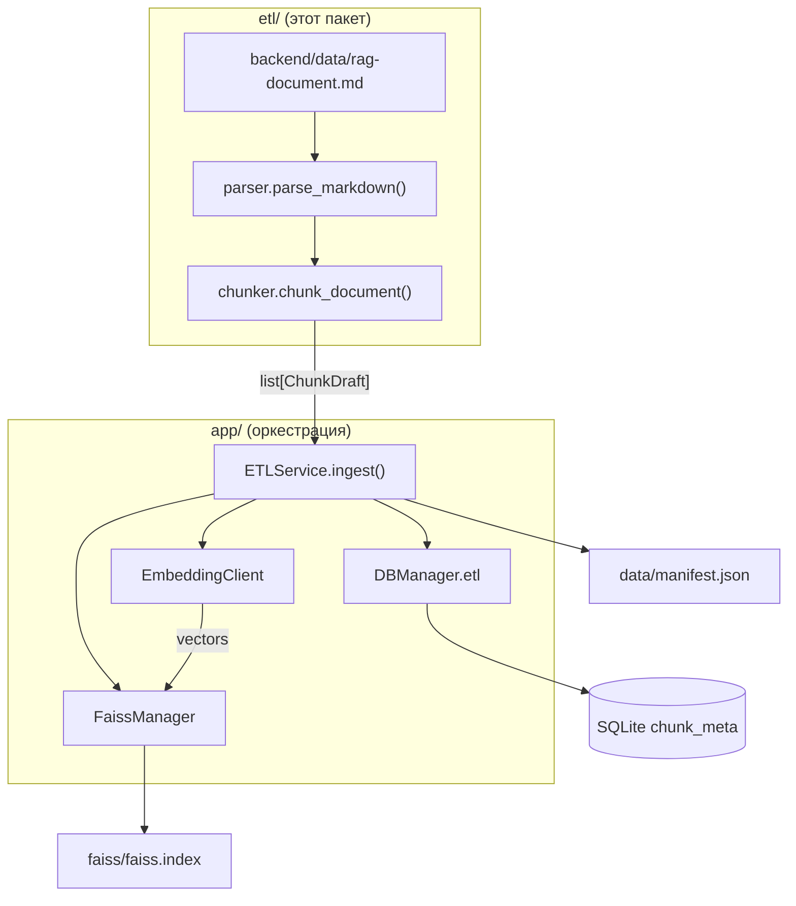
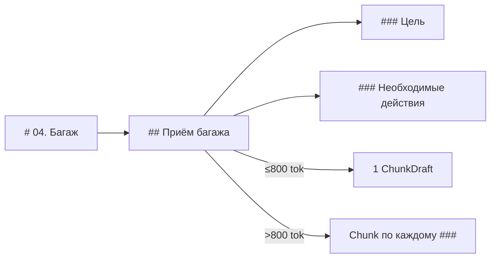

# ETL: парсинг и индексация базы знаний

Модуль `backend/etl/` — **чистый bounded context** для преобразования markdown-документа `backend/data/rag-document.md` в набор retrieval-чанков. Он не знает о FastAPI, SQLite и FAISS: только парсинг, классификация и нарезка текста.

Оркестрация полного pipeline (embeddings → БД → FAISS → manifest) выполняется в `app/services/etl.py` (`ETLService`). HTTP-эндпоинты — в `app/api/routers/etl.py`.

---

## Содержание

1. [Зачем отдельный пакет](#зачем-отдельный-пакет)
2. [Общая схема работы](#общая-схема-работы)
3. [Структура модуля](#структура-модуля)
4. [Исходный документ](#исходный-документ)
5. [Типы данных](#типы-данных)
6. [Парсер (`parser.py`)](#парсер-parserpy)
7. [Чанкер (`chunker.py`)](#чанкер-chunkerpy)
8. [Связь с сервисным слоем](#связь-с-сервисным-слоем)
9. [Артефакты на диске](#артефакты-на-диске)
10. [API и запуск](#api-и-запуск)
11. [Конфигурация](#конфигурация)
12. [Тестирование](#тестирование)
13. [Ограничения и известные особенности](#ограничения-и-известные-особенности)

---

## Зачем отдельный пакет

| Слой | Пакет | Ответственность |
|------|-------|----------------|
| **ETL (этот модуль)** | `etl/` | Parse + chunk, без I/O к БД и LLM |
| **Service** | `app/services/etl.py` | Use-case: ingest, stats, manifest |
| **Repository** | `app/repositories/chunk.py`, `index_manifest.py` | CRUD в SQLite (через `DBManager`) |
| **Infrastructure** | `app/llm/`, `app/core/faiss_manager.py` | Embeddings API, FAISS index |
| **API** | `app/api/routers/etl.py` | HTTP |

Преимущества разделения:

- unit-тесты parser/chunker не требуют поднятия FastAPI и БД;
- CLI (`scripts/etl.py`, `make etl-ingest`) переиспользует тот же `ETLService`, что и HTTP API;
- сервисный слой остаётся тонким оркестратором.

---

## Общая схема работы



**Полный ingest pipeline** (`ETLService.ingest`):

1. Прочитать markdown, вычислить SHA-256 (`doc_hash`).
2. Вызвать `chunk_document()` → список `ChunkDraft`.
3. Batch-embed через `POST /v1/embeddings` (модель `LLM__EMBEDDING_MODEL`).
4. Удалить старые `chunk_meta` и `index_manifest` (только full rebuild).
5. Вставить чанки с явными `id = 0..N-1` (совпадают с позицией в FAISS).
6. Записать `IndexManifest` в SQLite, `commit`.
7. Построить `IndexFlatIP`, L2-normalize, сохранить `faiss/faiss.index` (каталог `FAISS__DIR`, по умолчанию `backend/faiss/`).
8. Записать `data/manifest.json` (каталог `DATA__DIR`, по умолчанию `backend/data/`).

---

## Структура модуля

```
backend/etl/
├── README_RU.md    # этот файл
├── __init__.py
├── types.py        # ContentType, DocumentNode, ChunkDraft
├── parser.py       # parse_markdown() — дерево узлов по заголовкам
└── chunker.py      # chunk_document() — узлы → retrieval-чанки
```

Публичные точки входа:

```python
from etl.parser import parse_markdown
from etl.chunker import chunk_document
from etl.types import ContentType, DocumentNode, ChunkDraft
```

---

## Исходный документ

Источник по умолчанию: `backend/data/rag-document.md` (~6800 строк, 18 разделов `#`). Путь задаётся `ETL__DOCUMENT_PATH` (относительно корня репозитория, рекомендуемое значение: `backend/data/rag-document.md`).

| № | Заголовок H1 | `content_type` |
|---|--------------|----------------|
| 00 | Описание проекта | `meta` |
| 01–12 | Операционные разделы (регистрация, багаж, безопасность…) | `sop` |
| 13 | Out of Scope | `out_of_scope` |
| 14 | FAQ | `faq` |
| 15 | Глоссарий | `glossary` |
| 16 | Decision Trees | `decision_tree` |
| 17 | Практические сценарии | `scenario` |

Иерархия заголовков в SOP-разделах:

```
# 03. Регистрация пассажиров      ← H1, раздел
## Общие правила регистрации      ← H2, SOP-процедура
### Цель                           ← H3, подраздел SOP
### Необходимые действия
```

---

## Типы данных

### `ContentType` (`types.py`)

Строковый enum — классификация чанка для retrieval и роутера:

| Значение | Описание |
|----------|----------|
| `sop` | Стандартные операционные процедуры |
| `faq` | Пары вопрос/ответ |
| `glossary` | Термин + определение |
| `decision_tree` | Дерево решений (не режется) |
| `scenario` | Практический сценарий целиком |
| `meta` | Описание проекта, scope, политики |
| `out_of_scope` | Что бот не отвечает |

### `DocumentNode`

Промежуточный узел после парсинга (ещё не чанк для индекса):

| Поле | Тип | Описание |
|------|-----|----------|
| `id` | `str` | Стабильный идентификатор, напр. `03.общие_правила_регистрации` |
| `section` | `str` | Заголовок H1-раздела |
| `title` | `str` | Заголовок текущего узла (H1/H2/H3) |
| `level` | `int` | 1 = `#`, 2 = `##`, 3 = `###` |
| `content_type` | `ContentType` | Тип раздела |
| `text` | `str` | Текст узла без заголовка |
| `parent_id` | `str \| None` | `id` родительского узла |
| `metadata` | `dict` | Доп. поля (`source_path`) |

### `ChunkDraft`

Готовый к embedding и сохранению чанк:

| Поле | Тип | Описание |
|------|-----|----------|
| `content` | `str` | Текст с prefix-контекстом (см. ниже) |
| `content_type` | `ContentType` | Тип чанка |
| `section` | `str` | H1-раздел |
| `title` | `str` | Краткий заголовок (вопрос, термин, H2…) |
| `node_id` | `str` | Происхождение в дереве документа |
| `parent_chunk_index` | `int \| None` | Индекс родительского чанка при split SOP |
| `token_count` | `int` | Оценка токенов (`len(text) // 4`) |
| `source_path` | `str` | Путь к исходному файлу |

---

## Парсер (`parser.py`)

### `parse_markdown(text, source_path="") -> list[DocumentNode]`

**Шаг 1. Разбиение по H1**

Документ режется по строкам `^# <title>$`. Каждый блок — один «главный раздел».

**Шаг 2. Определение `content_type`**

По номеру раздела (`00`, `13`, `14`…) и ключевым словам в заголовке (`faq`, `глоссарий`, `decision tree`…). Всё остальное — `sop`.

**Шаг 3. Построение узлов**

Поведение зависит от типа:

| Тип раздела | Структура узлов |
|-------------|-----------------|
| `meta`, `faq`, `glossary`, `decision_tree`, `scenario`, `out_of_scope` | Один узел level=1 на весь H1-блок |
| `sop` | H2 → узлы level=2; внутри каждого H2 — H3 → узлы level=3 |

Для SOP без подзаголовков `##` создаётся один узел level=1.

**Идентификаторы узлов** (`_make_node_id`): номер раздела + slug заголовка, напр. `04.приём_багажа`.

---

## Чанкер (`chunker.py`)

### `chunk_document(text, source_path="") -> list[ChunkDraft]`

Вызывает `parse_markdown()`, затем для каждого узла — `chunk_node()`.

### Prefix в каждом чанке

Улучшает retrieval: модель и поиск видят контекст раздела.

```
[Раздел: 04. Багаж > Приём багажа]
[Тип: sop]
<тело чанка>
```

### Стратегии по типу

#### `sop`

| Условие | Действие |
|---------|----------|
| Узел level=2, ≤ 800 токенов | 1 чанк = весь `##`-раздел |
| Узел level=2, > 800 токенов | Split по `###`; в каждый чанк добавляется `Контекст: <H2-заголовок>` |
| Узел level=3 | Пропускается (уже обработан при split родителя H2) |
| Узел level=1 (fallback) | 1 чанк на весь раздел |

Лимит: `_MAX_SOP_TOKENS = 800`, оценка: `len(text) // 4`.

При split первый дочерний чанк запоминается в `parent_chunk_index` для связи в `chunk_meta.parent_id`.

#### `faq`

Извлекаются пары по regex:

```
**Вопрос:** ...
**Ответ:** ...
```

Поддерживаются варианты с маркером списка `* **Вопрос:**`. **1 пара = 1 чанк.**

FAQ-блоки внутри SOP-разделов (не в `# 14`) при парсинге остаются частью SOP-узла и **не** выделяются отдельно — только содержимое раздела 14 обрабатывается как `faq`.

#### `glossary`

Строки вида `**Термин:** определение` → **1 термин = 1 чанк**.

#### `decision_tree`

Split по `## 16.X. Название` → **1 дерево = 1 чанк** (текст дерева не режется).

#### `scenario`

Split по `## Сценарий N: ...` → **1 сценарий = 1 чанк**.

#### `meta` / `out_of_scope`

Split по `##` внутри раздела; если подзаголовков нет — 1 чанк на весь H1.

### Ожидаемый объём (текущий документ)

При прогоне `chunk_document()` на `backend/data/rag-document.md`:

| `content_type` | ~кол-во чанков |
|----------------|----------------|
| `faq` | 473 |
| `glossary` | 339 |
| `sop` | 106 |
| `meta` | 10 |
| `decision_tree` | 10 |
| `scenario` | 10 |
| `out_of_scope` | 5 |
| **Итого** | **~953** |

---

## Связь с сервисным слоем

`ETLService` (`app/services/etl.py`) работает через `DBManager` и импортирует из `etl/` только:

```python
from etl.chunker import chunk_document
```

Маппинг `ChunkDraft` → `ChunkMeta`:

| ChunkDraft | ChunkMeta (SQLite) |
|------------|------------------|
| порядок в списке | `id` (0..N-1, = строка FAISS) |
| `content` | `content` |
| `content_type.value` | `content_type` |
| `section` | `section` |
| `title` | `title` |
| `node_id` | `node_id` |
| `parent_chunk_index` | `parent_id` |
| `token_count` | `token_count` |
| `source_path` | `source_path` |

**Соглашение FAISS ↔ SQLite:** `ChunkMeta.id` строго равен позиции вектора в `faiss.index`. Порядок вставки чанков и порядок векторов после embedding должны совпадать.

---

## Артефакты на диске

Пути относительно `backend/` (при запуске из `backend/`):

| Путь | Переменная | Содержимое |
|------|------------|------------|
| `data/app.db` | `DB__URL` / `DATA__DIR` | Таблицы `chunk_meta`, `index_manifest`, чаты |
| `faiss/faiss.index` | `FAISS__DIR` | Бинарный FAISS `IndexFlatIP`, векторы L2-нормализованы |
| `data/manifest.json` | `DATA__DIR` | `source_path`, `doc_hash`, `embedding_model`, `chunk_count`, `built_at` |

FAISS пишется атомарно через `FaissManager`: сначала `faiss.index.tmp`, затем `replace`.

---

## API и запуск

### HTTP (через FastAPI)

| Метод | Путь | Описание |
|-------|------|----------|
| `POST` | `/api/etl/ingest` | Полная переиндексация |
| `GET` | `/api/etl/stats` | Количество чанков по `content_type` |
| `GET` | `/api/etl/manifest` | Метаданные последней сборки |

Тело `POST /api/etl/ingest`:

```json
{
  "rebuild": true,
  "source_path": null
}
```

- `rebuild` — сейчас поддерживается **только `true`** (full rebuild).
- `source_path` — опционально; относительный путь от корня репозитория или абсолютный. По умолчанию — `ETL__DOCUMENT_PATH` → `backend/data/rag-document.md`.

### Локальный запуск

Из корня репозитория (через `Makefile`):

```bash
cp backend/.env.example backend/.env   # заполнить LLM__*
make backend-install
make etl-ingest
make etl-stats
make etl-manifest
make etl-ingest SOURCE=backend/data/rag-document.md
```

**CLI** (`scripts/etl.py` — тот же pipeline, что `POST /api/etl/ingest`):

```bash
cd backend
uv sync
uv run python scripts/etl.py ingest
uv run python scripts/etl.py ingest --source backend/data/rag-document.md
uv run python scripts/etl.py stats
uv run python scripts/etl.py manifest
```

**HTTP** (через FastAPI):

```bash
uv run uvicorn app.main:app --reload --port 8000
```

Ingest (нужны `LLM__BASE_URL`, `LLM__EMBEDDING_MODEL` в `.env`):

```bash
curl -X POST http://localhost:8000/api/etl/ingest \
  -H "Content-Type: application/json" \
  -d '{"rebuild": true}'
```

### Программный вызов (без HTTP)

Только parse + chunk (без embeddings):

```python
from pathlib import Path
from etl.chunker import chunk_document

doc = Path("data/rag-document.md")  # из backend/
text = doc.read_text(encoding="utf-8")
chunks = chunk_document(text, source_path=str(doc))
print(len(chunks), {c.content_type for c in chunks})
```

---

## Конфигурация

Переменные из корневого `.env` (nested delimiter `__`):

| Переменная | Назначение для ETL |
|------------|-------------------|
| `DATA__DIR` | Каталог для `app.db`, `manifest.json` (по умолчанию `./data`) |
| `FAISS__DIR` | Каталог для `faiss.index` (по умолчанию `./faiss`, относительно `backend/`) |
| `DB__URL` | SQLite URL (по умолчанию `sqlite:///./data/app.db`) |
| `ETL__DOCUMENT_PATH` | Путь к markdown-источнику (относительно корня репозитория или абсолютный) |
| `LLM__BASE_URL` | OpenAI-compatible API для embeddings |
| `LLM__API_KEY` | Ключ авторизации |
| `LLM__EMBEDDING_MODEL` | Модель для `POST /v1/embeddings` |

Путь к документу: `settings.etl.resolve_document_path(repo_root)` — относительные значения `ETL__DOCUMENT_PATH` разрешаются от **корня репозитория** (`avia-bot/`), не от `backend/`. Файл базы знаний: `backend/data/rag-document.md`.

---

## Тестирование

Тесты parser/chunker **не требуют LLM и БД**:

```bash
cd backend
uv run pytest tests/unit/etl/test_chunker.py -v
# или из корня репозитория:
make backend-test-unit
```

Проверяется:

- наличие ключевых разделов после `parse_markdown`;
- все ожидаемые `ContentType` в выходе `chunk_document`;
- prefix `[Раздел:` и `[Тип:` в каждом чанке;
- минимум 200 чанков на полном документе.

API-тесты: `tests/api/test_etl.py` (`/api/etl/stats`, `/api/etl/manifest`); маркер `@pytest.mark.api`.

---

## Ограничения и известные особенности

1. **Только full rebuild** — инкрементальное обновление отдельных чанков не реализовано.
2. **Оценка токенов грубая** — `len(text) // 4`, без tiktoken; split SOP ориентируется на этот порог.
3. **FAQ вне раздела 14** — встроенные Q/A в SOP-разделах остаются внутри SOP-чанков, не выделяются как `faq`.
4. **Парсер завязан на структуру `rag-document.md`** — заголовки `# NN.`, пары `**Вопрос:**/**Ответ:**`, глоссарий `**Термин:**`.
5. **Узлы level=3 в SOP** создаются парсером, но чанкер их пропускает — нарезка идёт через split H2 по `###`.
6. **CLI** — `python scripts/etl.py ingest|stats|manifest` или `make etl-ingest|etl-stats|etl-manifest`.

---

## Диаграмма: от заголовка до чанка (SOP)



---

## См. также

- `app/services/etl.py` — оркестрация ingest
- `app/models/chunk_meta.py` — схема таблицы чанков
- `app/core/faiss_manager.py` — построение и сохранение FAISS-индекса
- `app/llm/embeddings.py` — клиент embeddings
- `scripts/etl.py` — CLI ingest/stats/manifest
- `backend/data/rag-document.md` — исходная база знаний
- `.cursor/rules/backend-layered-architecture.mdc` — правила слоёв backend
