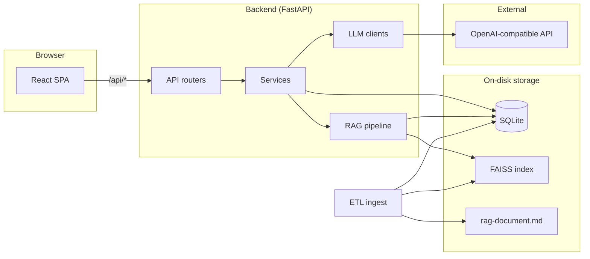
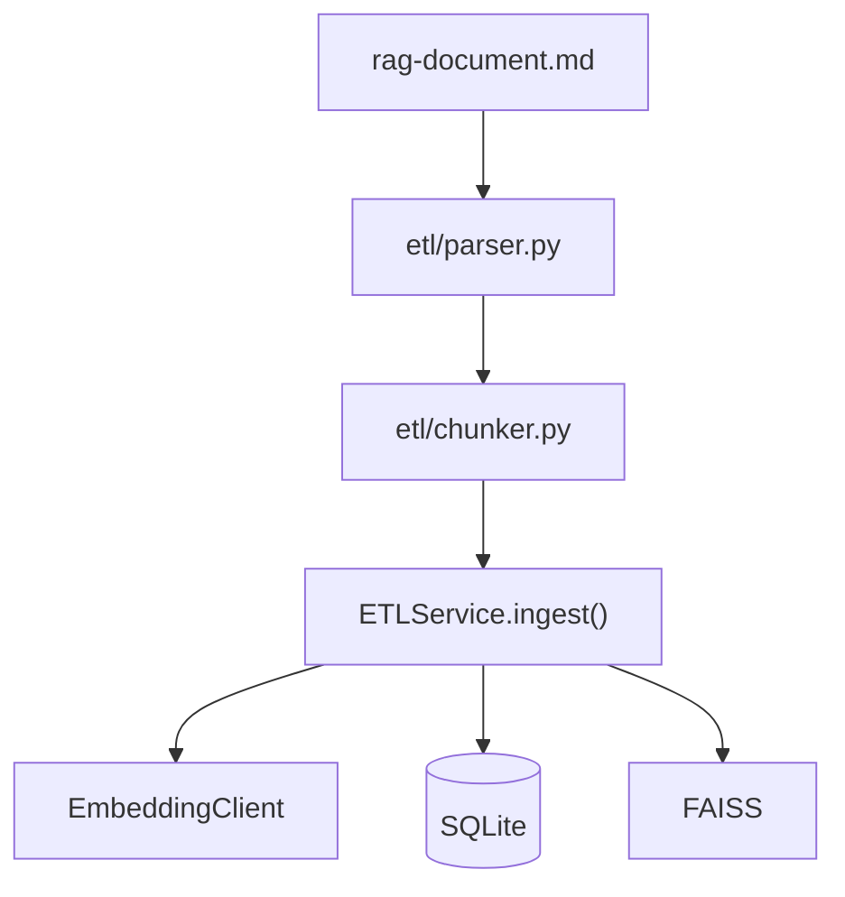
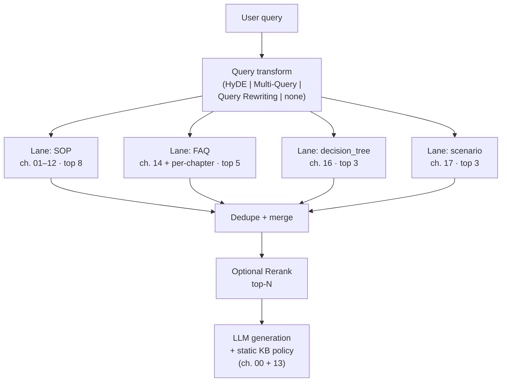
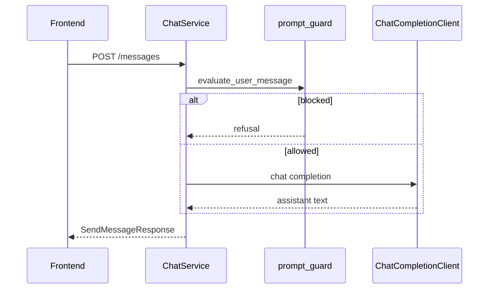

# Architecture

**English** · [Русский](ARCHITECTURE_RU.md)

This document describes how **avia-bot** is structured: components, data flows, layering rules, and deployment topology. For setup, commands, and feature overview, see [README.md](../README.md).

## Purpose

Avia-bot is a demonstration RAG assistant for airport staff. It answers questions from an internal markdown knowledge base (SOP, FAQ, decision trees, scenarios) and supports a parallel **LLM-only** mode for free-form dialogue. The UI lets operators compare RAG retrieval methods (HyDE, Multi-Query, Query Rewriting, Rerank) via a live pipeline trace.

The repository is a **monorepo**:

| Part | Role |
|------|------|
| `backend/` | FastAPI API, ETL, FAISS index, RAG pipeline, chat persistence |
| `frontend/` | React SPA — chat UI, settings panels, trace viewer |

## System context



In **development**, Vite proxies `/api` to `http://127.0.0.1:8000`. In **Docker**, Nginx serves the built SPA and proxies `/api` to the backend container.

## Repository layout

```
avia-bot/
├── backend/
│   ├── app/                 # FastAPI application
│   │   ├── api/routers/     # HTTP layer
│   │   ├── services/        # Use cases / orchestration
│   │   ├── repositories/    # Data access
│   │   ├── models/          # SQLModel tables
│   │   ├── schemas/         # API DTOs (Pydantic)
│   │   ├── rag/             # Retrieval pipeline (lanes, methods, generation)
│   │   ├── llm/             # Chat, embeddings, guards
│   │   ├── core/            # Config, FAISS, SSE, logging
│   │   ├── db/              # Session factory, init
│   │   └── exceptions/      # Error types and handlers
│   ├── etl/                 # Markdown parse + chunk (no I/O)
│   ├── data/                # SQLite, FAISS, source document
│   ├── scripts/             # CLI wrappers (e.g. run_etl.py)
│   └── tests/
├── frontend/
│   └── src/
│       ├── app/             # Shell, layout, providers
│       ├── features/        # chats, chat, rag, llm, trace
│       ├── shared/          # API client, i18n, utilities
│       └── theme/
├── docker-compose.yml
└── Makefile
```

## Backend layered architecture

The backend follows a **strict dependency direction**:

```
api/routers  →  services/  →  repositories/  →  models/
                      ↘  rag/  llm/  core/  ↗
```

| Layer | Location | Responsibility | Must not |
|-------|----------|----------------|----------|
| API | `app/api/routers/` | HTTP, validation, `Depends`, call services | SQL, FAISS, LLM, business rules |
| Service | `app/services/` | Use cases, orchestration, `@handle_basic_db_errors` | Direct session/SQL access |
| Repository | `app/repositories/` | CRUD, queries; raw SQLAlchemy errors bubble up | Business rules, HTTP |
| Model | `app/models/` | SQLModel table definitions | Logic, I/O |

**Schemas** (`app/schemas/`) are Pydantic DTOs for requests and responses — separate from SQLModel tables.

**Forbidden shortcuts:** `api → repository`, `api → models`, `repository → service`.

### Request lifecycle

1. FastAPI route receives a Pydantic body/query and injects `DBManager` via `get_db()`.
2. Route instantiates a service (`ChatService(db)`, `ETLService(db)`, …) and delegates.
3. Service calls repositories through `DBManager` attributes (`db.chat`, `db.etl`, …).
4. On success, service may `await db.commit()`; `DBManager` rolls back and closes the session on exit.
5. `ServiceError` and `BaseCustomException` subclasses are mapped to HTTP responses by global exception handlers.

### DBManager

`DBManager` is the single entry point for database access per request:

- `db.health` — readiness checks
- `db.etl.chunks`, `db.etl.index_manifest` — knowledge base metadata
- `db.chat.chats`, `db.chat.messages` — conversations

It is used as an async context manager (`async with DBManager(SessionLocal) as db`) in the FastAPI dependency and in tests.

## Data model

### SQLite tables

| Table | Purpose |
|-------|---------|
| `chunk_meta` | Text chunks; `id` equals FAISS row index (0…N−1) |
| `index_manifest` | Metadata of the latest vector index build |
| `chat` | Conversation thread (type, settings, soft-delete) |
| `chat_message` | User/assistant messages with JSON metadata |

`Chat.chat_type` is `llm` or `rag`. Settings (`rag_config`, `llm_config`, `use_history`) are stored on the chat and snapshotted into each message's `metadata` on send.

### On-disk artifacts

| Path | Purpose |
|------|---------|
| `backend/data/app.db` | SQLite database |
| `backend/data/faiss.index` | FAISS `IndexFlatIP` (L2-normalized inner product) |
| `backend/data/manifest.json` | Copy of latest manifest for tooling / Docker bootstrap |
| `backend/data/rag-document.md` | Source markdown for ETL |
| `backend/data/ingest_checkpoint.json` | Embedding checkpoint for resume after interrupt |

Chunk `id` in SQLite and FAISS row position must stay aligned — both are rebuilt together on full ingest.

## ETL pipeline

ETL splits into a **pure parsing package** and an **orchestrating service**.



### `etl/` package (bounded context)

- No FastAPI, SQLite, or FAISS imports.
- `parser.py` — markdown → section tree.
- `chunker.py` — content-type-aware splitting (`sop`, `faq`, `decision_tree`, `scenario`, …); FAQ pairs are extracted from SOP chapters (01–12) and chapter 14; chapters 00, 13, and 15 are skipped for indexing.
- `static_sections.py` — extract chapters 00 and 13 for runtime system prompt injection.
- Unit-tested in isolation.

### `ETLService` phases

1. **Parse & chunk** — read document, produce `ChunkDraft` list.
2. **Plan** — incremental diff vs existing chunks (`etl_plan.py`): reuse unchanged vectors, embed only new/changed.
3. **Embed** — batched calls to the embedding API; checkpoint saved per batch (resume on `Ctrl+C` via `IngestInterruptedError` in `scripts/run_etl.py`).
4. **Persist SQLite** — replace `chunk_meta`, insert new `index_manifest` row, commit.
5. **Persist FAISS** — build `IndexFlatIP`, atomic write to `faiss.index`.
6. **Write `manifest.json`** — after DB commit.

Entry points: `POST /api/etl/ingest`, `make etl-ingest`, `scripts/run_etl.py`.

See [backend/etl/README.md](../backend/etl/README.md) for chunking rules per chapter group.

## Knowledge base document

Single source file: `backend/data/rag-document.md`. Chapter groups differ in indexing strategy:

| Chapters | Role | Indexed |
|----------|------|---------|
| 00 | Project meta-policy | No — injected into RAG system prompt |
| 01–12 | Operational SOPs | Yes (`sop`) |
| 13 | Out-of-scope rules | No — injected into RAG system prompt |
| 14 | Central FAQ | Yes (`faq`) |
| 15 | Glossary | No (disabled in MVP) |
| 16 | Decision trees | Yes (`decision_tree`) |
| 17 | Scenarios | Yes (`scenario`) |

FAQ chunks unify **chapter 14** and **per-chapter FAQ blocks** at the end of SOP sections (01–12). Each FAQ chunk carries `[Источник: <chapter>]` metadata for trace and context.

Chapters **00** and **13** are loaded at runtime by `app/llm/kb_static_context.py` and appended in `RagPipeline.build_generation_prompt()` — they never pass through FAISS. For MVP the full chapter text is included (not summarized).

`backend/data/rag-doc-index.md` is a human-readable outline only; ETL and RAG do not use it.

## RAG pipeline

Orchestrator: `RagPipeline` in `app/rag/pipeline.py`.



### Query transform methods (mutually exclusive)

| Method | Module | Behavior |
|--------|--------|----------|
| HyDE | `rag/methods/hyde.py` | LLM generates hypothetical answer; search by its embedding |
| Multi-Query | `rag/methods/multi_query.py` | Several query variants → search each → RRF fusion **within each lane** |
| Query Rewriting | `rag/methods/query_rewriting.py` | Rewrite using conversation history |
| *(none)* | — | Direct vector search on the user question |

### Rerank (optional, combinable)

`LlmRerankMethod` in `rag/methods/rerank.py` — LLM scores merged lane candidates after vector retrieval.

### Multi-lane retrieval

Lane definitions live in `app/rag/retrieval_lanes.py`. `VectorRetriever.search_lanes()` runs all lanes **in parallel** (`asyncio.gather`):

| Lane | `content_type` filter | Quota | Source |
|------|----------------------|-------|--------|
| `sop` | `sop` | 8 | Chapters 01–12 |
| `faq` | `faq` | 5 | Chapter 14 + FAQ from 01–12 |
| `decision_tree` | `decision_tree` | 3 | Chapter 16 |
| `scenario` | `scenario` | 3 | Chapter 17 |

Within each lane, FAISS returns global top rows; results are **filtered by `content_type`** (with oversampling). Multiple search queries (from Multi-Query / HyDE / Rewriting) are fused per lane via **reciprocal rank fusion** (`retrieval.py`). Lane hits are deduplicated by chunk id, then optionally reranked or trimmed to `top_chunks`.

Each `RetrievedChunk` carries `retrieval_lane` for trace and UI.

### Trace

Each pipeline step produces a `RagTraceStep` (name, duration, structured data). Typical steps:

| Step | Content |
|------|---------|
| `rag_config` | Snapshot of RAG settings used for this answer (HyDE, Multi-Query, Rerank, `top_chunks`) |
| `hyde` / `multi_query` / `query_rewriting` | Generated search queries (if enabled) |
| `retrieval` | Per-lane hits (`lanes[]` with `source_label`, `top_k`, `hits`) plus merged candidates |
| `rerank` | Final ranked hits (if enabled) |

Steps are:

1. Published to the client via **SSE** (`event: trace`).
2. Stored in assistant message `metadata.rag_trace` (with `retrieved_chunks` including `retrieval_lane`).

The **trace panel** (`features/trace/`) shows: applied RAG settings for the last answer, search queries, expandable hits per corpus/lane, and chunks used in generation. The **RAG settings panel** above it edits chat-level defaults for the next message.

Missing index → HTTP `503` with `rag_index_missing`.

## Chat flows

### LLM mode



- Default: aviation system prompt (`llm/prompts.py`) + delimiter hardening (`<<USER>>` … `<</USER>>`).
- **Custom system prompt** (`llm_config`): guards disabled; empty prompt = no system message.
- History inclusion controlled by `use_history`.

### RAG mode

1. Same guard pre-check as LLM (unless overridden by mode rules).
2. `RagPipeline.run()` — retrieval + trace.
3. Context block built from retrieved chunks (`rag/generation.py`).
4. System prompt = RAG template + static chapters 00/13 + context.
5. `ChatCompletionClient` generates the answer.
6. Trace pushed over SSE during the request; persisted in message metadata.

### Chat title

After the first exchange, `chat_title.py` may schedule async title generation via LLM (SSE `chat_title` event).

## Real-time events (SSE)

`SSEManager` (`app/core/sse_manager.py`) is an in-memory pub/sub keyed by `client_id` (generated on the frontend).

| Endpoint | Event types |
|----------|-------------|
| `GET /api/chats/events?client_id=…` | `trace`, `error`, `chat_title` |

The client opens SSE before `POST /messages` and passes the same `client_id` in the message body. Used for pipeline trace and async sideband notifications during synchronous HTTP responses.

## Prompt injection protection

Applied in **LLM** and **RAG** modes (not when custom system prompt is enabled in LLM mode):

| Layer | Module | Role |
|-------|--------|------|
| System prompt | `llm/prompts.py` | Aviation scope, refuse jailbreaks |
| Message hardening | `llm/prompt_guard.py` | Delimiters, sanitization |
| Pre-flight block | `ChatService` | Regex patterns for obvious injection / off-topic |

## Frontend architecture

React 19 SPA with feature-based folders.

### Layout

Three-column shell (`app/layout/AppLayout.tsx`):

| Column | RAG mode | LLM mode |
|--------|----------|----------|
| Sidebar | Chat list | Chat list |
| Center | Dialog + composer | Dialog + composer |
| Right | Trace panel (lanes, applied settings, chunks) | LLM parameters panel |

Mode switch in the header (`features/chat/modeStore.ts` — Zustand). Chat lists are filtered by `chat_type` on the API.

### State and data fetching

| Concern | Technology |
|---------|------------|
| Server state | TanStack Query (`shared/api/queryClient.ts`, `shared/api/chats.ts`) |
| UI settings | Zustand stores (`ragSettingsStore`, `llmSettingsStore`, `theme/store`, `chats/store`) |
| SSE | `useChatEvents` hook in `AppProviders` |
| i18n | `shared/i18n/` — Russian (default) and English |
| Theming | `theme/themes.json` + `localStorage` persistence |

Settings are sent with each message (`rag_config`, `llm_config`, `use_history`) so the backend snapshots them in metadata.

### API client

All backend calls go to `/api/*` (relative URL). Dev: Vite proxy (`vite.config.ts`). Prod: Nginx proxy (`frontend/nginx.conf`).

## Configuration

Settings use **pydantic-settings** (`app/core/config.py`), loaded from `backend/.env`:

| Prefix | Examples |
|--------|----------|
| `LLM__` | `BASE_URL`, `API_KEY`, `MODEL`, `EMBEDDING_MODEL` |
| `DB__` | `URL` (default SQLite) |
| `DATA__` | `DIR` |
| `FAISS__` | `DIR` |
| `ETL__` | `DOCUMENT_PATH` |
| `APP__` | `CORS_ORIGINS` |

Docker overrides paths via `docker-compose.yml` environment and bind-mounts `./backend/data`.

## Deployment topologies

### Local development

| Service | URL |
|---------|-----|
| Backend | `http://127.0.0.1:8000` (`make backend-dev`) |
| Frontend | `http://127.0.0.1:5173` (`make frontend-dev`) |

### Docker Compose

| Service | Image | Exposure |
|---------|-------|----------|
| `backend` | `backend/Dockerfile` (uv + Python 3.13) | Internal `:8000`, healthcheck on `/api/healthz` |
| `frontend` | `frontend/Dockerfile` (Node build → Nginx) | Host `:8080` (configurable `FRONTEND_PORT`) |

Data persists on the host via volume `./backend/data:/app/data`.

## External dependencies

| Dependency | Usage |
|------------|-------|
| OpenAI-compatible chat API | Completions, HyDE, multi-query, rewriting, rerank, titles |
| OpenAI-compatible embeddings API | Chunk indexing, query embedding |
| FAISS (`faiss-cpu`) | In-process vector search; CPU build without AVX is expected |

## Error handling

- **Repositories** raise raw SQLAlchemy errors.
- **Services** use `@handle_basic_db_errors` to map DB failures to `Database*` exceptions.
- **API** registers handlers for `ServiceError`, `BaseCustomException`, and unhandled errors (`exceptions/__init__.py`).
- Health: `/api/healthz` (liveness), `/api/readyz` (DB readiness).

## Testing

| Suite | Location | Focus |
|-------|----------|-------|
| API integration | `backend/tests/api/` | HTTP contracts, chat, ETL endpoints |
| Unit | `backend/tests/unit/` | ETL chunker, RAG methods, prompt guard, services |
| ETL package | `backend/tests/unit/etl/` | Parser/chunker without DB |

Run: `make backend-test` (from repo root). See [backend/tests/README.md](../backend/tests/README.md).

## API surface (summary)

| Area | Prefix | Key endpoints |
|------|--------|---------------|
| Health | `/api` | `GET /healthz`, `GET /readyz` |
| ETL | `/api/etl` | `POST /ingest`, `GET /stats`, `GET /manifest` |
| Chats | `/api/chats` | CRUD, `POST /{id}/messages`, `GET /events` (SSE) |

Full request/response shapes are in `app/schemas/`.

## Design constraints and trade-offs

- **SQLite + FAISS on disk** — simple demo deployment; not horizontally scalable without externalizing state.
- **Synchronous message handling** — LLM/RAG runs in the POST handler; SSE is sideband only (no streaming tokens yet).
- **In-memory SSE** — single-process; multiple backend replicas would need a shared bus.
- **Incremental ETL** — content-hash diff reduces re-embedding cost; full rebuild available via `rebuild=true`.
- **Single FAISS index** — all indexed corpora share one `faiss.index`; lanes filter by `content_type` at query time (no per-corpus indices yet).
- **Chunk/FAISS alignment** — full replace on ingest keeps IDs consistent.

## Related documentation

| Document | Content |
|----------|---------|
| [README.md](../README.md) | Quick start, UI screenshots, feature list |
| [PRD.md](PRD.md) | Product requirements (business view) |
| [backend/etl/README.md](../backend/etl/README.md) | Parser/chunker internals |
| [backend/tests/README.md](../backend/tests/README.md) | Test layout and commands |
| `.cursor/rules/backend-layered-architecture.mdc` | Layer rules for contributors |
