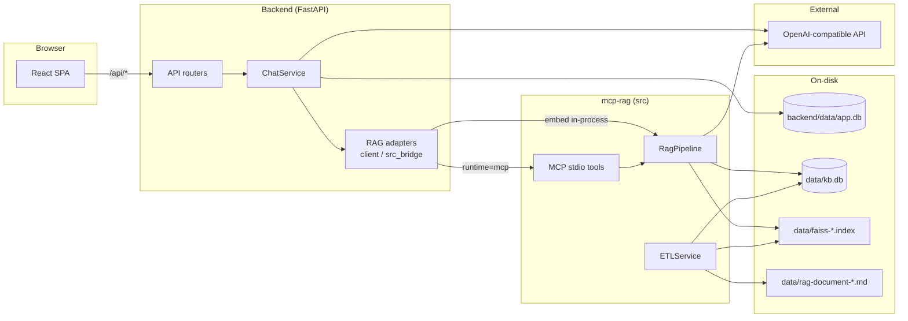
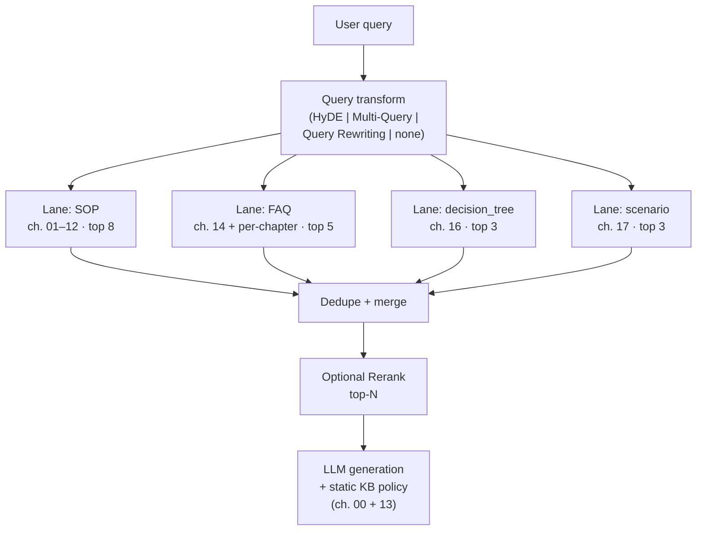
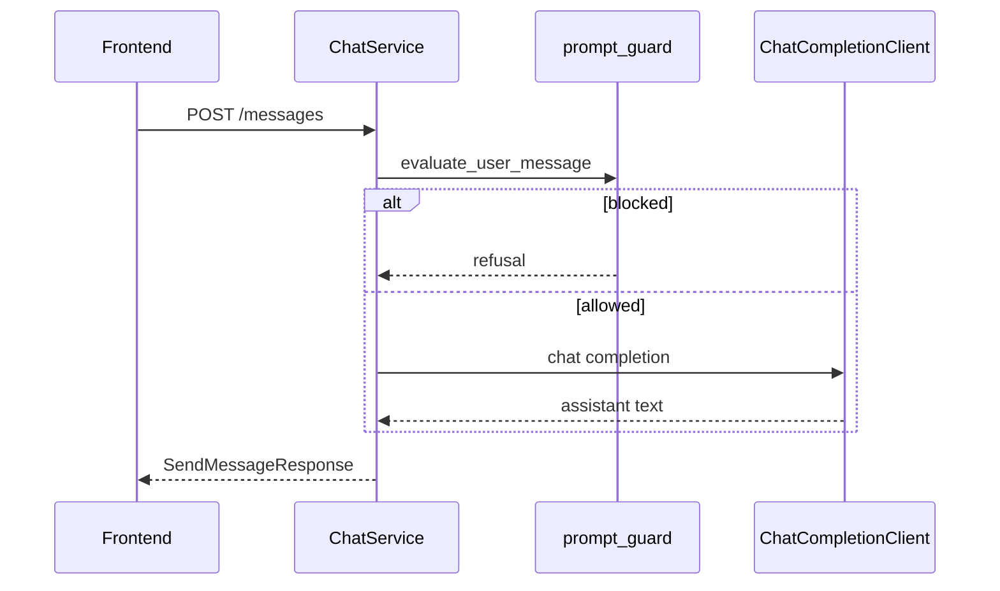

# Architecture

**English** · [Русский](ARCHITECTURE_RU.md)

This document describes how **avia-bot** is structured: components, data flows, layering rules, and deployment topology. For setup, commands, and feature overview, see [README.md](../README.md).

## Purpose

Avia-bot is a demonstration RAG assistant for airport staff. It answers questions from an internal markdown knowledge base (SOP, FAQ, decision trees, scenarios) and supports a parallel **LLM-only** mode for free-form dialogue. The UI lets operators compare RAG retrieval methods (HyDE, Multi-Query, Query Rewriting, Rerank) via a live pipeline trace.

The repository is a **monorepo**:

| Part | Role |
|------|------|
| `backend/` | FastAPI — chats, SSE, LLM guards; RAG via `mcp-rag` (`embed` or `mcp` stdio) |
| `mcp-rag/` | Canonical RAG + ETL (`src/` package), MCP stdio server, indexing CLI |
| `frontend/` | React SPA — chat UI, settings panels, trace viewer |
| `data/` (repo root) | KB volume — markdown, schemas, `kb.db`, FAISS |

## System context


```mermaid
flowchart LR
    subgraph client ["Browser"]
        UI["React SPA"]
    end

    subgraph backend ["Backend (FastAPI)"]
        API["API routers"]
        SVC["ChatService"]
        ADP["RAG adapters\nclient / src_bridge"]
        API --> SVC
        SVC --> ADP
    end

    subgraph mcp_rag ["mcp-rag (src)"]
        RAG["RagPipeline"]
        ETL["ETLService"]
        MCP["MCP stdio tools"]
    end

    subgraph storage ["On-disk"]
        APPDB[("backend/data/app.db")]
        KBDB[("data/kb.db")]
        FAISS["data/faiss-*.index"]
        DOC["data/rag-document-*.md"]
    end

    subgraph external ["External"]
        LLM_API["OpenAI-compatible API"]
    end

    UI -->|"/api/*"| API
    SVC --> APPDB
    ADP -->|embed in-process| RAG
    ADP -->|runtime=mcp| MCP
    MCP --> RAG
    RAG --> KBDB
    RAG --> FAISS
    ETL --> DOC
    ETL --> KBDB
    ETL --> FAISS
    SVC --> LLM_API
    RAG --> LLM_API
```

In **development**, Vite proxies `/api` to `http://127.0.0.1:8000`. In **Docker**, Nginx serves the built SPA and proxies `/api` to the backend container.

## Repository layout

```
avia-bot/
├── backend/
│   ├── app/                 # FastAPI — chats only in DB layer
│   │   ├── api/routers/     # HTTP (health, chats)
│   │   ├── services/        # ChatService, …
│   │   ├── repositories/    # chat repos
│   │   ├── models/          # Chat, ChatMessage
│   │   ├── rag/             # Thin adapters: client, types, mcp_deserialize, kb_access, src_bridge
│   │   ├── llm/             # Chat completion, guards (no KB ingest)
│   │   └── core/            # Config, SSE, logging
│   └── data/                # app.db (chats)
├── mcp-rag/
│   ├── src/                 # Canonical RAG + ETL (package `src`)
│   │   ├── rag/             # RagPipeline, retrieval, methods
│   │   ├── etl/             # Schema-driven chunker
│   │   ├── services/        # ETLService
│   │   ├── mcp/             # MCP tool handlers
│   │   └── core/            # Config, FAISS, db_manager
│   ├── scripts/run_etl.py   # Indexing CLI
│   └── Makefile             # etl-ingest, etl-stats, etl-manifest
├── data/                    # KB volume (git sources + runtime artifacts)
├── frontend/
└── Makefile                 # Delegates etl-* to mcp-rag
```

## Backend layered architecture

The backend follows a **strict dependency direction**:

```
api/routers  →  services/  →  repositories/  →  models/
                      ↘  rag/  llm/  core/  ↗
```

| Layer | Location | Responsibility |
|-------|----------|----------------|
| API | `backend/app/api/routers/` | HTTP, validation, call services |
| Service | `backend/app/services/` | Chat use cases |
| Repository | `backend/app/repositories/` | Chat CRUD |
| RAG adapters | `backend/app/rag/` | `EmbedRagClient`, `McpRagClient`, lazy `src` imports |
| **Canonical RAG/ETL** | **`mcp-rag/src/`** | `RagPipeline`, `ETLService`, FAISS, `kb.db` |

**Schemas** (`app/schemas/`) are Pydantic DTOs for requests and responses — separate from SQLModel tables.

**Forbidden shortcuts:** `api → repository`, `api → models`, `repository → service`.

### Request lifecycle

1. FastAPI route receives a Pydantic body/query and injects `DBManager` via `get_db()`.
2. Route instantiates `ChatService(db)` and delegates.
3. Service calls repositories through `DBManager` (`db.chat`, …).
4. RAG mode uses `get_rag_client()` → embed (`src.rag`) or MCP stdio.
4. On success, service may `await db.commit()`; `DBManager` rolls back and closes the session on exit.
5. `ServiceError` and `BaseCustomException` subclasses are mapped to HTTP responses by global exception handlers.

### DBManager

`DBManager` is the single entry point for database access per request:

- `db.health` — readiness checks
- `db.chat.chats`, `db.chat.messages` — conversations

KB access for trace enrichment: `app/rag/kb_access.py` opens a short-lived session to **`data/kb.db`** via mcp-rag `src`.

It is used as an async context manager (`async with DBManager(SessionLocal) as db`) in the FastAPI dependency and in tests.

## Data volumes

### `backend/data/app.db` (chats)

| Table | Purpose |
|-------|---------|
| `chat` | Conversation thread (type, settings, soft-delete) |
| `chat_message` | User/assistant messages with JSON metadata |

### `data/kb.db` + FAISS (knowledge base)

| Artifact | Purpose |
|----------|---------|
| `data/kb.db` — `chunk_meta`, `index_manifest` | Chunk rows + build metadata |
| `data/faiss-{lang}.index` | Per-language FAISS `IndexFlatIP` |
| `data/manifest-{lang}.json` | Sidecar metadata |
| `data/rag-document-{lang}.md` | Source markdown (git) |
| `data/chunking-schema-{lang}.json` | ETL schema v3 (git) |
| `data/ingest_checkpoint_{lang}.json` | Transient resume state (deleted on success) |

Chunk `id` in `kb.db` must match FAISS row index — rebuilt together on ingest.

## ETL pipeline (mcp-rag)

Canonical code: **`mcp-rag/src/`** (`ETLService`, `etl/universal_chunker.py`).  
**No** `/api/etl` on backend.

Entry points:

| Entry | Command / tool |
|-------|----------------|
| Makefile | `make etl-ingest`, `make -C mcp-rag etl-ingest` |
| CLI | `mcp-rag/scripts/run_etl.py` |
| MCP | `ingest_schema`, `ingest_all`, `stats`, `index_status` |

See [mcp-rag/src/etl/README.md](../mcp-rag/src/etl/README.md) and [operations.md](operations.md).

Sources: `data/rag-document-{lang}.md` (repo root). Chapter groups — see [knowledge_base.md](knowledge_base.md).

Chapters **00** and **13** are injected at generation time via `src/llm/kb_static_context.py` — not in FAISS.

## RAG pipeline (mcp-rag)

Orchestrator: **`src/rag/pipeline.py`** (`RagPipeline`).  
Backend invokes it via:

| `rag_config.runtime` | Path |
|----------------------|------|
| `embed` (default) | `EmbedRagClient` → lazy import `src.rag.pipeline` |
| `mcp` | `McpRagClient` → stdio MCP tool `retrieve` |


```mermaid
flowchart TB
    Q["User query"]
    T["Query transform\n(HyDE | Multi-Query |\nQuery Rewriting | none)"]
    L1["Lane: SOP\nch. 01–12 · top 8"]
    L2["Lane: FAQ\nch. 14 + per-chapter · top 5"]
    L3["Lane: decision_tree\nch. 16 · top 3"]
    L4["Lane: scenario\nch. 17 · top 3"]
    M["Dedupe + merge"]
    R["Optional Rerank\ntop-N"]
    G["LLM generation\n+ static KB policy\n(ch. 00 + 13)"]

    Q --> T
    T --> L1 & L2 & L3 & L4
    L1 & L2 & L3 & L4 --> M --> R --> G
```

### Query transform methods (mutually exclusive)

| Method | Module | Behavior |
|--------|--------|----------|
| HyDE | `rag/methods/hyde.py` | LLM generates hypothetical answer; search by its embedding |
| Multi-Query | `rag/methods/multi_query.py` | Several query variants → search each → RRF fusion **within each lane** |
| Query Rewriting | `rag/methods/query_rewriting.py` | Rewrite using conversation history |
| *(none)* | — | Direct vector search on the user question |

### Rerank (optional, combinable)

`LlmRerankMethod` in `rag/methods/rerank.py` — LLM scores merged lane candidates after vector retrieval.

### Multi-lane retrieval

Lane definitions: `src/rag/retrieval_lanes.py`. Decision-tree walkthrough: `src/rag/decision_tree.py` (orchestrated from `ChatService` via `src_bridge`).

| Lane | `content_type` filter | Quota | Source |
|------|----------------------|-------|--------|
| `sop` | `sop` | 8 | Chapters 01–12 |
| `faq` | `faq` | 5 | Chapter 14 + FAQ from 01–12 |
| `decision_tree` | `decision_tree` | 3 | Chapter 16 |
| `scenario` | `scenario` | 3 | Chapter 17 |

Within each lane, FAISS returns global top rows; results are **filtered by `content_type`** (with oversampling). Multiple search queries (from Multi-Query / HyDE / Rewriting) are fused per lane via **reciprocal rank fusion** (`retrieval.py`). Lane hits are deduplicated by chunk id, then optionally reranked or trimmed to `top_chunks`.

Each `RetrievedChunk` carries `retrieval_lane` for trace and UI.

### Decision tree walkthrough

When the `decision_tree` lane returns a chunk whose similarity is at or above the threshold (`DECISION_TREE_MIN_SIMILARITY`, default **0.30**), the pipeline treats it as an **operational situation** that warrants a dedicated procedure — not a generic knowledge-base excerpt.

Logic lives in `src/rag/decision_tree.py`; orchestration in `RagPipeline` and `ChatService` (via `src_bridge`):

1. **Detection** — after multi-lane retrieval, `select_applicable_decision_trees()` inspects the `decision_tree` lane independently of the global `top_chunks` trim (at most one tree per answer).
2. **Context split** — matching `decision_tree` chunks are **excluded** from the general RAG context so the main answer is not diluted by mixed corpora.
3. **Dedicated generation** — a separate LLM call walks through the matched tree and produces a numbered operational checklist (immediate actions, branch selection, critical safety steps). Result is stored in assistant message metadata as `decision_tree_guidance`.
4. **General answer** — the usual RAG completion runs in parallel on the remaining chunks (SOP, FAQ, scenario).

Trace adds two steps when applicable: `decision_tree` (matched hits from the lane) and `decision_tree_generation` (walkthrough applied).

### Trace

Each pipeline step produces a `RagTraceStep` (name, duration, structured data). Typical steps:

| Step | Content |
|------|---------|
| `rag_config` | Snapshot of RAG settings used for this answer (HyDE, Multi-Query, Rerank, `top_chunks`) |
| `hyde` / `multi_query` / `query_rewriting` | Generated search queries (if enabled) |
| `retrieval` | Per-lane hits (`lanes[]` with `label`, `description`, `top_k`, `hits`) plus merged candidates |
| `rerank` | Final ranked hits (if enabled) |
| `decision_tree` | Applicable decision-tree hits from the `decision_tree` lane (similarity ≥ threshold) |
| `decision_tree_generation` | Dedicated walkthrough of the matched tree (if applied) |

Steps are:

1. Published to the client via **SSE** (`event: trace`).
2. Stored in assistant message `metadata.rag_trace` (with `retrieved_chunks` including `retrieval_lane` and `retrieval_lane_label`).

The **trace panel** (`features/trace/`) shows: applied RAG settings for the last answer, search queries, expandable hits per corpus/lane, and chunks used in generation. The **RAG settings panel** above it edits chat-level defaults for the next message.

Missing index → HTTP `503` with `rag_index_missing`.

## Chat flows

### LLM mode


```mermaid
sequenceDiagram
    participant UI as Frontend
    participant API as ChatService
    participant Guard as prompt_guard
    participant LLM as ChatCompletionClient

    UI->>API: POST /messages
    API->>Guard: evaluate_user_message
    alt blocked
        Guard-->>API: refusal
    else allowed
        API->>LLM: chat completion
        LLM-->>API: assistant text
    end
    API-->>UI: SendMessageResponse
```

- Default: aviation system prompt (`llm/prompts.py`) + delimiter hardening (`<<USER>>` … `<</USER>>`).
- **Custom system prompt** (`llm_config`): guards disabled; empty prompt = no system message.
- History inclusion controlled by `use_history`.

### RAG mode

1. Same guard pre-check as LLM (unless overridden by mode rules).
2. `RagPipeline.run()` — retrieval + trace.
3. Context block built from retrieved chunks **excluding** applicable decision trees (`src/rag/generation.py`).
4. System prompt = RAG template + static chapters 00/13 + context.
5. `ChatCompletionClient` generates the general answer.
6. If a decision tree matched — a **second** LLM call produces the operational walkthrough (`decision_tree_guidance` in metadata).
7. Trace pushed over SSE during the request; persisted in message metadata.

### Chat title

After the first exchange, `chat_title.py` may schedule async title generation via LLM (SSE `chat_title` event).

## Real-time events (SSE)

`SSEManager` (`app/core/sse_manager.py`) is an in-memory pub/sub keyed by `client_id` (generated on the frontend).

| Endpoint | Event types |
|----------|-------------|
| `GET /api/chats/events?client_id=…` | `trace`, `error`, `chat_title` |

The client opens SSE before `POST /messages` and passes the same `client_id` in the message body. Used for pipeline trace and async sideband notifications during synchronous HTTP responses.

## Prompt injection protection

Applied in **LLM** and **RAG** modes (not when custom system prompt is enabled in LLM mode):

| Layer | Module | Role |
|-------|--------|------|
| System prompt | `llm/prompts.py` | Aviation scope, refuse jailbreaks |
| Message hardening | `llm/prompt_guard.py` | Delimiters, sanitization |
| Pre-flight block | `ChatService` | Regex patterns for obvious injection / off-topic |

## Frontend architecture

React 19 SPA with feature-based folders.

### Layout

Three-column shell (`app/layout/AppLayout.tsx`):

| Column | RAG mode | LLM mode |
|--------|----------|----------|
| Sidebar | Chat list | Chat list |
| Center | Dialog + composer | Dialog + composer |
| Right | Trace panel (lanes, applied settings, chunks) | LLM parameters panel |

In RAG mode, when `metadata.decision_tree_guidance` is present, the chat panel renders an **operational procedure card** above the general assistant reply (`DecisionTreeGuidanceBlock` in `features/chat/components/ChatPanel.tsx`). The card uses a distinct **warning-colored** border and background so on-duty staff can spot step-by-step algorithms at a glance, separate from explanatory text.

Mode switch in the header (`features/chat/modeStore.ts` — Zustand). Chat lists are filtered by `chat_type` on the API.

### State and data fetching

| Concern | Technology |
|---------|------------|
| Server state | TanStack Query (`shared/api/queryClient.ts`, `shared/api/chats.ts`) |
| UI settings | Zustand stores (`ragSettingsStore`, `llmSettingsStore`, `theme/store`, `chats/store`) |
| SSE | `useChatEvents` hook in `AppProviders` |
| i18n | `shared/i18n/` — Russian (default) and English |
| Theming | `theme/themes.json` + `localStorage` persistence |

Settings are sent with each message (`rag_config`, `llm_config`, `use_history`) so the backend snapshots them in metadata.

### API client

All backend calls go to `/api/*` (relative URL). Dev: Vite proxy (`vite.config.ts`). Prod: Nginx proxy (`frontend/nginx.conf`).

## Configuration

Settings use **pydantic-settings**:

| Package | Config module | Prefix | Examples |
|---------|---------------|--------|----------|
| backend | `app/core/config.py` | `LLM__`, `DB__`, `APP__` | chat DB, CORS, LLM API |
| mcp-rag | `src/core/config.py` | `MCP_RAG__`, `LLM__`, `DB__`, `DATA__`, `FAISS__` | `kb.db`, FAISS dir, ETL paths |

Backend loads `backend/.env`; mcp-rag loads `mcp-rag/.env` (or env vars when imported from backend embed mode).

See [configuration.md](configuration.md) for volume layout (`backend/data/app.db` vs repo-root `data/`).

## Deployment topologies

### Local development

| Service | URL |
|---------|-----|
| Backend | `http://127.0.0.1:8000` (`make backend-dev`) |
| Frontend | `http://127.0.0.1:5173` (`make frontend-dev`) |

### Docker Compose

| Service | Image | Exposure |
|---------|-------|----------|
| `backend` | `backend/Dockerfile` (uv + Python 3.13) | Internal `:8000`, healthcheck on `/api/healthz` |
| `frontend` | `frontend/Dockerfile` (Node build → Nginx) | Host `:8080` (configurable `FRONTEND_PORT`) |

Data volumes (stage 9):

| Mount | Contents |
|-------|----------|
| `./backend/data` | `app.db` (chats) |
| `./data` | `kb.db`, FAISS, markdown, schemas |

See [deployment.md](deployment.md) for Compose details.

## External dependencies

| Dependency | Usage |
|------------|-------|
| OpenAI-compatible chat API | Completions, HyDE, multi-query, rewriting, rerank, titles |
| OpenAI-compatible embeddings API | Chunk indexing, query embedding |
| FAISS (`faiss-cpu`) | In-process vector search; CPU build without AVX is expected |

## Error handling

- **Repositories** raise raw SQLAlchemy errors.
- **Services** use `@handle_basic_db_errors` to map DB failures to `Database*` exceptions.
- **API** registers handlers for `ServiceError`, `BaseCustomException`, and unhandled errors (`exceptions/__init__.py`).
- Health: `/api/healthz` (liveness), `/api/readyz` (DB readiness).

## Testing

| Suite | Location | Focus |
|-------|----------|-------|
| API integration | `backend/tests/api/` | HTTP contracts, chat endpoints |
| Unit | `backend/tests/unit/` | RAG client, prompt guard, services |
| Parity (opt-in) | `backend/tests/parity/` | embed vs MCP stdio (`--run-parity`) |
| mcp-rag unit | `mcp-rag/tests/` | ETL chunker, MCP tools, import smoke |

Run: `make backend-test` (repo root). ETL tests live in **`mcp-rag/tests/`**. See [backend/tests/README.md](../backend/tests/README.md).

## API surface (summary)

| Area | Prefix | Key endpoints |
|------|--------|---------------|
| Health | `/api` | `GET /healthz`, `GET /readyz` |
| Chats | `/api/chats` | CRUD, `POST /{id}/messages`, `GET /events` (SSE) |

Indexing (ETL) is **not** exposed on backend HTTP — use `make etl-ingest`, `mcp-rag/scripts/run_etl.py`, or MCP tools. See [operations.md](operations.md).

Full request/response shapes are in `app/schemas/`.

## Design constraints and trade-offs

- **SQLite + FAISS on disk** — simple demo deployment; not horizontally scalable without externalizing state.
- **Synchronous message handling** — LLM/RAG runs in the POST handler; SSE is sideband only (no streaming tokens yet).
- **In-memory SSE** — single-process; multiple backend replicas would need a shared bus.
- **Incremental ETL** — content-hash diff reduces re-embedding cost; full rebuild available via `rebuild=true`.
- **Single FAISS index** — all indexed corpora share one `faiss.index`; lanes filter by `content_type` at query time (no per-corpus indices yet).
- **Chunk/FAISS alignment** — full replace on ingest keeps IDs consistent.

## Related documentation

| Document | Content |
|----------|---------|
| [README.md](README.md) | Documentation index |
| [README.md](../README.md) | Quick start, UI screenshots, feature list |
| [PRD.md](PRD.md) | Product requirements (business view) |
| [api.md](api.md) | HTTP API reference |
| [deployment.md](deployment.md) | Deployment runbook |
| [operations.md](operations.md) | ETL, backups, troubleshooting |
| [mcp-rag/src/etl/README.md](../mcp-rag/src/etl/README.md) | Schema-driven ETL internals |
| [backend/tests/README.md](../backend/tests/README.md) | Test layout and commands |
| [adr/](adr/) | Architecture Decision Records |
