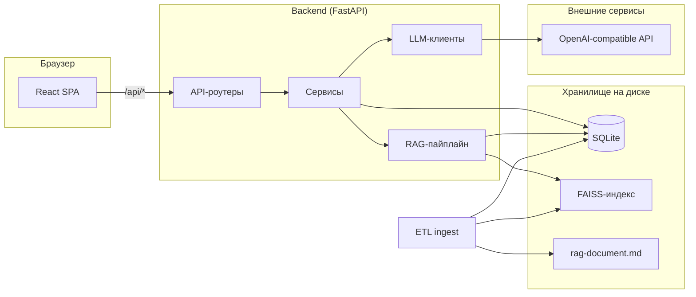
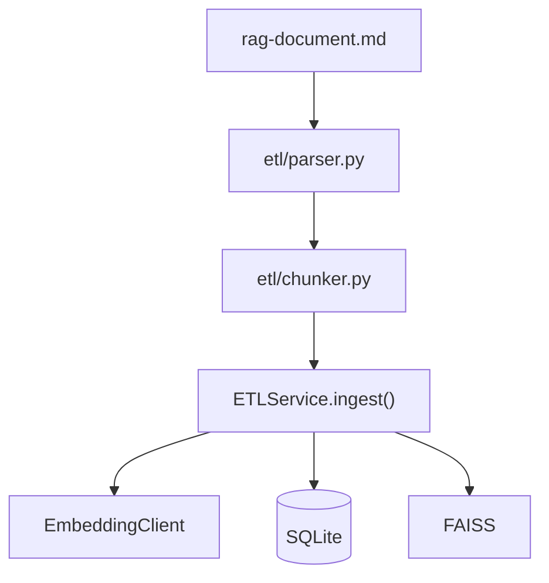
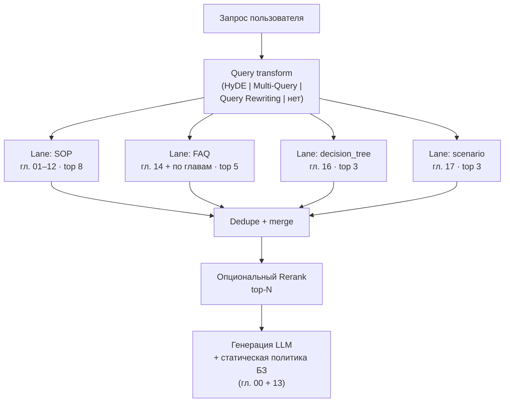
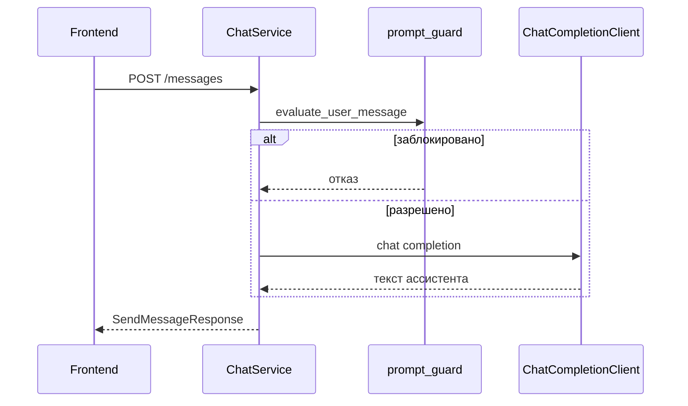

# Архитектура

[English](ARCHITECTURE.md) · **Русский**

В этом документе описана структура **avia-bot**: компоненты, потоки данных, правила слоёв и топология развёртывания. Запуск, команды и обзор возможностей — в [README_RU.md](../README_RU.md).

## Назначение

Avia-bot — демонстрационный RAG-ассистент для сотрудников аэропорта. Он отвечает на вопросы по внутренней markdown-базе знаний (SOP, FAQ, decision trees, сценарии) и поддерживает параллельный режим **только LLM** для свободного диалога. Интерфейс позволяет сравнивать методы RAG-retrieval (HyDE, Multi-Query, Query Rewriting, Rerank) по живой трассировке пайплайна.

Репозиторий — **monorepo**:

| Часть | Роль |
|-------|------|
| `backend/` | FastAPI API, ETL, FAISS-индекс, RAG-пайплайн, хранение чатов |
| `frontend/` | React SPA — чат, панели настроек, просмотр трассировки |

## Контекст системы



В **разработке** Vite проксирует `/api` на `http://127.0.0.1:8000`. В **Docker** Nginx отдаёт собранный SPA и проксирует `/api` в контейнер backend.

## Структура репозитория

```
avia-bot/
├── backend/
│   ├── app/                 # Приложение FastAPI
│   │   ├── api/routers/     # HTTP-слой
│   │   ├── services/        # Сценарии / оркестрация
│   │   ├── repositories/    # Доступ к данным
│   │   ├── models/          # Таблицы SQLModel
│   │   ├── schemas/         # DTO API (Pydantic)
│   │   ├── rag/             # Пайплайн retrieval (lanes, methods, generation)
│   │   ├── llm/             # Чат, embeddings, guard
│   │   ├── core/            # Конфиг, FAISS, SSE, логи
│   │   ├── db/              # Фабрика сессий, init
│   │   └── exceptions/      # Ошибки и обработчики
│   ├── etl/                 # Парсинг markdown + чанкинг (без I/O)
│   ├── data/                # SQLite, FAISS, исходный документ
│   ├── scripts/             # CLI-обёртки (напр. run_etl.py)
│   └── tests/
├── frontend/
│   └── src/
│       ├── app/             # Оболочка, layout, провайдеры
│       ├── features/        # chats, chat, rag, llm, trace
│       ├── shared/          # API-клиент, i18n, утилиты
│       └── theme/
├── docker-compose.yml
└── Makefile
```

## Слоистая архитектура backend

Backend следует **строгому направлению зависимостей**:

```
api/routers  →  services/  →  repositories/  →  models/
                      ↘  rag/  llm/  core/  ↗
```

| Слой | Расположение | Ответственность | Запрещено |
|------|--------------|-----------------|-----------|
| API | `app/api/routers/` | HTTP, валидация, `Depends`, вызов сервисов | SQL, FAISS, LLM, бизнес-правила |
| Service | `app/services/` | Сценарии, оркестрация, `@handle_basic_db_errors` | Прямой доступ к сессии/SQL |
| Repository | `app/repositories/` | CRUD, запросы; сырые ошибки SQLAlchemy пробрасываются | Бизнес-правила, HTTP |
| Model | `app/models/` | Определения таблиц SQLModel | Логика, I/O |

**Schemas** (`app/schemas/`) — Pydantic DTO для запросов и ответов, отдельно от таблиц SQLModel.

**Запрещённые сокращения:** `api → repository`, `api → models`, `repository → service`.

### Жизненный цикл запроса

1. Роут FastAPI принимает тело/query Pydantic и инжектит `DBManager` через `get_db()`.
2. Роут создаёт сервис (`ChatService(db)`, `ETLService(db)`, …) и делегирует работу.
3. Сервис вызывает репозитории через атрибуты `DBManager` (`db.chat`, `db.etl`, …).
4. При успехе сервис может вызвать `await db.commit()`; при выходе `DBManager` откатывает транзакцию и закрывает сессию.
5. `ServiceError` и подклассы `BaseCustomException` преобразуются в HTTP-ответы глобальными обработчиками.

### DBManager

`DBManager` — единая точка доступа к БД на запрос:

- `db.health` — проверки готовности
- `db.etl.chunks`, `db.etl.index_manifest` — метаданные базы знаний
- `db.chat.chats`, `db.chat.messages` — диалоги

Используется как async context manager (`async with DBManager(SessionLocal) as db`) в зависимости FastAPI и в тестах.

## Модель данных

### Таблицы SQLite

| Таблица | Назначение |
|---------|------------|
| `chunk_meta` | Текстовые чанки; `id` совпадает с номером строки в FAISS (0…N−1) |
| `index_manifest` | Метаданные последней сборки векторного индекса |
| `chat` | Тред диалога (тип, настройки, мягкое удаление) |
| `chat_message` | Сообщения user/assistant с JSON metadata |

`Chat.chat_type` — `llm` или `rag`. Настройки (`rag_config`, `llm_config`, `use_history`) хранятся в чате и снимком попадают в `metadata` каждого сообщения при отправке.

### Артефакты на диске

| Путь | Назначение |
|------|------------|
| `backend/data/app.db` | База SQLite |
| `backend/data/faiss.index` | FAISS `IndexFlatIP` (L2-нормализованное скалярное произведение) |
| `backend/data/manifest.json` | Копия последнего manifest для tooling / Docker bootstrap |
| `backend/data/rag-document.md` | Исходный markdown для ETL |
| `backend/data/ingest_checkpoint.json` | Checkpoint embeddings для возобновления после прерывания |

`id` чанка в SQLite и позиция строки в FAISS должны оставаться согласованными — оба пересобираются вместе при полном ingest.

## ETL-пайплайн

ETL разделён на **чистый пакет парсинга** и **оркестрирующий сервис**.



### Пакет `etl/` (ограниченный контекст)

- Без импортов FastAPI, SQLite и FAISS.
- `parser.py` — markdown → дерево разделов.
- `chunker.py` — разбиение с учётом типа контента (`sop`, `faq`, `decision_tree`, `scenario`, …); пары FAQ извлекаются из SOP-глав (01–12) и главы 14; главы 00, 13 и 15 не индексируются.
- `static_sections.py` — извлечение глав 00 и 13 для инъекции в системный промпт в runtime.
- Unit-тесты изолированно.

### Фазы `ETLService`

1. **Parse & chunk** — чтение документа, список `ChunkDraft`.
2. **Plan** — инкрементальный diff с существующими чанками (`etl_plan.py`): переиспользование неизменённых векторов, embed только новых/изменённых.
3. **Embed** — пакетные вызовы embedding API; checkpoint сохраняется после каждого батча (возобновление по `Ctrl+C` через `IngestInterruptedError` в `scripts/run_etl.py`).
4. **Persist SQLite** — замена `chunk_meta`, вставка строки `index_manifest`, commit.
5. **Persist FAISS** — сборка `IndexFlatIP`, атомарная запись в `faiss.index`.
6. **Запись `manifest.json`** — после commit в БД.

Точки входа: `POST /api/etl/ingest`, `make etl-ingest`, `scripts/run_etl.py`.

Подробности чанкинга по группам глав — в [backend/etl/README_RU.md](../backend/etl/README_RU.md).

## Документ базы знаний

Единый исходный файл: `backend/data/rag-document.md`. Группы глав различаются стратегией индексации:

| Главы | Роль | Индексируется |
|-------|------|---------------|
| 00 | Мета-политика проекта | Нет — в системный промпт RAG |
| 01–12 | Операционные SOP | Да (`sop`) |
| 13 | Правила out-of-scope | Нет — в системный промпт RAG |
| 14 | Центральный FAQ | Да (`faq`) |
| 15 | Глоссарий | Нет (отключено в MVP) |
| 16 | Decision trees | Да (`decision_tree`) |
| 17 | Сценарии | Да (`scenario`) |

FAQ-чанки объединяют **главу 14** и **блоки FAQ в конце SOP-разделов** (01–12). Каждый FAQ-чанк содержит метаданные `[Источник: <глава>]` для трассировки и контекста.

Главы **00** и **13** загружаются в runtime через `app/llm/kb_static_context.py` и добавляются в `RagPipeline.build_generation_prompt()` — через FAISS не проходят. В MVP в промпт попадает полный текст глав (без суммаризации).

`backend/data/rag-doc-index.md` — только человекочитаемый оглавление; ETL и RAG его не используют.

## RAG-пайплайн

Оркестратор: `RagPipeline` в `app/rag/pipeline.py`.



### Методы query transform (взаимоисключающие)

| Метод | Модуль | Поведение |
|-------|--------|-----------|
| HyDE | `rag/methods/hyde.py` | LLM генерирует гипотетический ответ; поиск по его embedding |
| Multi-Query | `rag/methods/multi_query.py` | Несколько вариантов запроса → поиск по каждому → fusion RRF **внутри каждого lane** |
| Query Rewriting | `rag/methods/query_rewriting.py` | Переформулировка с учётом истории диалога |
| *(нет)* | — | Прямой векторный поиск по вопросу пользователя |

### Rerank (опционально, комбинируется)

`LlmRerankMethod` в `rag/methods/rerank.py` — LLM ранжирует объединённых кандидатов из lane после векторного поиска.

### Multi-lane retrieval

Определения lane — в `app/rag/retrieval_lanes.py`. `VectorRetriever.search_lanes()` запускает все lane **параллельно** (`asyncio.gather`):

| Lane | Фильтр `content_type` | Квота | Источник |
|------|----------------------|-------|----------|
| `sop` | `sop` | 8 | Главы 01–12 |
| `faq` | `faq` | 5 | Глава 14 + FAQ из 01–12 |
| `decision_tree` | `decision_tree` | 3 | Глава 16 |
| `scenario` | `scenario` | 3 | Глава 17 |

Внутри lane FAISS возвращает глобальный top; результаты **фильтруются по `content_type`** (с oversampling). Несколько поисковых запросов (Multi-Query / HyDE / Rewriting) сливаются внутри lane через **reciprocal rank fusion** (`retrieval.py`). Hits из lane дедуплицируются по id чанка, затем опционально rerank или обрезка до `top_chunks`.

У каждого `RetrievedChunk` есть поле `retrieval_lane` для трассировки и UI.

### Проработка дерева решений

Если lane `decision_tree` возвращает чанк с similarity не ниже порога (`DECISION_TREE_MIN_SIMILARITY`, по умолчанию **0.30**), пайплайн считает ситуацию **операционной** — нужен отдельный пошаговый алгоритм, а не общий справочный ответ.

Логика — в `app/rag/decision_tree.py`; оркестрация — в `RagPipeline` и `ChatService`:

1. **Детекция** — после multi-lane retrieval `select_applicable_decision_trees()` смотрит на lane `decision_tree` независимо от глобальной обрезки `top_chunks` (не более одного дерева на ответ).
2. **Разделение контекста** — совпавшие чанки `decision_tree` **исключаются** из общего RAG-контекста, чтобы основной ответ не размывался смешением корпусов.
3. **Отдельная генерация** — второй вызов LLM проходит по дереву и формирует нумерованный оперативный чеклист (немедленные действия, выбор ветки, критические шаги безопасности). Результат сохраняется в metadata ответа ассистента как `decision_tree_guidance`.
4. **Общий ответ** — обычная RAG-генерация по оставшимся чанкам (SOP, FAQ, scenario).

В trace при срабатывании добавляются шаги `decision_tree` (совпавшие hits из lane) и `decision_tree_generation` (проработка применена).

### Трассировка

Каждый шаг пайплайна формирует `RagTraceStep` (имя, длительность, структурированные данные). Типичные шаги:

| Шаг | Содержание |
|-----|------------|
| `rag_config` | Снимок настроек RAG для этого ответа (HyDE, Multi-Query, Rerank, `top_chunks`) |
| `hyde` / `multi_query` / `query_rewriting` | Сгенерированные поисковые запросы (если включены) |
| `retrieval` | Hits по lane (`lanes[]` с `source_label`, `top_k`, `hits`) и объединённые кандидаты |
| `rerank` | Финальный ранжированный список (если включён) |
| `decision_tree` | Применимые hits дерева решений из lane `decision_tree` (similarity ≥ порога) |
| `decision_tree_generation` | Отдельная проработка совпавшего дерева (если применена) |

Шаги:

1. Публикуются клиенту через **SSE** (`event: trace`).
2. Сохраняются в `metadata.rag_trace` ответа ассистента (вместе с `retrieved_chunks`, включая `retrieval_lane`).

**Панель трассировки** (`features/trace/`) показывает: применённые настройки RAG для последнего ответа, поисковые запросы, раскрываемые hits по корпусу/lane и чанки, ушедшие в генерацию. **Панель настроек RAG** над ней редактирует значения чата для следующего сообщения.

Отсутствие индекса → HTTP `503` с `rag_index_missing`.

## Потоки чата

### Режим LLM



- По умолчанию: авиационный системный промпт (`llm/prompts.py`) + усиление разделителями (`<<USER>>` … `<</USER>>`).
- **Свой системный промпт** (`llm_config`): guard отключены; пустой промпт = без system message.
- Включение истории — через `use_history`.

### Режим RAG

1. Тот же pre-check guard, что и в LLM (если не переопределено правилами режима).
2. `RagPipeline.run()` — retrieval + trace.
3. Блок контекста из найденных чанков **без** применимых деревьев решений (`rag/generation.py`).
4. System prompt = RAG-шаблон + статические главы 00/13 + контекст.
5. `ChatCompletionClient` генерирует общий ответ.
6. Если дерево решений совпало — **второй** вызов LLM формирует оперативную проработку (`decision_tree_guidance` в metadata).
7. Trace уходит по SSE во время запроса; сохраняется в metadata сообщения.

### Заголовок чата

После первого обмена `chat_title.py` может асинхронно сгенерировать заголовок через LLM (SSE-событие `chat_title`).

## События в реальном времени (SSE)

`SSEManager` (`app/core/sse_manager.py`) — in-memory pub/sub по ключу `client_id` (генерируется на frontend).

| Endpoint | Типы событий |
|----------|--------------|
| `GET /api/chats/events?client_id=…` | `trace`, `error`, `chat_title` |

Клиент открывает SSE до `POST /messages` и передаёт тот же `client_id` в теле сообщения. Используется для трассировки пайплайна и асинхронных уведомлений при синхронном HTTP-ответе.

## Защита от prompt injection

Применяется в режимах **LLM** и **RAG** (не при включённом custom system prompt в LLM):

| Слой | Модуль | Роль |
|------|--------|------|
| System prompt | `llm/prompts.py` | Авиационная область, отказ от jailbreak |
| Усиление сообщений | `llm/prompt_guard.py` | Разделители, санитизация |
| Pre-flight block | `ChatService` | Regex для явных injection / off-topic |

## Архитектура frontend

React 19 SPA с feature-based структурой папок.

### Layout

Трёхколоночная оболочка (`app/layout/AppLayout.tsx`):

| Колонка | Режим RAG | Режим LLM |
|---------|-----------|-----------|
| Sidebar | Список чатов | Список чатов |
| Центр | Диалог + composer | Диалог + composer |
| Справа | Панель трассировки (lane, применённые настройки, чанки) | Панель параметров LLM |

В режиме RAG при наличии `metadata.decision_tree_guidance` панель чата показывает **карточку оперативного алгоритма** над обычным текстом ответа (`DecisionTreeGuidanceBlock` в `features/chat/components/ChatPanel.tsx`). Карточка выделена **предупреждающим цветом** (рамка и фон), чтобы дежурный персонал сразу видел пошаговую процедуру отдельно от справочного текста.

Переключатель режима в шапке (`features/chat/modeStore.ts` — Zustand). Списки чатов фильтруются по `chat_type` на API.

### Состояние и загрузка данных

| Задача | Технология |
|--------|------------|
| Серверное состояние | TanStack Query (`shared/api/queryClient.ts`, `shared/api/chats.ts`) |
| Настройки UI | Zustand stores (`ragSettingsStore`, `llmSettingsStore`, `theme/store`, `chats/store`) |
| SSE | хук `useChatEvents` в `AppProviders` |
| i18n | `shared/i18n/` — русский (по умолчанию) и английский |
| Тема | `theme/themes.json` + сохранение в `localStorage` |

Настройки отправляются с каждым сообщением (`rag_config`, `llm_config`, `use_history`), чтобы backend снимал их в metadata.

### API-клиент

Все вызовы backend идут на `/api/*` (относительный URL). Dev: прокси Vite (`vite.config.ts`). Prod: прокси Nginx (`frontend/nginx.conf`).

## Конфигурация

Настройки через **pydantic-settings** (`app/core/config.py`), загрузка из `backend/.env`:

| Префикс | Примеры |
|---------|---------|
| `LLM__` | `BASE_URL`, `API_KEY`, `MODEL`, `EMBEDDING_MODEL` |
| `DB__` | `URL` (по умолчанию SQLite) |
| `DATA__` | `DIR` |
| `FAISS__` | `DIR` |
| `ETL__` | `DOCUMENT_PATH` |
| `APP__` | `CORS_ORIGINS` |

В Docker пути переопределяются через environment в `docker-compose.yml` и bind-mount `./backend/data`.

## Топологии развёртывания

### Локальная разработка

| Сервис | URL |
|--------|-----|
| Backend | `http://127.0.0.1:8000` (`make backend-dev`) |
| Frontend | `http://127.0.0.1:5173` (`make frontend-dev`) |

### Docker Compose

| Сервис | Образ | Доступ |
|--------|-------|--------|
| `backend` | `backend/Dockerfile` (uv + Python 3.13) | Внутренний `:8000`, healthcheck `/api/healthz` |
| `frontend` | `frontend/Dockerfile` (Node build → Nginx) | Хост `:8080` (настраивается `FRONTEND_PORT`) |

Данные сохраняются на хосте через volume `./backend/data:/app/data`.

## Внешние зависимости

| Зависимость | Использование |
|-------------|---------------|
| OpenAI-compatible chat API | Completions, HyDE, multi-query, rewriting, rerank, заголовки |
| OpenAI-compatible embeddings API | Индексация чанков, embedding запросов |
| FAISS (`faiss-cpu`) | Векторный поиск в процессе; CPU-сборка без AVX — ожидаемое поведение |

## Обработка ошибок

- **Repositories** пробрасывают сырые ошибки SQLAlchemy.
- **Services** используют `@handle_basic_db_errors` для маппинга сбоев БД в `Database*`-исключения.
- **API** регистрирует обработчики для `ServiceError`, `BaseCustomException` и необработанных ошибок (`exceptions/__init__.py`).
- Health: `/api/healthz` (liveness), `/api/readyz` (готовность БД).

## Тестирование

| Набор | Расположение | Фокус |
|-------|--------------|-------|
| API integration | `backend/tests/api/` | HTTP-контракты, чат, ETL endpoints |
| Unit | `backend/tests/unit/` | ETL chunker, RAG methods, prompt guard, services |
| Пакет ETL | `backend/tests/unit/etl/` | Parser/chunker без БД |

Запуск: `make backend-test` (из корня репозитория). См. [backend/tests/README_RU.md](../backend/tests/README_RU.md).

## Поверхность API (кратко)

| Область | Префикс | Ключевые endpoints |
|---------|---------|-------------------|
| Health | `/api` | `GET /healthz`, `GET /readyz` |
| ETL | `/api/etl` | `POST /ingest`, `GET /stats`, `GET /manifest` |
| Chats | `/api/chats` | CRUD, `POST /{id}/messages`, `GET /events` (SSE) |

Полные формы запросов/ответов — в `app/schemas/`.

## Ограничения и компромиссы

- **SQLite + FAISS на диске** — простое demo-развёртывание; горизонтальное масштабирование потребует вынести состояние наружу.
- **Синхронная обработка сообщений** — LLM/RAG выполняется в обработчике POST; SSE только sideband (потоковая отдача токенов пока нет).
- **In-memory SSE** — один процесс; несколько реплик backend потребуют общую шину событий.
- **Инкрементальный ETL** — diff по content-hash снижает стоимость re-embed; полная пересборка — `rebuild=true`.
- **Единый FAISS-индекс** — все корпуса в одном `faiss.index`; lane фильтруют по `content_type` при запросе (отдельные индексы на корпус пока не используются).
- **Согласованность chunk/FAISS** — полная замена при ingest сохраняет выравнивание id.

## Связанная документация

| Документ | Содержание |
|----------|------------|
| [README_RU.md](README_RU.md) | Индекс документации |
| [README_RU.md](../README_RU.md) | Быстрый старт, скриншоты, список возможностей |
| [PRD_RU.md](PRD_RU.md) | Продуктовые требования (бизнес-вид) |
| [api_ru.md](api_ru.md) | Справочник HTTP API |
| [deployment_ru.md](deployment_ru.md) | Runbook развёртывания |
| [operations_ru.md](operations_ru.md) | ETL, бэкапы, troubleshooting |
| [backend/etl/README_RU.md](../backend/etl/README_RU.md) | Внутренности parser/chunker |
| [backend/tests/README_RU.md](../backend/tests/README_RU.md) | Структура тестов и команды |
| [adr/](adr/) | Architecture Decision Records |
