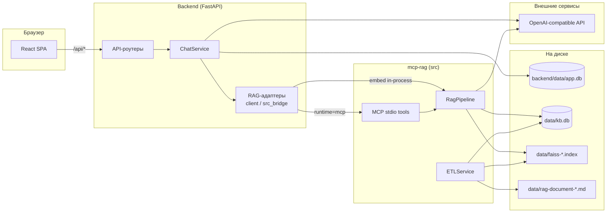
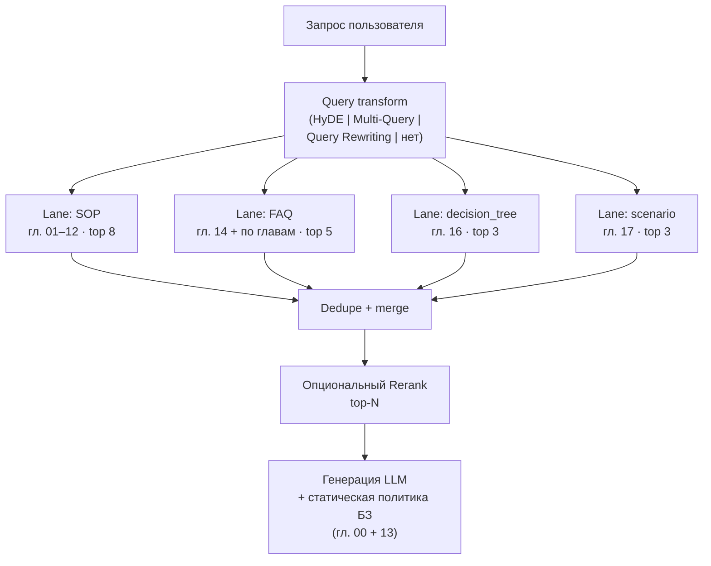
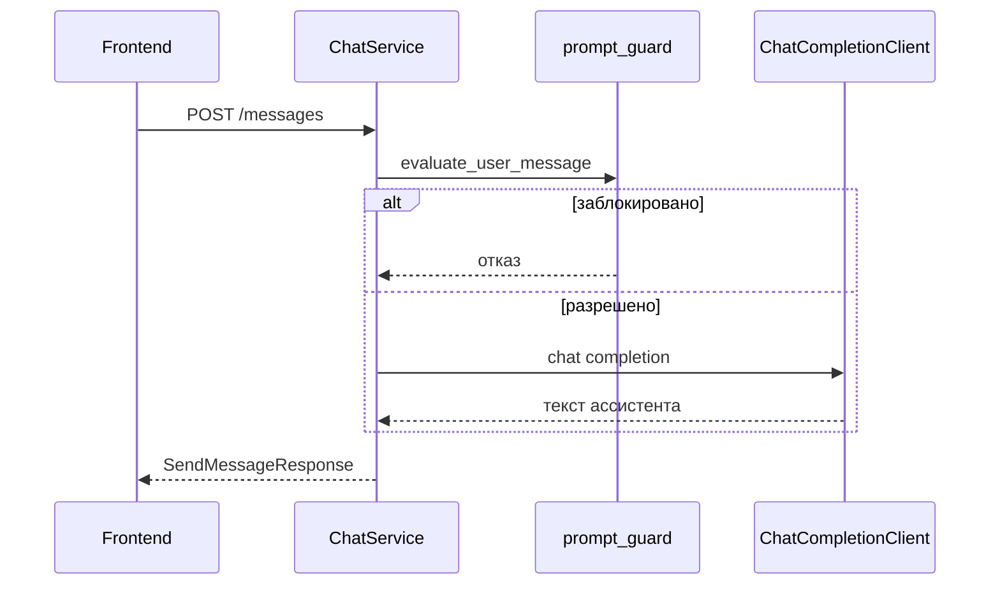

# Архитектура

[English](ARCHITECTURE.md) · **Русский**

В этом документе описана структура **avia-bot**: компоненты, потоки данных, правила слоёв и топология развёртывания. Запуск, команды и обзор возможностей — в [README_RU.md](../README_RU.md).

## Назначение

Avia-bot — демонстрационный RAG-ассистент для сотрудников аэропорта. Он отвечает на вопросы по внутренней markdown-базе знаний (SOP, FAQ, decision trees, сценарии) и поддерживает параллельный режим **только LLM** для свободного диалога. Интерфейс позволяет сравнивать методы RAG-retrieval (HyDE, Multi-Query, Query Rewriting, Rerank) по живой трассировке пайплайна.

Репозиторий — **monorepo**:

| Часть | Роль |
|-------|------|
| `backend/` | FastAPI — чаты, SSE, LLM guards; RAG через `mcp-rag` (`embed` или `mcp` stdio) |
| `mcp-rag/` | Канонический RAG + ETL (пакет `src/`), MCP stdio, CLI индексации |
| `frontend/` | React SPA — чат, панели настроек, трассировка |
| `data/` (корень репо) | Том KB — markdown, схемы, `kb.db`, FAISS |

## Контекст системы


```mermaid
flowchart LR
    subgraph client ["Браузер"]
        UI["React SPA"]
    end

    subgraph backend ["Backend (FastAPI)"]
        API["API-роутеры"]
        SVC["ChatService"]
        ADP["RAG-адаптеры\nclient / src_bridge"]
        API --> SVC
        SVC --> ADP
    end

    subgraph mcp_rag ["mcp-rag (src)"]
        RAG["RagPipeline"]
        ETL["ETLService"]
        MCP["MCP stdio tools"]
    end

    subgraph storage ["На диске"]
        APPDB[("backend/data/app.db")]
        KBDB[("data/kb.db")]
        FAISS["data/faiss-*.index"]
        DOC["data/rag-document-*.md"]
    end

    subgraph external ["Внешние сервисы"]
        LLM_API["OpenAI-compatible API"]
    end

    UI -->|"/api/*"| API
    SVC --> APPDB
    ADP -->|embed in-process| RAG
    ADP -->|runtime=mcp| MCP
    MCP --> RAG
    RAG --> KBDB
    RAG --> FAISS
    ETL --> DOC
    ETL --> KBDB
    ETL --> FAISS
    SVC --> LLM_API
    RAG --> LLM_API
```

В **разработке** Vite проксирует `/api` на `http://127.0.0.1:8000`. В **Docker** Nginx отдаёт собранный SPA и проксирует `/api` в контейнер backend.

## Структура репозитория

```
avia-bot/
├── backend/
│   ├── app/                 # FastAPI — в DB только чаты
│   │   ├── api/routers/     # HTTP (health, chats)
│   │   ├── services/        # ChatService, …
│   │   ├── repositories/    # chat repos
│   │   ├── models/          # Chat, ChatMessage
│   │   ├── rag/             # Тонкие адаптеры: client, types, mcp_deserialize, kb_access, src_bridge
│   │   ├── llm/             # Чат, guards (без KB ingest)
│   │   └── core/            # Конфиг, SSE, логи
│   └── data/                # app.db (чаты)
├── mcp-rag/
│   ├── src/                 # Канонический RAG + ETL (пакет `src`)
│   │   ├── rag/             # RagPipeline, retrieval, methods
│   │   ├── etl/             # Schema-driven chunker
│   │   ├── services/        # ETLService
│   │   ├── mcp/             # MCP tool handlers
│   │   └── core/            # Конфиг, FAISS, db_manager
│   ├── scripts/run_etl.py   # CLI индексации
│   └── Makefile             # etl-ingest, etl-stats, etl-manifest
├── data/                    # Том KB (git-источники + runtime-артефакты)
├── frontend/
└── Makefile                 # Делегирует etl-* в mcp-rag
```

## Слоистая архитектура backend

Backend следует **строгому направлению зависимостей**:

```
api/routers  →  services/  →  repositories/  →  models/
                      ↘  rag/  llm/  core/  ↗
```

| Слой | Расположение | Ответственность |
|------|--------------|-----------------|
| API | `backend/app/api/routers/` | HTTP, валидация, вызов сервисов |
| Service | `backend/app/services/` | Сценарии чата |
| Repository | `backend/app/repositories/` | CRUD чатов |
| RAG-адаптеры | `backend/app/rag/` | `EmbedRagClient`, `McpRagClient`, lazy-импорты `src` |
| **Канонический RAG/ETL** | **`mcp-rag/src/`** | `RagPipeline`, `ETLService`, FAISS, `kb.db` |

**Schemas** (`app/schemas/`) — Pydantic DTO для запросов и ответов, отдельно от таблиц SQLModel.

**Запрещённые сокращения:** `api → repository`, `api → models`, `repository → service`.

### Жизненный цикл запроса

1. Роут FastAPI принимает тело/query Pydantic и инжектит `DBManager` через `get_db()`.
2. Роут создаёт `ChatService(db)` и делегирует работу.
3. Сервис вызывает репозитории через `DBManager` (`db.chat`, …).
4. RAG: `get_rag_client()` → embed (`src.rag`) или MCP stdio.
4. При успехе сервис может вызвать `await db.commit()`; при выходе `DBManager` откатывает транзакцию и закрывает сессию.
5. `ServiceError` и подклассы `BaseCustomException` преобразуются в HTTP-ответы глобальными обработчиками.

### DBManager

`DBManager` — единая точка доступа к БД на запрос:

- `db.health` — проверки готовности
- `db.chat.chats`, `db.chat.messages` — диалоги

Доступ к KB для обогащения trace: `app/rag/kb_access.py` открывает короткую сессию к **`data/kb.db`** через mcp-rag `src`.

Используется как async context manager (`async with DBManager(SessionLocal) as db`) в зависимости FastAPI и в тестах.

## Тома данных

### `backend/data/app.db` (чаты)

| Таблица | Назначение |
|---------|------------|
| `chat` | Тред диалога (тип, настройки, мягкое удаление) |
| `chat_message` | Сообщения user/assistant с JSON metadata |

### `data/kb.db` + FAISS (база знаний)

| Артефакт | Назначение |
|----------|------------|
| `data/kb.db` — `chunk_meta`, `index_manifest` | Чанки + метаданные сборки |
| `data/faiss-{lang}.index` | FAISS `IndexFlatIP` по языку |
| `data/manifest-{lang}.json` | Sidecar-метаданные |
| `data/rag-document-{lang}.md` | Исходный markdown (git) |
| `data/chunking-schema-{lang}.json` | ETL schema v3 (git) |
| `data/ingest_checkpoint_{lang}.json` | Временный resume (удаляется при успехе) |

`id` чанка в `kb.db` должен совпадать с номером строки FAISS — пересобираются вместе при ingest.

## ETL-пайплайн (mcp-rag)

Канонический код: **`mcp-rag/src/`** (`ETLService`, `etl/universal_chunker.py`).  
**Нет** `/api/etl` на backend.

Точки входа:

| Вход | Команда / tool |
|------|----------------|
| Makefile | `make etl-ingest`, `make -C mcp-rag etl-ingest` |
| CLI | `mcp-rag/scripts/run_etl.py` |
| MCP | `ingest_schema`, `ingest_all`, `stats`, `index_status` |

См. [mcp-rag/src/etl/README_RU.md](../mcp-rag/src/etl/README_RU.md) и [operations_ru.md](operations_ru.md).

Источники: `data/rag-document-{lang}.md`. Группы глав — [knowledge_base_ru.md](knowledge_base_ru.md).

Главы **00** и **13** инжектируются при генерации через `src/llm/kb_static_context.py` — не в FAISS.

## RAG-пайплайн (mcp-rag)

Оркестратор: **`src/rag/pipeline.py`** (`RagPipeline`).  
Backend вызывает через:

| `rag_config.runtime` | Путь |
|----------------------|------|
| `embed` (по умолчанию) | `EmbedRagClient` → lazy import `src.rag.pipeline` |
| `mcp` | `McpRagClient` → stdio MCP tool `retrieve` |


```mermaid
flowchart TB
    Q["Запрос пользователя"]
    T["Query transform\n(HyDE | Multi-Query |\nQuery Rewriting | нет)"]
    L1["Lane: SOP\nгл. 01–12 · top 8"]
    L2["Lane: FAQ\nгл. 14 + по главам · top 5"]
    L3["Lane: decision_tree\nгл. 16 · top 3"]
    L4["Lane: scenario\nгл. 17 · top 3"]
    M["Dedupe + merge"]
    R["Опциональный Rerank\ntop-N"]
    G["Генерация LLM\n+ статическая политика БЗ\n(гл. 00 + 13)"]

    Q --> T
    T --> L1 & L2 & L3 & L4
    L1 & L2 & L3 & L4 --> M --> R --> G
```

### Методы query transform (взаимоисключающие)

| Метод | Модуль | Поведение |
|-------|--------|-----------|
| HyDE | `rag/methods/hyde.py` | LLM генерирует гипотетический ответ; поиск по его embedding |
| Multi-Query | `rag/methods/multi_query.py` | Несколько вариантов запроса → поиск по каждому → fusion RRF **внутри каждого lane** |
| Query Rewriting | `rag/methods/query_rewriting.py` | Переформулировка с учётом истории диалога |
| *(нет)* | — | Прямой векторный поиск по вопросу пользователя |

### Rerank (опционально, комбинируется)

`LlmRerankMethod` в `rag/methods/rerank.py` — LLM ранжирует объединённых кандидатов из lane после векторного поиска.

### Multi-lane retrieval

Определения lane — в `src/rag/retrieval_lanes.py`. Decision-tree walkthrough: `src/rag/decision_tree.py` (из `ChatService` через `src_bridge`).

| Lane | Фильтр `content_type` | Квота | Источник |
|------|----------------------|-------|----------|
| `sop` | `sop` | 8 | Главы 01–12 |
| `faq` | `faq` | 5 | Глава 14 + FAQ из 01–12 |
| `decision_tree` | `decision_tree` | 3 | Глава 16 |
| `scenario` | `scenario` | 3 | Глава 17 |

Внутри lane FAISS возвращает глобальный top; результаты **фильтруются по `content_type`** (с oversampling). Несколько поисковых запросов (Multi-Query / HyDE / Rewriting) сливаются внутри lane через **reciprocal rank fusion** (`retrieval.py`). Hits из lane дедуплицируются по id чанка, затем опционально rerank или обрезка до `top_chunks`.

У каждого `RetrievedChunk` есть поле `retrieval_lane` для трассировки и UI.

### Проработка дерева решений

Если lane `decision_tree` возвращает чанк с similarity не ниже порога (`DECISION_TREE_MIN_SIMILARITY`, по умолчанию **0.30**), пайплайн считает ситуацию **операционной** — нужен отдельный пошаговый алгоритм, а не общий справочный ответ.

Логика — в `src/rag/decision_tree.py`; оркестрация — в `RagPipeline` и `ChatService` (через `src_bridge`):

1. **Детекция** — после multi-lane retrieval `select_applicable_decision_trees()` смотрит на lane `decision_tree` независимо от глобальной обрезки `top_chunks` (не более одного дерева на ответ).
2. **Разделение контекста** — совпавшие чанки `decision_tree` **исключаются** из общего RAG-контекста, чтобы основной ответ не размывался смешением корпусов.
3. **Отдельная генерация** — второй вызов LLM проходит по дереву и формирует нумерованный оперативный чеклист (немедленные действия, выбор ветки, критические шаги безопасности). Результат сохраняется в metadata ответа ассистента как `decision_tree_guidance`.
4. **Общий ответ** — обычная RAG-генерация по оставшимся чанкам (SOP, FAQ, scenario).

В trace при срабатывании добавляются шаги `decision_tree` (совпавшие hits из lane) и `decision_tree_generation` (проработка применена).

### Трассировка

Каждый шаг пайплайна формирует `RagTraceStep` (имя, длительность, структурированные данные). Типичные шаги:

| Шаг | Содержание |
|-----|------------|
| `rag_config` | Снимок настроек RAG для этого ответа (HyDE, Multi-Query, Rerank, `top_chunks`) |
| `hyde` / `multi_query` / `query_rewriting` | Сгенерированные поисковые запросы (если включены) |
| `retrieval` | Hits по lane (`lanes[]` с `label`, `description`, `top_k`, `hits`) и объединённые кандидаты |
| `rerank` | Финальный ранжированный список (если включён) |
| `decision_tree` | Применимые hits дерева решений из lane `decision_tree` (similarity ≥ порога) |
| `decision_tree_generation` | Отдельная проработка совпавшего дерева (если применена) |

Шаги:

1. Публикуются клиенту через **SSE** (`event: trace`).
2. Сохраняются в `metadata.rag_trace` ответа ассистента (вместе с `retrieved_chunks`, включая `retrieval_lane` и `retrieval_lane_label`).

**Панель трассировки** (`features/trace/`) показывает: применённые настройки RAG для последнего ответа, поисковые запросы, раскрываемые hits по корпусу/lane и чанки, ушедшие в генерацию. **Панель настроек RAG** над ней редактирует значения чата для следующего сообщения.

Отсутствие индекса → HTTP `503` с `rag_index_missing`.

## Потоки чата

### Режим LLM


```mermaid
sequenceDiagram
    participant UI as Frontend
    participant API as ChatService
    participant Guard as prompt_guard
    participant LLM as ChatCompletionClient

    UI->>API: POST /messages
    API->>Guard: evaluate_user_message
    alt заблокировано
        Guard-->>API: отказ
    else разрешено
        API->>LLM: chat completion
        LLM-->>API: текст ассистента
    end
    API-->>UI: SendMessageResponse
```

- По умолчанию: авиационный системный промпт (`llm/prompts.py`) + усиление разделителями (`<<USER>>` … `<</USER>>`).
- **Свой системный промпт** (`llm_config`): guard отключены; пустой промпт = без system message.
- Включение истории — через `use_history`.

### Режим RAG

1. Тот же pre-check guard, что и в LLM (если не переопределено правилами режима).
2. `RagPipeline.run()` — retrieval + trace.
3. Блок контекста из найденных чанков **без** применимых деревьев решений (`src/rag/generation.py`).
4. System prompt = RAG-шаблон + статические главы 00/13 + контекст.
5. `ChatCompletionClient` генерирует общий ответ.
6. Если дерево решений совпало — **второй** вызов LLM формирует оперативную проработку (`decision_tree_guidance` в metadata).
7. Trace уходит по SSE во время запроса; сохраняется в metadata сообщения.

### Заголовок чата

После первого обмена `chat_title.py` может асинхронно сгенерировать заголовок через LLM (SSE-событие `chat_title`).

## События в реальном времени (SSE)

`SSEManager` (`app/core/sse_manager.py`) — in-memory pub/sub по ключу `client_id` (генерируется на frontend).

| Endpoint | Типы событий |
|----------|--------------|
| `GET /api/chats/events?client_id=…` | `trace`, `error`, `chat_title` |

Клиент открывает SSE до `POST /messages` и передаёт тот же `client_id` в теле сообщения. Используется для трассировки пайплайна и асинхронных уведомлений при синхронном HTTP-ответе.

## Защита от prompt injection

Применяется в режимах **LLM** и **RAG** (не при включённом custom system prompt в LLM):

| Слой | Модуль | Роль |
|------|--------|------|
| System prompt | `llm/prompts.py` | Авиационная область, отказ от jailbreak |
| Усиление сообщений | `llm/prompt_guard.py` | Разделители, санитизация |
| Pre-flight block | `ChatService` | Regex для явных injection / off-topic |

## Архитектура frontend

React 19 SPA с feature-based структурой папок.

### Layout

Трёхколоночная оболочка (`app/layout/AppLayout.tsx`):

| Колонка | Режим RAG | Режим LLM |
|---------|-----------|-----------|
| Sidebar | Список чатов | Список чатов |
| Центр | Диалог + composer | Диалог + composer |
| Справа | Панель трассировки (lane, применённые настройки, чанки) | Панель параметров LLM |

В режиме RAG при наличии `metadata.decision_tree_guidance` панель чата показывает **карточку оперативного алгоритма** над обычным текстом ответа (`DecisionTreeGuidanceBlock` в `features/chat/components/ChatPanel.tsx`). Карточка выделена **предупреждающим цветом** (рамка и фон), чтобы дежурный персонал сразу видел пошаговую процедуру отдельно от справочного текста.

Переключатель режима в шапке (`features/chat/modeStore.ts` — Zustand). Списки чатов фильтруются по `chat_type` на API.

### Состояние и загрузка данных

| Задача | Технология |
|--------|------------|
| Серверное состояние | TanStack Query (`shared/api/queryClient.ts`, `shared/api/chats.ts`) |
| Настройки UI | Zustand stores (`ragSettingsStore`, `llmSettingsStore`, `theme/store`, `chats/store`) |
| SSE | хук `useChatEvents` в `AppProviders` |
| i18n | `shared/i18n/` — русский (по умолчанию) и английский |
| Тема | `theme/themes.json` + сохранение в `localStorage` |

Настройки отправляются с каждым сообщением (`rag_config`, `llm_config`, `use_history`), чтобы backend снимал их в metadata.

### API-клиент

Все вызовы backend идут на `/api/*` (относительный URL). Dev: прокси Vite (`vite.config.ts`). Prod: прокси Nginx (`frontend/nginx.conf`).

## Конфигурация

Настройки через **pydantic-settings**:

| Пакет | Модуль | Префикс | Примеры |
|-------|--------|---------|---------|
| backend | `app/core/config.py` | `LLM__`, `DB__`, `APP__` | БД чатов, CORS, LLM API |
| mcp-rag | `src/core/config.py` | `MCP_RAG__`, `LLM__`, `DB__`, `DATA__`, `FAISS__` | `kb.db`, FAISS, пути ETL |

См. [configuration_ru.md](configuration_ru.md) — раскладка томов (`backend/data/app.db` vs `data/`).

## Топологии развёртывания

### Локальная разработка

| Сервис | URL |
|--------|-----|
| Backend | `http://127.0.0.1:8000` (`make backend-dev`) |
| Frontend | `http://127.0.0.1:5173` (`make frontend-dev`) |

### Docker Compose

| Сервис | Образ | Доступ |
|--------|-------|--------|
| `backend` | `backend/Dockerfile` (uv + Python 3.13) | Внутренний `:8000`, healthcheck `/api/healthz` |
| `frontend` | `frontend/Dockerfile` (Node build → Nginx) | Хост `:8080` (настраивается `FRONTEND_PORT`) |

Тома данных (этап 9):

| Mount | Содержимое |
|-------|------------|
| `./backend/data` | `app.db` (чаты) |
| `./data` | `kb.db`, FAISS, markdown, схемы |

См. [deployment_ru.md](deployment_ru.md).

## Внешние зависимости

| Зависимость | Использование |
|-------------|---------------|
| OpenAI-compatible chat API | Completions, HyDE, multi-query, rewriting, rerank, заголовки |
| OpenAI-compatible embeddings API | Индексация чанков, embedding запросов |
| FAISS (`faiss-cpu`) | Векторный поиск в процессе; CPU-сборка без AVX — ожидаемое поведение |

## Обработка ошибок

- **Repositories** пробрасывают сырые ошибки SQLAlchemy.
- **Services** используют `@handle_basic_db_errors` для маппинга сбоев БД в `Database*`-исключения.
- **API** регистрирует обработчики для `ServiceError`, `BaseCustomException` и необработанных ошибок (`exceptions/__init__.py`).
- Health: `/api/healthz` (liveness), `/api/readyz` (готовность БД).

## Тестирование

| Набор | Расположение | Фокус |
|-------|--------------|-------|
| API integration | `backend/tests/api/` | HTTP-контракты, чат |
| Unit | `backend/tests/unit/` | RAG client, prompt guard, services |
| Parity (opt-in) | `backend/tests/parity/` | embed vs MCP stdio (`--run-parity`) |
| mcp-rag unit | `mcp-rag/tests/` | ETL chunker, MCP tools |

Запуск: `make backend-test`. ETL-тесты — в **`mcp-rag/tests/`**. См. [backend/tests/README_RU.md](../backend/tests/README_RU.md).

## Поверхность API (кратко)

| Область | Префикс | Ключевые endpoints |
|---------|---------|-------------------|
| Health | `/api` | `GET /healthz`, `GET /readyz` |
| Chats | `/api/chats` | CRUD, `POST /{id}/messages`, `GET /events` (SSE) |

Индексация (ETL) **не** на backend HTTP — `make etl-ingest`, `mcp-rag/scripts/run_etl.py` или MCP tools. См. [operations_ru.md](operations_ru.md).

Полные формы запросов/ответов — в `app/schemas/`.

## Ограничения и компромиссы

- **SQLite + FAISS на диске** — простое demo-развёртывание; горизонтальное масштабирование потребует вынести состояние наружу.
- **Синхронная обработка сообщений** — LLM/RAG выполняется в обработчике POST; SSE только sideband (потоковая отдача токенов пока нет).
- **In-memory SSE** — один процесс; несколько реплик backend потребуют общую шину событий.
- **Инкрементальный ETL** — diff по content-hash снижает стоимость re-embed; полная пересборка — `rebuild=true`.
- **Единый FAISS-индекс** — все корпуса в одном `faiss.index`; lane фильтруют по `content_type` при запросе (отдельные индексы на корпус пока не используются).
- **Согласованность chunk/FAISS** — полная замена при ingest сохраняет выравнивание id.

## Связанная документация

| Документ | Содержание |
|----------|------------|
| [README_RU.md](README_RU.md) | Индекс документации |
| [README_RU.md](../README_RU.md) | Быстрый старт, скриншоты, список возможностей |
| [PRD_RU.md](PRD_RU.md) | Продуктовые требования (бизнес-вид) |
| [api_ru.md](api_ru.md) | Справочник HTTP API |
| [deployment_ru.md](deployment_ru.md) | Runbook развёртывания |
| [operations_ru.md](operations_ru.md) | ETL, бэкапы, troubleshooting |
| [mcp-rag/src/etl/README_RU.md](../mcp-rag/src/etl/README_RU.md) | Внутренности schema-driven ETL |
| [backend/tests/README_RU.md](../backend/tests/README_RU.md) | Структура тестов и команды |
| [adr/](adr/) | Architecture Decision Records |
