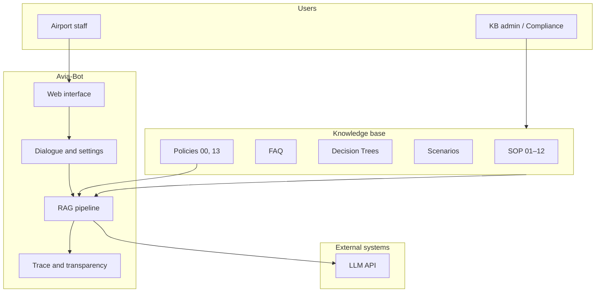

# PRD: AI Airport Staff Assistant (Avia-Bot)

**English** · [Русский](PRD_RU.md)

**Version:** 1.0  
**Date:** July 11, 2026  
**Status:** Demonstration MVP → product concept  
**Sources:** [README.md](../README.md), [ARCHITECTURE.md](ARCHITECTURE.md), knowledge base `backend/data/rag-document.md` (chapters 00, 13)

---

## 1. Executive summary

**Avia-Bot** is a corporate AI assistant for airport staff that provides fast answers from internal regulations (SOP), FAQ, decision trees, and practical scenarios. The product reduces information lookup time, standardizes service quality, and accelerates onboarding for new employees.

A **demonstration MVP** is currently implemented on an educational knowledge base (~6800 lines of markdown). It proves the technical viability of the RAG approach and allows comparing retrieval methods (HyDE, Multi-Query, Query Rewriting, Rerank). The next step is a pilot on real airport documentation with integration into corporate infrastructure.

**Key business value:** staff get an answer in seconds instead of minutes spent searching PDFs, Confluence, or asking colleagues — especially in stressful and non-standard situations.

---

## 2. Problem and opportunity

### 2.1. Business problem

| Problem | Business impact |
|---------|-----------------|
| Fragmented documentation (SOP, FAQ, service-specific instructions) | Long onboarding, procedural errors |
| High turnover and shift work | Loss of expertise, inconsistent service quality |
| Non-standard situations at the counter/boarding gate | Flight delays, passenger complaints, safety risks |
| No single access point to current rules | Staff act from memory or call a supervisor |
| Regulation updates | New versions reach the front line with delay |

### 2.2. Opportunity

The airport already formalizes knowledge in SOP and FAQ. RAG can turn this documentation into an **interactive assistant** that:

- answers in natural language;
- references specific regulation sections;
- behaves predictably within defined policy (scope / out-of-scope);
- does not replace humans but **supports decision-making**.

---

## 3. Vision and mission

**Vision:** every airport employee — from the check-in counter to security — has instant access to current procedures through a single AI interface.

**Mission:** reduce time to operational knowledge and improve consistency of staff actions without reducing human accountability for the final decision.

**Product principle** (from the knowledge base, ch. 00): the bot is a **support tool, not a replacement for staff**. Answers are advisory; in doubtful and critical cases — escalation to a supervisor or the relevant service.

---

## 4. Target audience and personas

### 4.1. Primary users (B2E — business to employee)

| Persona | Role | Typical queries | Value |
|---------|------|-----------------|-------|
| **Anna, check-in agent** | Frontline, high passenger flow | Child baggage, late arrival, documents | Fast answer without leaving the counter |
| **Igor, screening officer** | Security | Prohibited items, scanner alert procedures | Fewer procedural errors |
| **Maria, hall supervisor** | Shift lead | Non-standard situations, complaint escalation | Single reference line for the team |
| **Dmitry, new hire** | Onboarding 1–3 months | "What to do if…", general SOP | Shorter time to independent work |

### 4.2. Secondary stakeholders

| Stakeholder | Interest |
|-------------|----------|
| **Operations director** | Process stability, fewer incidents |
| **HR / training** | Training material, knowledge checks |
| **Compliance / quality** | Regulation adherence, answer audit |
| **IT / security** | Data control, corporate network integration |
| **Knowledge management** | Feedback for knowledge base updates |

### 4.3. Who is NOT a user (current scope)

- Passengers (the product targets **internal** staff; passenger questions in the KB serve as context for staff).
- Legal, finance, HR on salary — explicitly out of scope.

---

## 5. Business goals and success metrics

### 5.1. Strategic goals

1. **Reduce time to obtain operational information** (target: from 5–15 min to < 30 sec).
2. **Lower escalation of "simple" questions** to supervisors.
3. **Accelerate onboarding** of new employees.
4. **Improve consistency** of SOP application in non-standard situations.

### 5.2. KPIs (pilot and production)

| Metric | Description | Target (pilot) |
|--------|-------------|----------------|
| **Time-to-answer** | Time from question to answer | < 10 sec (p95) |
| **Adoption rate** | % of staff who used the bot in a month | > 40% of target group |
| **Queries per active user** | Average queries per active user | Growth curve in first 4 weeks |
| **Self-service rate** | % of questions answered satisfactorily without escalation | > 70% |
| **Escalation appropriateness** | Correctness of refusals and referrals to services | Sample audit, > 90% |
| **Knowledge gap signals** | Frequent questions without a good answer | List for KB updates |
| **Incident correlation** | Link between bot usage and operational incidents | No increase in incidents due to wrong advice |

### 5.3. Demo/training metrics (current stage)

| Metric | Purpose |
|--------|---------|
| RAG method comparison by chunk relevance | Choose configuration for pilot |
| Trace completeness (lanes, rerank) | Transparency for compliance and QA |
| Answer accuracy on a test question set | Benchmark before production |

---

## 6. Product positioning

### 6.1. What it is

A **corporate RAG assistant** with a web interface for airport staff, operating **only** on an approved internal knowledge base.

### 6.2. Differentiation from alternatives

| Alternative | Drawback | Avia-Bot advantage |
|-------------|----------|-------------------|
| Confluence/SharePoint search | Keywords, noise | Semantic search + answer in plain language |
| "Ask ChatGPT" | Hallucinations, data leakage, no corporate regulations | Answers only from KB + refusal policy |
| Call a supervisor | Distracting, does not scale | 24/7 self-service for typical questions |
| Printed SOPs | Become outdated, inconvenient on the line | Current version after ETL update |

### 6.3. Two operating modes (product logic)

| Mode | Business scenario | Target user |
|------|-------------------|-------------|
| **RAG** | Operational questions on regulations | Frontline staff, supervisors |
| **LLM** | Free-form aviation dialogue (training, experiments) | Training, IT, R&D; **not** for operational decisions without KB |

For production, **the primary mode is RAG**. LLM mode is auxiliary or role-restricted.

---

## 7. Product scope

### 7.1. In scope — knowledge base topics

Per documentation chapters 00 and 13:

- Passenger service standards
- Check-in, boarding, screening
- Baggage
- Aviation security
- Passport and customs control
- Special passenger categories (PRM, children, animals, etc.)
- Non-standard and emergency situations
- Inter-service coordination at the airport
- Complaint and conflict handling
- Internal regulations and policies (from KB)

### 7.2. Out of scope — hard boundaries

- Finance, salary, budgets
- Personal data of passengers and employees
- Legal advice
- Confidential investigations
- Employment contracts, HR details
- Commercial contracts and suppliers
- Equipment technical documentation (unless in SOP)
- Real-time operational information (flight status, passenger location) — **not in KB**

### 7.3. Answer policy (business rules)

1. Answers are **advisory**, not a substitute for an official order.
2. For questions outside the KB — **polite refusal** + referral to the relevant service.
3. In critical situations — recommend **contacting a live employee**.
4. If the user is unsure — verify against the document or a supervisor.
5. Questions may be **anonymously analyzed** to improve the system (requires DPO agreement).

---

## 8. User stories

### 8.1. Must have (implemented in MVP)

| ID | As a… | I want to… | So that… |
|----|-------|------------|----------|
| US-01 | staff member | ask a question in Russian/English in chat | quickly get an answer on a procedure |
| US-02 | staff member | see which KB sections the answer came from (trace, chunks) | trust the answer and verify the source |
| US-03 | staff member | maintain multiple conversations (chats) | separate topics (baggage / security) |
| US-04 | supervisor | configure the search method (HyDE, Multi-Query, etc.) | pick the best configuration for question types |
| US-05 | KB administrator | update markdown and re-index | refresh answers without development |
| US-06 | staff member | get a refusal on salary/PII questions | not receive incorrect or unsafe information |
| US-07 | user | switch UI language and theme | work comfortably during a shift |

### 8.2. Should have (defined in KB, partially not in product)

| ID | Scenario | Status |
|----|----------|--------|
| US-08 | Report an incorrect answer (feedback) | Described in KB, **UI not implemented** |
| US-09 | Escalation to operator / service | Policy in KB, **automatic routing not implemented** |
| US-10 | Glossary term search (ch. 15) | **Disabled in MVP** |
| US-11 | Access via Telegram on mobile | Config stub present, **bot not implemented** |

### 8.3. Could have (roadmap)

- SSO / corporate authentication (AD, Keycloak)
- Role-based access to KB sections
- Analytics: top questions, KB gaps
- Document versioning and audit of "which version the answer is based on"
- Answer streaming (currently synchronous POST + SSE for trace only)
- Integration with airport systems (AODB, CRM) for operational data
- Answer languages beyond RU/EN

---

## 9. Functional requirements

### 9.1. Knowledge management

| ID | Requirement | Priority | MVP |
|----|-------------|----------|-----|
| FR-KB-01 | Single source — structured markdown with content types (SOP, FAQ, decision tree, scenario) | P0 | ✅ |
| FR-KB-02 | Indexing: parse → chunk → embed → SQLite + FAISS | P0 | ✅ |
| FR-KB-03 | Incremental update (no full re-embed of unchanged chunks) | P1 | ✅ |
| FR-KB-04 | Resume on ingest interrupt | P2 | ✅ |
| FR-KB-05 | Meta-policies (ch. 00, 13) in system prompt, not in search | P0 | ✅ |
| FR-KB-06 | Glossary in search | P2 | ❌ |

### 9.2. Dialogue and answers

| ID | Requirement | Priority | MVP |
|----|-------------|----------|-----|
| FR-CHAT-01 | Chat CRUD, message history | P0 | ✅ |
| FR-CHAT-02 | RAG mode: multi-lane search (SOP / FAQ / decision trees / scenarios) | P0 | ✅ |
| FR-CHAT-03 | Configurable RAG methods + rerank | P1 | ✅ |
| FR-CHAT-04 | Settings snapshot in each answer's metadata | P1 | ✅ |
| FR-CHAT-05 | Auto-generated chat title | P2 | ✅ |
| FR-CHAT-06 | Citation / section reference in answer | P1 | ✅ (via trace) |
| FR-CHAT-07 | LLM mode for free-form dialogue | P2 | ✅ |

### 9.3. Security and compliance

| ID | Requirement | Priority | MVP |
|----|-------------|----------|-----|
| FR-SEC-01 | System prompt: aviation scope, jailbreak refusal | P0 | ✅ |
| FR-SEC-02 | Delimiter hardening of user input | P0 | ✅ |
| FR-SEC-03 | Pre-flight block of obvious injection/off-topic | P0 | ✅ |
| FR-SEC-04 | User authentication | P0 (prod) | ❌ |
| FR-SEC-05 | Query audit logs | P1 (prod) | ❌ |
| FR-SEC-06 | Role-based restriction of LLM free-mode (no guards) | P1 | ❌ |

### 9.4. Observability and trust

| ID | Requirement | Priority | MVP |
|----|-------------|----------|-----|
| FR-OBS-01 | Pipeline trace: query transform, lanes, rerank, chunks | P0 | ✅ |
| FR-OBS-02 | SSE for real-time trace | P1 | ✅ |
| FR-OBS-03 | Business metrics dashboard | P2 | ❌ |

### 9.5. Deployment

| ID | Requirement | Priority | MVP |
|----|-------------|----------|-----|
| FR-DEP-01 | Local development (backend + frontend) | P0 | ✅ |
| FR-DEP-02 | Docker Compose for demo/pilot | P1 | ✅ |
| FR-DEP-03 | Horizontal scaling | P2 (prod) | ❌ |

---

## 10. Non-functional requirements

| Category | Requirement (production target) | Current MVP |
|----------|-----------------------------------|-------------|
| **Availability** | 99.5% during airport operating hours | Not guaranteed (demo) |
| **Latency** | p95 < 10 sec for RAG answer | Depends on LLM API |
| **Scale** | Hundreds of concurrent users | Single process, SQLite, in-memory SSE |
| **Confidentiality** | Data stays on-prem (on-prem LLM) | Depends on chosen LLM provider |
| **Localization** | UI RU/EN; answer in question language | ✅ |
| **Accessibility (a11y)** | WCAG 2.1 AA | Not claimed |
| **Maintainability** | KB update without code release | ✅ (ETL + ingest) |

---

## 11. Product architecture (business view)

**Key product principle:** the answer is built from **verifiable KB fragments** (trace), not from model "memory". This is the foundation of trust for compliance.

---

## 12. Typical use cases

### UC-01: Procedure question (happy path)

1. A check-in agent asks: "How do I check baggage for a child?"
2. The system searches SOP + FAQ lanes.
3. It forms an answer based on chunks.
4. Trace shows sections and scores.
5. The agent applies the procedure; if unsure — verifies against the full SOP.

### UC-02: Non-standard situation (decision tree)

1. A suspicious item is found.
2. Staff asks: "What should I do?"
3. RAG retrieves decision tree 16.2.
4. The answer is a step-by-step algorithm.
5. At the critical phase the bot reminds to call security.

### UC-03: Out-of-scope question

1. "How much does a pilot earn?"
2. The system refuses (ch. 13 + guards).
3. It directs to HR.
4. **Business value:** no leakage or hallucinations on a sensitive topic.

### UC-04: RAG method comparison (demo/QA)

1. The QA team asks one question with different settings.
2. They compare trace: which chunks matched, impact of HyDE vs Multi-Query.
3. They choose the configuration for the pilot.

---

## 13. Current state vs roadmap

### 13.1. Implemented (MVP / demo)

- Backend: ETL, FAISS, multi-lane RAG, chats, LLM/RAG replies, SSE trace, prompt guards
- Frontend: three-column UI, RAG/LLM settings, trace viewer, i18n, themes
- Docker: nginx + backend, persistence in `backend/data/`
- Educational KB with realistic airport SOP structure

### 13.2. Proposed phases (business roadmap)

| Phase | Focus | Business outcome |
|-------|-------|------------------|
| **0. Demo (now)** | Educational KB, RAG comparison | Proof of concept for stakeholders |
| **1. Pilot** | Real KB for one service, SSO, feedback | Measurable KPIs on a limited group |
| **2. Expansion** | All services, glossary, roles, analytics | Scale across the airport |
| **3. Channels** | Telegram / mobile, integrations | Access in the field, at the counter |
| **4. Operations** | HA, monitoring, KB versioning | Production SLA |

---

## 14. Risks and mitigations

| Risk | Likelihood | Impact | Mitigation |
|------|------------|--------|------------|
| LLM hallucinations | Medium | High | RAG + trace + refusal policy; mandatory "advisory" disclaimer |
| Outdated KB | High | High | KB owner process, regular ETL, versioning |
| Wrong interpretation in critical situation | Medium | Critical | Decision trees, human escalation, staff training |
| Leakage via LLM API | Medium | High | On-prem / private LLM, no PII in prompts |
| Low adoption | Medium | Medium | Pilot with shift leads, training, process integration |
| Legal liability for advice | Medium | High | Disclaimer, usage policy, audit |
| Scaling (SQLite, single-process SSE) | High at growth | Medium | PostgreSQL, Redis pub/sub, external vector DB |

---

## 15. Dependencies and assumptions

### Dependencies

- **Structured** internal documentation (or readiness to create it).
- Access to **LLM API** (chat + embeddings) — cloud or on-prem.
- Sponsorship from **operations** and **compliance**.
- IT infrastructure for deployment (Docker / K8s, corporate network).

### Assumptions

- Staff have access to the corporate web interface (PC or tablet).
- The knowledge base is kept current by a responsible owner.
- Users understand the bot **does not replace** a supervisor in exceptional cases.

---

## 16. Pilot readiness criteria (Go/No-Go)

| # | Criterion |
|---|-----------|
| 1 | **Real** KB loaded for at least one operational area (not educational) |
| 2 | Test set of ≥ 50 typical questions passed with compliance review |
| 3 | Authentication and basic audit implemented |
| 4 | Query handling policy agreed with DPO / legal |
| 5 | KB owner and update process defined |
| 6 | Production RAG configuration chosen from demo A/B results |
| 7 | Training and support plan for pilot group (20–50 people) |

---

## 17. Open business questions

1. **Access channel:** web in corporate network only, or also Telegram/mobile for frontline staff?
2. **LLM model:** cloud vs on-prem — balance of cost, quality, and compliance.
3. **Feedback loop:** who handles incorrect-answer reports and how fast is the KB updated?
4. **Roles:** different access to sections (security vs check-in)?
5. **Operational system integration:** flight status in v1 or deliberately out of scope?
6. **Pilot success metrics:** which 2–3 KPIs are critical to continue investment?
7. **Branding and tone:** "official regulation" vs "friendly assistant"?

---

## 18. Summary

**Avia-Bot** is a product with clear business logic: give airport staff fast, controlled, and verifiable access to operational knowledge. Technically, the MVP already demonstrates the core (RAG, multi-lane retrieval, trace, guards, ETL). From a business perspective, the next step is not new RAG methods but a **pilot on real KB**, **authentication**, **feedback**, and **operational metrics** to move from demonstration to measurable value for the airport.

---

## Related documentation

| Document | Content |
|----------|---------|
| [README.md](../README.md) | Product overview, quick start, features |
| [ARCHITECTURE.md](ARCHITECTURE.md) | Technical architecture |
| [backend/data/rag-document.md](../backend/data/rag-document.md) | Educational knowledge base |
