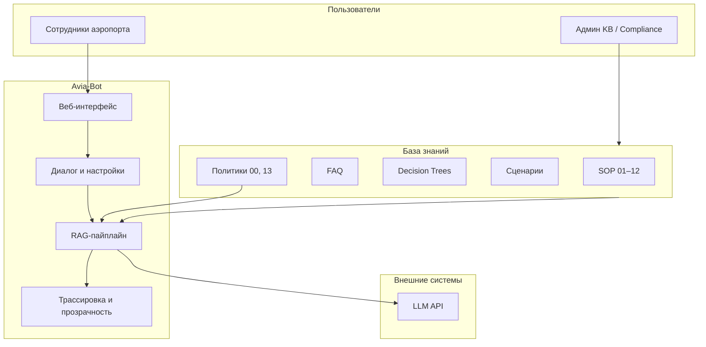

# PRD: AI-помощник сотрудника аэропорта (Avia-Bot)

[English](PRD.md) · **Русский**

**Версия:** 1.0  
**Дата:** 11 июля 2026  
**Статус:** Демонстрационный MVP → продуктовая концепция  
**Источники:** [README_RU.md](../README_RU.md), [ARCHITECTURE_RU.md](ARCHITECTURE_RU.md), база знаний `backend/data/rag-document.md` (главы 00, 13)

---

## 1. Резюме для руководства

**Avia-Bot** — корпоративный AI-ассистент для сотрудников аэропорта, который даёт быстрые ответы по внутренним регламентам (SOP), FAQ, деревьям решений и практическим сценариям. Продукт снижает время поиска информации, выравнивает качество обслуживания и ускоряет адаптацию новых сотрудников.

Сейчас реализован **демонстрационный MVP** на учебной базе знаний (~6800 строк markdown). Он доказывает техническую жизнеспособность RAG-подхода и позволяет сравнивать методы поиска (HyDE, Multi-Query, Query Rewriting, Rerank). Следующий этап — перевод в пилот на реальной документации аэропорта с интеграцией в корпоративную инфраструктуру.

**Ключевая бизнес-ценность:** сотрудник получает ответ за секунды вместо минут поиска в PDF, Confluence или у коллег — особенно в стрессовых и нестандартных ситуациях.

---

## 2. Проблема и возможность

### 2.1. Бизнес-проблема

| Проблема | Влияние на бизнес |
|----------|-------------------|
| Разрозненная документация (SOP, FAQ, инструкции по службам) | Долгий онбординг, ошибки в процедурах |
| Высокая текучка и сменный график | Потеря экспертизы, неоднородное качество сервиса |
| Нестандартные ситуации у стойки/на посадке | Задержки рейсов, жалобы пассажиров, риски безопасности |
| Отсутствие единой точки доступа к актуальным правилам | Сотрудники действуют «по памяти» или звонят руководителю |
| Обновление регламентов | Новые версии доходят до линии с задержкой |

### 2.2. Возможность

Аэропорт уже формализует знания в SOP и FAQ. RAG позволяет превратить эту документацию в **интерактивного помощника**, который:

- отвечает на естественном языке;
- ссылается на конкретные разделы регламентов;
- ведёт себя предсказуемо в рамках заданной политики (scope / out-of-scope);
- не заменяет человека, а **поддерживает решение**.

---

## 3. Видение и миссия

**Видение:** каждый сотрудник аэропорта — от стойки регистрации до службы безопасности — имеет мгновенный доступ к актуальным процедурам через единый AI-интерфейс.

**Миссия:** сократить время доступа к операционным знаниям и повысить согласованность действий персонала, не снижая ответственность человека за финальное решение.

**Принцип продукта** (из базы знаний, гл. 00): бот — **инструмент поддержки, а не замена сотрудника**. Ответы справочные; в сомнительных и критических случаях — эскалация к руководителю или профильной службе.

---

## 4. Целевая аудитория и персоны

### 4.1. Первичные пользователи (B2E — business to employee)

| Персона | Роль | Типичные запросы | Ценность |
|---------|------|------------------|----------|
| **Анна, агент регистрации** | Frontline, высокий поток пассажиров | Багаж ребёнка, опоздание, документы | Быстрый ответ без отрыва от стойки |
| **Игорь, сотрудник досмотра** | Безопасность | Запрещённые предметы, процедуры при срабатывании сканера | Снижение ошибок в процедурах |
| **Мария, супервайзер зала** | Руководитель смены | Нештатные ситуации, эскалация жалоб | Единая линия для команды |
| **Дмитрий, новый сотрудник** | Онбординг 1–3 месяца | «Что делать, если…», общие SOP | Сокращение времени до самостоятельной работы |

### 4.2. Вторичные стейкхолдеры

| Стейкхолдер | Интерес |
|-------------|---------|
| **Операционный директор** | Стабильность процессов, меньше инцидентов |
| **HR / обучение** | Материал для тренингов, контроль знаний |
| **Compliance / качество** | Соответствие регламентам, аудит ответов |
| **ИТ / безопасность** | Контроль данных, интеграция в корп. сеть |
| **Knowledge management** | Обратная связь для обновления базы |

### 4.3. Кто НЕ является пользователем (в текущем scope)

- Пассажиры (продукт ориентирован на **внутренний** персонал; пассажирские вопросы в KB — как контекст для сотрудника).
- Юристы, финансы, HR по зарплате — явно out of scope.

---

## 5. Бизнес-цели и метрики успеха

### 5.1. Стратегические цели

1. **Сократить время получения операционной информации** (целевой ориентир: с 5–15 мин до < 30 сек).
2. **Снизить количество эскалаций «простых» вопросов** к руководителю.
3. **Ускорить онбординг** новых сотрудников.
4. **Повысить единообразие** применения SOP в нестандартных ситуациях.

### 5.2. KPI (для пилота и продакшена)

| Метрика | Описание | Целевое значение (пилот) |
|---------|----------|----------------------------|
| **Time-to-answer** | Время от вопроса до ответа | < 10 сек (p95) |
| **Adoption rate** | % сотрудников, использовавших бот за месяц | > 40% целевой группы |
| **Queries per active user** | Среднее число запросов на активного пользователя | Рост кривой в первые 4 недели |
| **Self-service rate** | % вопросов, на которые бот дал удовлетворительный ответ без эскалации | > 70% |
| **Escalation appropriateness** | Корректность отказов и направлений к службам | Аудит выборки, > 90% |
| **Knowledge gap signals** | Частые вопросы без хорошего ответа | Список для обновления KB |
| **Incident correlation** | Связь использования бота с операционными инцидентами | Нет роста инцидентов из-за неверных советов |

### 5.3. Метрики для демо/обучения (текущий этап)

| Метрика | Назначение |
|---------|------------|
| Сравнение RAG-методов по релевантности чанков | Выбор конфигурации для пилота |
| Полнота trace (lanes, rerank) | Прозрачность для compliance и QA |
| Точность ответов на тестовый набор вопросов | Бенчмарк перед продакшеном |

---

## 6. Позиционирование продукта

### 6.1. Что это

**Корпоративный RAG-ассистент** с веб-интерфейсом для сотрудников аэропорта, работающий **только** по утверждённой внутренней базе знаний.

### 6.2. Чем отличается от альтернатив

| Альтернатива | Недостаток | Преимущество Avia-Bot |
|--------------|------------|----------------------|
| Поиск по Confluence/SharePoint | Ключевые слова, много шума | Семантический поиск + ответ «своими словами» |
| «Спросить ChatGPT» | Галлюцинации, утечка данных, нет корп. регламентов | Ответы только из KB + политика отказов |
| Звонок руководителю | Отвлекает, не масштабируется | 24/7 self-service для типовых вопросов |
| Печатные SOP | Устаревают, неудобны на линии | Актуальная версия после ETL-обновления |

### 6.3. Два режима работы (продуктовая логика)

| Режим | Бизнес-сценарий | Целевой пользователь |
|-------|-----------------|----------------------|
| **RAG** | Операционные вопросы по регламентам | Линейный персонал, супервайзеры |
| **LLM** | Свободный диалог по авиации (обучение, эксперименты) | Тренинги, ИТ, R&D; **не** для принятия операционных решений без KB |

Для продакшена **основной режим — RAG**. LLM-режим — вспомогательный или ограниченный по ролям.

---

## 7. Область продукта (Scope)

### 7.1. In Scope — темы базы знаний

Согласно гл. 00 и 13 документации:

- Стандарты обслуживания пассажиров
- Регистрация, посадка, досмотр
- Багаж
- Авиационная безопасность
- Паспортный и таможенный контроль
- Особые категории пассажиров (PRM, дети, животные и т.д.)
- Нештатные и экстренные ситуации
- Взаимодействие служб аэропорта
- Работа с жалобами и конфликтами
- Внутренние регламенты и политики (из KB)

### 7.2. Out of Scope — жёсткие границы

- Финансы, зарплата, бюджеты
- Персональные данные пассажиров и сотрудников
- Юридические консультации
- Конфиденциальные расследования
- Трудовые договоры, HR-детали
- Коммерческие контракты и поставщики
- Техническая документация оборудования (если не в SOP)
- Оперативная информация в реальном времени (статусы рейсов, местоположение пассажира) — **не в KB**

### 7.3. Политика ответов (бизнес-правила)

1. Ответы **справочные**, не заменяют официальный приказ.
2. При вопросе вне KB — **вежливый отказ** + направление к профильной службе.
3. В критических ситуациях — рекомендация **обратиться к живому сотруднику**.
4. При сомнении пользователя — сверка с документом или руководителем.
5. Вопросы могут **анонимно анализироваться** для улучшения системы (требует согласования с DPO).

---

## 8. Пользовательские сценарии (User Stories)

### 8.1. Must Have (реализовано в MVP)

| ID | Как… | Я хочу… | Чтобы… |
|----|------|---------|--------|
| US-01 | сотрудник | задать вопрос на русском/английском в чате | быстро получить ответ по процедуре |
| US-02 | сотрудник | видеть, из каких разделов KB взят ответ (trace, чанки) | доверять ответу и проверить источник |
| US-03 | сотрудник | вести несколько диалогов (чаты) | разделять темы (багаж / безопасность) |
| US-04 | супервайзер | настроить метод поиска (HyDE, Multi-Query и др.) | подобрать лучшую конфигурацию для типа вопросов |
| US-05 | администратор KB | обновить markdown и переиндексировать | актуализировать ответы без разработки |
| US-06 | сотрудник | получить отказ на вопрос о зарплате/ПДн | не получить некорректную или опасную информацию |
| US-07 | пользователь | переключить язык UI и тему | комфортно работать в смене |

### 8.2. Should Have (заложено в KB, частично не в продукте)

| ID | Сценарий | Статус |
|----|----------|--------|
| US-08 | Сообщить о неверном ответе (feedback) | Описано в KB, **UI не реализован** |
| US-09 | Эскалация к оператору / службе | Политика в KB, **автоматическая маршрутизация не реализована** |
| US-10 | Поиск по глоссарию терминов (гл. 15) | **Отключено в MVP** |
| US-11 | Доступ через Telegram на мобильном | Конфиг заготовлен, **бот не реализован** |

### 8.3. Could Have (дорожная карта)

- SSO / корпоративная аутентификация (AD, Keycloak)
- Ролевой доступ к разделам KB
- Аналитика: топ вопросов, пробелы в KB
- Версионирование документов и аудит «на какой версии основан ответ»
- Стриминг ответа (сейчас синхронный POST + SSE только для trace)
- Интеграция с системами аэропорта (AODB, CRM) для оперативных данных
- Мультиязычность ответов помимо RU/EN

---

## 9. Функциональные требования

### 9.1. Управление знаниями

| ID | Требование | Приоритет | MVP |
|----|------------|-----------|-----|
| FR-KB-01 | Единый источник — структурированный markdown с типами контента (SOP, FAQ, decision tree, scenario) | P0 | ✅ |
| FR-KB-02 | Индексация: parse → chunk → embed → SQLite + FAISS | P0 | ✅ |
| FR-KB-03 | Инкрементальное обновление (без полного re-embed неизменённых чанков) | P1 | ✅ |
| FR-KB-04 | Resume при прерывании ingest | P2 | ✅ |
| FR-KB-05 | Мета-политики (гл. 00, 13) в system prompt, не в поиске | P0 | ✅ |
| FR-KB-06 | Глоссарий в поиске | P2 | ❌ |

### 9.2. Диалог и ответы

| ID | Требование | Приоритет | MVP |
|----|------------|-----------|-----|
| FR-CHAT-01 | CRUD чатов, история сообщений | P0 | ✅ |
| FR-CHAT-02 | RAG-режим: multi-lane поиск (SOP / FAQ / decision trees / scenarios) | P0 | ✅ |
| FR-CHAT-03 | Настраиваемые RAG-методы + rerank | P1 | ✅ |
| FR-CHAT-04 | Снимок настроек в metadata каждого ответа | P1 | ✅ |
| FR-CHAT-05 | Автогенерация заголовка чата | P2 | ✅ |
| FR-CHAT-06 | Цитирование / указание раздела в ответе | P1 | ✅ (через trace) |
| FR-CHAT-07 | LLM-режим для свободного диалога | P2 | ✅ |
| FR-CHAT-08 | Совпадение с деревом решений → отдельная оперативная проработка + выделенная карточка в UI | P0 | ✅ |

### 9.3. Безопасность и compliance

| ID | Требование | Приоритет | MVP |
|----|------------|-----------|-----|
| FR-SEC-01 | Системный промпт: scope авиации, отказ от jailbreak | P0 | ✅ |
| FR-SEC-02 | Delimiter hardening пользовательского ввода | P0 | ✅ |
| FR-SEC-03 | Pre-flight блокировка явных injection/off-topic | P0 | ✅ |
| FR-SEC-04 | Аутентификация пользователей | P0 (prod) | ❌ |
| FR-SEC-05 | Аудит логов запросов | P1 (prod) | ❌ |
| FR-SEC-06 | Разграничение LLM free-mode (без guards) по ролям | P1 | ❌ |

### 9.4. Наблюдаемость и доверие

| ID | Требование | Приоритет | MVP |
|----|------------|-----------|-----|
| FR-OBS-01 | Pipeline trace: query transform, lanes, rerank, chunks | P0 | ✅ |
| FR-OBS-02 | SSE для trace в реальном времени | P1 | ✅ |
| FR-OBS-03 | Дашборд метрик для бизнеса | P2 | ❌ |

### 9.5. Развёртывание

| ID | Требование | Приоритет | MVP |
|----|------------|-----------|-----|
| FR-DEP-01 | Локальная разработка (backend + frontend) | P0 | ✅ |
| FR-DEP-02 | Docker Compose для демо/пилота | P1 | ✅ |
| FR-DEP-03 | Горизонтальное масштабирование | P2 (prod) | ❌ |

---

## 10. Нефункциональные требования

| Категория | Требование (продакшен-цель) | Текущий MVP |
|-----------|----------------------------|-------------|
| **Доступность** | 99.5% в рабочие часы аэропорта | Не гарантируется (демо) |
| **Латентность** | p95 < 10 сек на RAG-ответ | Зависит от LLM API |
| **Масштаб** | Сотни одновременных пользователей | Один процесс, SQLite, in-memory SSE |
| **Конфиденциальность** | Данные не покидают периметр (on-prem LLM) | Зависит от выбранного LLM provider |
| **Локализация** | UI RU/EN; ответ на языке вопроса | ✅ |
| **Доступность (a11y)** | WCAG 2.1 AA | Не заявлено |
| **Сопровождаемость** | Обновление KB без релиза кода | ✅ (ETL + ingest) |

---

## 11. Архитектура продукта (бизнес-вид)

**Ключевой продуктовый принцип:** ответ строится из **проверяемых фрагментов KB** (trace), а не из «памяти» модели. Это основа доверия для compliance.

---

## 12. Типовые use cases

### UC-01: Вопрос по процедуре (happy path)

1. Агент регистрации спрашивает: «Как оформить багаж для ребёнка?»
2. Система ищет в lane SOP + FAQ.
3. Формирует ответ с опорой на чанки.
4. В trace видны разделы и score.
5. Агент применяет процедуру; при сомнении — сверяется с полным SOP.

### UC-02: Нестандартная ситуация (decision tree)

1. Обнаружен подозрительный предмет.
2. Сотрудник спрашивает: «Что делать?»
3. RAG подтягивает decision tree 16.2 из lane `decision_tree`.
4. **Отдельный алгоритм** проходит по дереву и формирует нумерованный оперативный чеклист (сохраняется в `decision_tree_guidance`).
5. UI показывает чеклист в **карточке предупреждающего цвета** над общим ответом, чтобы персонал сразу заметил процедуру.
6. В критической фазе бот напоминает вызвать службу безопасности.

### UC-03: Вопрос вне scope

1. «Сколько получает пилот?»
2. Система отказывает (гл. 13 + guards).
3. Направляет в отдел кадров.
4. **Бизнес-ценность:** нет утечки и галлюцинаций по чувствительной теме.

### UC-04: Сравнение RAG-методов (демо/QA)

1. QA-команда задаёт один вопрос с разными настройками.
2. Сравнивает trace: какие чанки попали, влияние HyDE vs Multi-Query.
3. Выбирает конфигурацию для пилота.

---

## 13. Текущее состояние vs дорожная карта

### 13.1. Реализовано (MVP / демо)

- Backend: ETL, FAISS, multi-lane RAG, проработка деревьев решений, чаты, LLM/RAG ответы, SSE trace, prompt guards
- Frontend: трёхколоночный UI, настройки RAG/LLM, trace viewer, карточки оперативного алгоритма (decision trees), i18n, темы
- Docker: nginx + backend, персистентность `backend/data/`
- Учебная KB с реалистичной структурой аэропортовых SOP

### 13.2. Предлагаемые фазы (бизнес-roadmap)

| Фаза | Фокус | Бизнес-результат |
|------|-------|------------------|
| **0. Демо (сейчас)** | Учебная KB, сравнение RAG | Доказательство концепции для стейкхолдеров |
| **1. Пилот** | Реальная KB одной службы, SSO, feedback | Измеримые KPI на ограниченной группе |
| **2. Расширение** | Все службы, глоссарий, роли, аналитика | Масштаб на весь аэропорт |
| **3. Каналы** | Telegram / мобильный, интеграции | Доступ «в поле», у стойки |
| **4. Операции** | HA, мониторинг, версионирование KB | Production SLA |

---

## 14. Риски и митигации

| Риск | Вероятность | Влияние | Митигация |
|------|-------------|---------|-----------|
| Галлюцинации LLM | Средняя | Высокое | RAG + trace + политика отказов; обязательная пометка «справочно» |
| Устаревшая KB | Высокая | Высокое | Процесс владельца KB, регулярный ETL, версионирование |
| Неверная интерпретация в критической ситуации | Средняя | Критическое | Decision trees, эскалация к человеку, обучение персонала |
| Утечка через LLM API | Средняя | Высокое | On-prem / private LLM, запрет ПДн в промптах |
| Низкое adoption | Средняя | Среднее | Пилот с лидерами смен, обучение, встроенность в процессы |
| Юридическая ответственность за советы | Средняя | Высокое | Disclaimer, политика использования, аудит |
| Масштабирование (SQLite, single-process SSE) | Высокая при росте | Среднее | PostgreSQL, Redis pub/sub, внешний vector DB |

---

## 15. Зависимости и допущения

### Зависимости

- Наличие **структурированной** внутренней документации (или готовности её создать).
- Доступ к **LLM API** (chat + embeddings) — облако или on-prem.
- Спонсорство со стороны **операций** и **compliance**.
- ИТ-инфраструктура для развёртывания (Docker / K8s, корп. сеть).

### Допущения

- Сотрудники имеют доступ к корпоративному веб-интерфейсу (ПК или планшет).
- База знаний поддерживается в актуальном состоянии ответственным владельцем.
- Пользователи понимают, что бот **не заменяет** руководителя в исключительных случаях.

---

## 16. Критерии готовности к пилоту (Go/No-Go)

| # | Критерий |
|---|----------|
| 1 | Загружена **реальная** KB хотя бы одной операционной зоны (не учебная) |
| 2 | Пройден тестовый набор из ≥ 50 типовых вопросов с оценкой compliance |
| 3 | Реализована аутентификация и базовый аудит |
| 4 | Согласована политика обработки запросов с DPO / юристами |
| 5 | Определены владелец KB и процесс обновления |
| 6 | Выбрана production-конфигурация RAG по результатам A/B на демо |
| 7 | План обучения и поддержки для пилотной группы (20–50 человек) |

---

## 17. Открытые вопросы для бизнеса

1. **Канал доступа:** только веб в корп. сети или также Telegram/мобильный для линейного персонала?
2. **Модель LLM:** облако vs on-prem — баланс стоимости, качества и compliance.
3. **Feedback loop:** кто обрабатывает жалобы на неверные ответы и как быстро обновляется KB?
4. **Роли:** нужен ли разный доступ к разделам (безопасность vs регистрация)?
5. **Интеграция с оперативными системами:** нужны ли статусы рейсов в v1 или это сознательно out of scope?
6. **Метрики успеха пилота:** какие 2–3 KPI критичны для продолжения инвестиций?
7. **Брендинг и тон:** «официальный регламент» vs «дружелюбный помощник»?

---

## 18. Резюме

**Avia-Bot** — продукт с чёткой бизнес-логикой: дать сотрудникам аэропорта быстрый, контролируемый и проверяемый доступ к операционным знаниям. Технически MVP уже демонстрирует ядро (RAG, multi-lane retrieval, trace, guards, ETL). С бизнес-точки зрения следующий шаг — не новые RAG-методы, а **пилот на реальной KB**, **аутентификация**, **feedback** и **операционные метрики**, чтобы перейти от демонстрации к измеримой ценности для аэропорта.

---

## Связанная документация

| Документ | Содержание |
|----------|------------|
| [README_RU.md](../README_RU.md) | Обзор продукта, quick start, функции |
| [ARCHITECTURE_RU.md](ARCHITECTURE_RU.md) | Техническая архитектура |
| [PRD.md](PRD.md) | Product requirements (English) |
| [backend/data/rag-document.md](../backend/data/rag-document.md) | Учебная база знаний |
