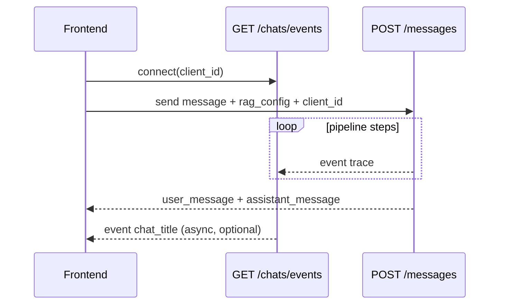

# API reference

**English** · [Русский](api_ru.md)

HTTP contract for **avia-bot** backend. Base path: `/api`. Interactive OpenAPI: `http://127.0.0.1:8000/docs` when running locally.

Schemas are defined in `backend/app/schemas/`. See [architecture.md](architecture.md) for behavioral context.

---

## Conventions

| Topic | Rule |
|-------|------|
| Content-Type | `application/json` for request/response bodies |
| Timestamps | UTC ISO 8601 in responses |
| Soft delete | `DELETE` sets `is_deleted=true`; records are not returned in lists |
| Idempotency | `client_message_id` on send — retries return the existing reply |

### Error response shape

```json
{
  "detail": "Human-readable message",
  "error_code": "machine_readable_code",
  "extra": {}
}
```

HTTP status follows exception type (typically `400`, `404`, `503`).

---

## Health

| Method | Path | Response |
|--------|------|----------|
| `GET` | `/healthz` | Liveness probe |
| `GET` | `/readyz` | DB readiness |

---

## ETL (`/api/etl`)

### `POST /ingest`

Parse knowledge document, embed chunks, update SQLite + FAISS.

**Request body:**

```json
{
  "rebuild": false,
  "source_path": null
}
```

| Field | Type | Description |
|-------|------|-------------|
| `rebuild` | boolean | Force full re-embed (default `false` = incremental) |
| `source_path` | string \| null | Override markdown path; default from `ETL__DOCUMENT_PATH` |

**Response `200`:** `IngestResponse` — `chunk_count`, `doc_hash`, `embedding_model`, `source_path`, `built_at`, `added`, `updated`, `unchanged`, `removed`, `embedded`.

### `GET /stats`

**Response `200`:** `{ "total": int, "by_content_type": { "sop": int, ... } }`

### `GET /manifest`

**Response `200`:** latest index metadata — `source_path`, `doc_hash`, `embedding_model`, `chunker_version`, `chunk_count`, `built_at`.

---

## Chats (`/api/chats`)

### `GET /events` (SSE)

Subscribe to sideband events. **Query:** `client_id` (required, same value as in `POST /messages`).

**Event types:**

| Event | When | Data shape |
|-------|------|------------|
| `trace` | RAG pipeline step completed | RAG trace step object (name, duration, structured payload) |
| `chat_title` | Async title generated | `{ "chat_id": int, "title": string }` |
| `error` | Sideband failure | `{ "message": string, "chat_id"?: int, "error_code"?: string }` |

SSE format: `event: <name>\ndata: <json>\n\n`

### `GET /`

List non-deleted chats, newest activity first.

**Query:** `chat_type` — optional filter: `llm` | `rag`.

**Response:** array of `ChatSummaryResponse`.

### `POST /`

Create empty chat.

**Request:**

```json
{
  "title": "New chat",
  "chat_type": "llm",
  "rag_config": null,
  "llm_config": null,
  "use_history": null
}
```

### `GET /{chat_id}`

Chat metadata + non-deleted message history.

### `PATCH /{chat_id}`

Update chat-level settings (`rag_config`, `llm_config`, `use_history`). Omitted fields unchanged.

### `DELETE /{chat_id}`

Soft-delete chat. **Response:** `204`.

### `POST /{chat_id}/close`

Mark chat closed — no new messages allowed.

### `POST /{chat_id}/messages`

Send user message; assistant reply returned **synchronously** in response body.

**Request:**

```json
{
  "content": "User question",
  "client_id": "uuid-from-frontend",
  "client_message_id": "optional-idempotency-key",
  "rag_config": { "use_hyde": false, "use_multi_query": false, "use_query_rewriting": false, "use_rerank": false, "top_chunks": 5 },
  "llm_config": { "use_custom_prompt": false, "custom_prompt": null },
  "use_history": true
}
```

**Response `200`:**

```json
{
  "user_message": { "id": 1, "role": "user", "content": "...", "metadata": {} },
  "assistant_message": { "id": 2, "role": "assistant", "content": "...", "metadata": { "rag_trace": [...] } }
}
```

Assistant `metadata` may include:

| Key | Mode | Content |
|-----|------|---------|
| `rag_trace` | RAG | Pipeline steps (also streamed via SSE) |
| `retrieved_chunks` | RAG | Chunks used in generation |
| `decision_tree_guidance` | RAG | Operational walkthrough text |
| `rag_config` / `llm_config` | Both | Settings snapshot |
| `guard_refusal` | Both | Set when prompt guard blocks the message |

### `PATCH /{chat_id}/messages/{message_id}`

Edit user message body. **Request:** `{ "content": "..." }`

### `POST /{chat_id}/messages/{message_id}/rating`

Rate assistant message. **Request:** `{ "rating": 1-5, "comment": "optional" }`

### `DELETE /{chat_id}/messages/{message_id}`

Soft-delete message. **Response:** `204`.

---

## Configuration schemas

### `RagConfig`

| Field | Type | Description |
|-------|------|-------------|
| `use_hyde` | bool \| null | HyDE query transform |
| `use_multi_query` | bool \| null | Multi-Query transform |
| `use_query_rewriting` | bool \| null | History-aware rewrite |
| `use_rerank` | bool \| null | LLM rerank after retrieval |
| `top_chunks` | int (3–21) | Chunks in LLM context |

Query transforms are **mutually exclusive** (enforced in UI; backend accepts multiple — last wins in pipeline logic).

### `LlmConfig`

| Field | Type | Description |
|-------|------|-------------|
| `use_custom_prompt` | bool \| null | Use custom system prompt |
| `custom_prompt` | string \| null | Prompt text; disables guards when enabled |

---

## Error codes

| Code | HTTP | Meaning |
|------|------|---------|
| `rag_index_missing` | 503 | FAISS index not built — run ETL ingest |
| `rag_chunks_missing` | 503 | Index/DB mismatch |
| `chat_not_found` | 404 | Invalid `chat_id` |
| `chat_closed` | 400 | Message to closed chat |
| `message_not_found` | 404 | Invalid message id |
| `message_not_editable` | 400 | Cannot edit this message |
| `message_not_rateable` | 400 | Rating only on assistant messages |
| `llm_config_error` | 500 | Missing LLM configuration |
| `llm_api_error` | 502 | LLM provider failure |
| `embedding_config_error` | 500 | Missing embedding configuration |
| `embedding_api_error` | 502 | Embeddings API failure |
| `etl_source_not_found` | 404 | KB file missing |
| `etl_empty_document` | 400 | Document has no indexable content |
| `etl_embedding_mismatch` | 400 | Embedding model ≠ manifest |
| `etl_not_indexed` | 404 | No manifest row |
| `db_not_found` | 404 | Record not found |
| `db_unique_violation` | 409 | Unique constraint |
| `external_api_error` | 502 | External service error |
| `internal_error` | 500 | Unhandled failure |
| `service_error` | 500 | Generic service error |

Guard refusals are returned as **successful** `200` responses with assistant content explaining the refusal (`metadata.guard_refusal`).

---

## Typical client flow (RAG)



---

## Related documentation

| Document | Content |
|----------|---------|
| [architecture.md](architecture.md) | RAG pipeline, SSE internals |
| [frontend.md](frontend.md) | How the SPA calls this API |
| [operations.md](operations.md) | ETL and troubleshooting |
