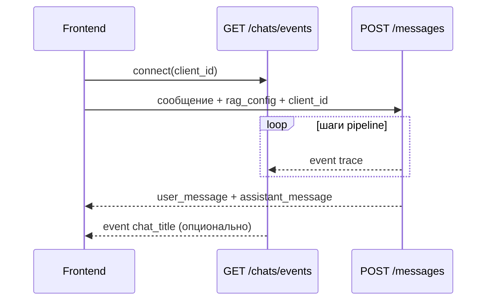

# Справочник API

**Русский** · [English](api.md)

HTTP-контракт backend **avia-bot**. Базовый путь: `/api`. Интерактивный OpenAPI: `http://127.0.0.1:8000/docs` при локальном запуске.

Схемы: `backend/app/schemas/`. Поведение — [ARCHITECTURE_RU.md](ARCHITECTURE_RU.md).

---

## Соглашения

| Тема | Правило |
|------|---------|
| Content-Type | `application/json` для тел запросов и ответов |
| Временные метки | UTC ISO 8601 в ответах |
| Мягкое удаление | `DELETE` ставит `is_deleted=true`; записи не возвращаются в списках |
| Идемпотентность | `client_message_id` при отправке — повтор вернёт существующий ответ |

### Формат ошибки

```json
{
  "detail": "Человекочитаемое сообщение",
  "error_code": "machine_readable_code",
  "extra": {}
}
```

HTTP-статус по типу исключения (обычно `400`, `404`, `503`).

---

## Health

| Метод | Путь | Ответ |
|-------|------|-------|
| `GET` | `/healthz` | Liveness |
| `GET` | `/readyz` | Готовность БД |

---

## ETL (`/api/etl`)

### `POST /ingest`

Парсинг документа KB, эмбеддинг чанков, обновление SQLite + FAISS.

**Тело запроса:**

```json
{
  "rebuild": false,
  "source_path": null
}
```

| Поле | Тип | Описание |
|------|-----|----------|
| `rebuild` | boolean | Полный re-embed (`false` = инкрементально) |
| `source_path` | string \| null | Путь к markdown; по умолчанию `ETL__DOCUMENT_PATH` |

**Ответ `200`:** `IngestResponse` — `chunk_count`, `doc_hash`, `embedding_model`, `source_path`, `built_at`, `added`, `updated`, `unchanged`, `removed`, `embedded`.

### `GET /stats`

**Ответ `200`:** `{ "total": int, "by_content_type": { "sop": int, ... } }`

### `GET /manifest`

**Ответ `200`:** метаданные последней сборки индекса.

---

## Чаты (`/api/chats`)

### `GET /events` (SSE)

Подписка на sideband-события. **Query:** `client_id` (обязателен, тот же, что в `POST /messages`).

**Типы событий:**

| Событие | Когда | Данные |
|---------|-------|--------|
| `trace` | Шаг RAG pipeline завершён | Объект шага trace |
| `chat_title` | Заголовок сгенерирован асинхронно | `{ "chat_id": int, "title": string }` |
| `error` | Ошибка sideband | `{ "message": string, "chat_id"?: int, "error_code"?: string }` |

Формат SSE: `event: <name>\ndata: <json>\n\n`

### `GET /`

Список неудалённых чатов, сначала недавние.

**Query:** `chat_type` — фильтр `llm` | `rag`.

### `POST /`

Создать пустой чат.

### `GET /{chat_id}`

Метаданные чата + история сообщений.

### `PATCH /{chat_id}`

Обновить настройки чата (`rag_config`, `llm_config`, `use_history`).

### `DELETE /{chat_id}`

Мягкое удаление. **Ответ:** `204`.

### `POST /{chat_id}/close`

Закрыть чат — новые сообщения запрещены.

### `POST /{chat_id}/messages`

Отправить сообщение; ответ ассистента **синхронно** в теле ответа.

**Запрос:**

```json
{
  "content": "Вопрос пользователя",
  "client_id": "uuid-from-frontend",
  "client_message_id": "optional-idempotency-key",
  "rag_config": { "use_hyde": false, "use_multi_query": false, "use_query_rewriting": false, "use_rerank": false, "top_chunks": 5 },
  "llm_config": { "use_custom_prompt": false, "custom_prompt": null },
  "use_history": true
}
```

**Ответ `200`:** `user_message` + `assistant_message`.

`metadata` ассистента может содержать:

| Ключ | Режим | Содержание |
|------|-------|------------|
| `rag_trace` | RAG | Шаги pipeline (также по SSE) |
| `retrieved_chunks` | RAG | Чанки в генерации |
| `decision_tree_guidance` | RAG | Текст операционного walkthrough |
| `rag_config` / `llm_config` | Оба | Снимок настроек |
| `guard_refusal` | Оба | Блокировка prompt guard |

### `PATCH /{chat_id}/messages/{message_id}`

Редактировать сообщение пользователя.

### `POST /{chat_id}/messages/{message_id}/rating`

Оценить ответ ассистента: `{ "rating": 1-5, "comment": "..." }`

### `DELETE /{chat_id}/messages/{message_id}`

Мягкое удаление сообщения. **Ответ:** `204`.

---

## Схемы конфигурации

### `RagConfig`

| Поле | Тип | Описание |
|------|-----|----------|
| `use_hyde` | bool \| null | HyDE |
| `use_multi_query` | bool \| null | Multi-Query |
| `use_query_rewriting` | bool \| null | Переписывание с учётом истории |
| `use_rerank` | bool \| null | LLM rerank |
| `top_chunks` | int (3–21) | Чанки в контексте LLM |

Query transform в UI **взаимоисключающие**.

### `LlmConfig`

| Поле | Тип | Описание |
|------|-----|----------|
| `use_custom_prompt` | bool \| null | Свой system prompt |
| `custom_prompt` | string \| null | Текст; отключает guards |

---

## Коды ошибок

| Код | HTTP | Значение |
|-----|------|----------|
| `rag_index_missing` | 503 | Индекс не построен — запустите ETL |
| `rag_chunks_missing` | 503 | Рассинхрон индекса и БД |
| `chat_not_found` | 404 | Неверный `chat_id` |
| `chat_closed` | 400 | Сообщение в закрытый чат |
| `message_not_found` | 404 | Неверный id сообщения |
| `message_not_editable` | 400 | Сообщение нельзя редактировать |
| `message_not_rateable` | 400 | Оценка только для ассистента |
| `llm_config_error` | 500 | Нет конфигурации LLM |
| `llm_api_error` | 502 | Сбой LLM-провайдера |
| `embedding_config_error` | 500 | Нет конфигурации embeddings |
| `embedding_api_error` | 502 | Сбой API embeddings |
| `etl_source_not_found` | 404 | Файл KB не найден |
| `etl_empty_document` | 400 | Нет индексируемого контента |
| `etl_embedding_mismatch` | 400 | Модель ≠ manifest |
| `etl_not_indexed` | 404 | Нет записи manifest |
| `db_not_found` | 404 | Запись не найдена |
| `db_unique_violation` | 409 | Нарушение уникальности |
| `external_api_error` | 502 | Внешний сервис |
| `internal_error` | 500 | Необработанная ошибка |
| `service_error` | 500 | Общая ошибка сервиса |

Отказы guard возвращаются как **успешный** `200` с текстом отказа (`metadata.guard_refusal`).

---

## Типичный поток клиента (RAG)



---

## Связанная документация

| Документ | Содержание |
|----------|------------|
| [ARCHITECTURE_RU.md](ARCHITECTURE_RU.md) | RAG pipeline, SSE |
| [frontend_ru.md](frontend_ru.md) | Вызовы API из SPA |
| [operations_ru.md](operations_ru.md) | ETL и troubleshooting |
