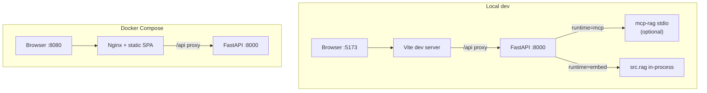

# Deployment guide

**English** · [Русский](deployment_ru.md)

Runbook for deploying **avia-bot** in local development and Docker Compose. For day-2 operations see [operations.md](operations.md). For environment variables see [configuration.md](configuration.md).

---

## Prerequisites

| Requirement | Version / notes |
|-------------|-----------------|
| Python | 3.13 (`backend/.python-version`) |
| Node.js | 20+ (frontend build) |
| uv | Package manager for backend and mcp-rag |
| LLM API | OpenAI-compatible chat + embeddings endpoints |
| Docker (optional) | Docker Compose v2 |

---

## Local development

### 1. Clone and configure

```bash
git clone <repo-url> avia-bot && cd avia-bot
cp backend/.env.example backend/.env
cp backend/.env mcp-rag/.env   # same LLM__* for ingest + RAG
# Set LLM__* variables
```

### 2. Install dependencies

```bash
make backend-install
cd mcp-rag && uv sync && cd ..
make frontend-install
```

### 3. Build the knowledge index (required for RAG)

```bash
make etl-ingest
```

Runs **`mcp-rag`** against repo-root `data/` → `data/kb.db` + FAISS. First run embeds all chunks via the configured embedding API.

### 4. Start services

Terminal 1 — backend (`:8000`):

```bash
make backend-dev
```

Terminal 2 — frontend (`:5173`):

```bash
make frontend-dev
```

Optional — MCP server (stdio, for external clients or `runtime=mcp` testing):

```bash
cd mcp-rag && uv run python -m src.server
```

Open `http://127.0.0.1:5173`. Vite proxies `/api` to the backend.

### 5. Verify

| Check | URL / command |
|-------|---------------|
| Liveness | `curl http://127.0.0.1:8000/api/healthz` |
| Readiness | `curl http://127.0.0.1:8000/api/readyz` |
| Index stats | `make etl-stats` |

---

## Docker Compose

### 1. Configure

Place `.env` in the **repository root** (used by `docker-compose.yml` for backend `env_file`):

```bash
cp .env.docker.example .env
# Edit LLM credentials
```

Ensure repo-root `data/` contains an indexed KB (`make etl-ingest` on the host), or run ingest after startup.

### 2. Start stack

```bash
make docker-up
```

| Service | Internal | Host |
|---------|----------|------|
| Frontend (Nginx) | `:80` | `http://localhost:8080` |
| Backend (FastAPI) | `:8000` | proxied at `/api` |

**Volumes:**

| Host path | Container path | Contents |
|-----------|----------------|----------|
| `./backend/data` | `/app/data` | `app.db` (chats) |
| `./data` | `/data` | `kb.db`, FAISS, markdown, schemas |

`mcp-rag` is baked into the backend image at `/mcp-rag`; embed RAG resolves KB paths from repo root (`/data/...`).

### 3. Post-start ingest (if index missing)

```bash
make docker-etl-ingest
# Full re-embed: REBUILD=1 make docker-etl-ingest
```

### 4. Stop

```bash
make docker-down
```

### 5. Logs

```bash
make docker-logs
```

---

## Deployment checklist

| Step | Action |
|------|--------|
| 1 | Configure `LLM__*` in `backend/.env` and `mcp-rag/.env` (chat + embedding models) |
| 2 | Set `APP__CORS_ORIGINS` for actual frontend origin |
| 3 | Run `make etl-ingest` after KB or embedding model changes |
| 4 | Confirm `/api/readyz` returns healthy |
| 5 | Test RAG mode — without index, API returns `503 rag_index_missing` |
| 6 | Review [security.md](security.md) — MVP has **no authentication** |

---

## Topology comparison


```mermaid
flowchart TB
    subgraph dev ["Local dev"]
        Browser1["Browser :5173"]
        Vite["Vite dev server"]
        API1["FastAPI :8000"]
        MCP1["mcp-rag stdio\n(optional)"]
        Browser1 --> Vite
        Vite -->|"/api proxy"| API1
        API1 -->|runtime=mcp| MCP1
        API1 -->|runtime=embed| RAG1["src.rag in-process"]
    end

    subgraph docker ["Docker Compose"]
        Browser2["Browser :8080"]
        Nginx["Nginx + static SPA"]
        API2["FastAPI :8000"]
        Browser2 --> Nginx
        Nginx -->|"/api proxy"| API2
    end
```

---

## Known limitations (MVP)

| Limitation | Impact |
|------------|--------|
| No auth | Anyone with network access can use the API |
| SQLite + local FAISS | Single-node; not horizontally scalable |
| In-memory SSE | Multiple backend replicas need shared pub/sub |
| Synchronous responses | No token streaming yet |
| MCP transport | stdio only — no HTTP API for mcp-rag |

See [roadmap.md](roadmap.md) for planned improvements.

---

## Related documentation

| Document | Content |
|----------|---------|
| [operations.md](operations.md) | Backups, ETL maintenance, troubleshooting |
| [configuration.md](configuration.md) | Full env reference |
| [ARCHITECTURE.md](ARCHITECTURE.md) | System design |
| [mcp-rag/README.md](../mcp-rag/README.md) | MCP server and indexing |
