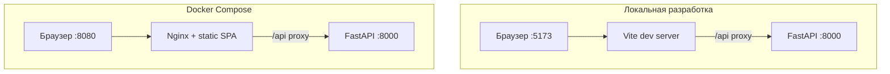

# Руководство по развёртыванию

**Русский** · [English](deployment.md)

Runbook развёртывания **avia-bot** в локальной разработке и Docker Compose. Эксплуатация — [operations_ru.md](operations_ru.md). Переменные окружения — [configuration_ru.md](configuration_ru.md).

---

## Требования

| Требование | Версия / примечания |
|------------|---------------------|
| Python | 3.13 (`backend/.python-version`) |
| Node.js | 20+ (сборка frontend) |
| uv | Менеджер пакетов backend (`uv sync`) |
| LLM API | OpenAI-совместимые chat + embeddings |
| Docker (опционально) | Docker Compose v2 |

---

## Локальная разработка

### 1. Клонирование и конфигурация

```bash
git clone <repo-url> avia-bot && cd avia-bot
cp backend/.env.example backend/.env
# Укажите LLM__* в backend/.env
```

### 2. Установка зависимостей

```bash
make backend-install
make frontend-install
```

### 3. Построение индекса (обязательно для RAG)

```bash
make etl-ingest
```

Первый запуск эмбеддит все чанки через API. Время зависит от размера документа и latency API.

### 4. Запуск сервисов

Терминал 1 — backend (`:8000`):

```bash
make backend-dev
```

Терминал 2 — frontend (`:5173`):

```bash
make frontend-dev
```

Откройте `http://127.0.0.1:5173`. Vite проксирует `/api` на backend.

### 5. Проверка

| Проверка | URL / команда |
|----------|---------------|
| Liveness | `curl http://127.0.0.1:8000/api/healthz` |
| Readiness | `curl http://127.0.0.1:8000/api/readyz` |
| Статистика индекса | `make etl-stats` |

---

## Docker Compose

### 1. Конфигурация

Файл `.env` в **корне репозитория** (для `env_file` в `docker-compose.yml`):

```bash
cp backend/.env.example .env
# Укажите учётные данные LLM
```

Убедитесь, что в `backend/data/` есть индекс, или выполните ingest после старта.

### 2. Запуск

```bash
make docker-up
```

| Сервис | Внутренний | Хост |
|--------|------------|------|
| Frontend (Nginx) | `:80` | `http://localhost:8080` |
| Backend (FastAPI) | `:8000` | прокси `/api` |

Данные: volume `./backend/data:/app/data`.

### 3. Ingest после старта (если индекса нет)

```bash
make docker-etl-ingest
```

### 4. Остановка

```bash
make docker-down
```

### 5. Логи

```bash
make docker-logs
```

---

## Чеклист развёртывания

| Шаг | Действие |
|-----|----------|
| 1 | Настроить `LLM__*` (chat + embedding) |
| 2 | Задать `APP__CORS_ORIGINS` для реального origin frontend |
| 3 | Запустить `etl-ingest` после смены KB или embedding model |
| 4 | Убедиться, что `/api/readyz` healthy |
| 5 | Проверить RAG — без индекса API вернёт `503 rag_index_missing` |
| 6 | Изучить [security_ru.md](security_ru.md) — в MVP **нет аутентификации** |

---

## Сравнение топологий



---

## Ограничения MVP

| Ограничение | Влияние |
|-------------|---------|
| Нет auth | Любой с доступом к сети может вызывать API |
| SQLite + локальный FAISS | Один узел; без горизонтального масштабирования |
| In-memory SSE | Несколько реплик backend нужен shared pub/sub |
| Синхронные ответы | Потоковая выдача токенов пока не реализована |

Планы — [roadmap_ru.md](roadmap_ru.md).

---

## Связанная документация

| Документ | Содержание |
|----------|------------|
| [operations_ru.md](operations_ru.md) | Бэкапы, ETL, troubleshooting |
| [configuration_ru.md](configuration_ru.md) | Справочник env |
| [architecture_ru.md](architecture_ru.md) | Архитектура |
