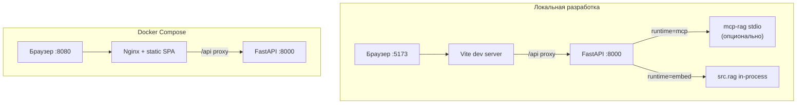

# Руководство по развёртыванию

**Русский** · [English](deployment.md)

Runbook развёртывания **avia-bot** в локальной разработке и Docker Compose. Эксплуатация — [operations_ru.md](operations_ru.md). Переменные окружения — [configuration_ru.md](configuration_ru.md).

---

## Требования

| Требование | Версия / примечания |
|------------|---------------------|
| Python | 3.13 (`backend/.python-version`) |
| Node.js | 20+ (сборка frontend) |
| uv | Менеджер пакетов backend и mcp-rag |
| LLM API | OpenAI-совместимые chat + embeddings |
| Docker (опционально) | Docker Compose v2 |

---

## Локальная разработка

### 1. Клонирование и конфигурация

```bash
git clone <repo-url> avia-bot && cd avia-bot
cp backend/.env.example backend/.env
cp backend/.env mcp-rag/.env   # те же LLM__* для ingest и RAG
# Укажите LLM__*
```

### 2. Установка зависимостей

```bash
make backend-install
cd mcp-rag && uv sync && cd ..
make frontend-install
```

### 3. Построение индекса (обязательно для RAG)

```bash
make etl-ingest
```

Запускает **`mcp-rag`** на `data/` в корне репо → `data/kb.db` + FAISS.

### 4. Запуск сервисов

Терминал 1 — backend (`:8000`):

```bash
make backend-dev
```

Терминал 2 — frontend (`:5173`):

```bash
make frontend-dev
```

Опционально — MCP-сервер (stdio):

```bash
cd mcp-rag && uv run python -m src.server
```

Откройте `http://127.0.0.1:5173`. Vite проксирует `/api` на backend.

### 5. Проверка

| Проверка | URL / команда |
|----------|---------------|
| Liveness | `curl http://127.0.0.1:8000/api/healthz` |
| Readiness | `curl http://127.0.0.1:8000/api/readyz` |
| Статистика индекса | `make etl-stats` |

---

## Docker Compose

### 1. Конфигурация

Файл `.env` в **корне репозитория**:

```bash
cp .env.docker.example .env
# Учётные данные LLM
```

Индекс KB: `make etl-ingest` на хосте или `make docker-etl-ingest` после старта.

### 2. Запуск

```bash
make docker-up
```

| Сервис | Внутренний | Хост |
|--------|------------|------|
| Frontend (Nginx) | `:80` | `http://localhost:8080` |
| Backend (FastAPI) | `:8000` | прокси `/api` |

**Volumes:**

| Путь на хосте | В контейнере | Содержимое |
|---------------|--------------|------------|
| `./backend/data` | `/app/data` | `app.db` (чаты) |
| `./data` | `/data` | `kb.db`, FAISS, markdown, схемы |

`mcp-rag` в образе backend по пути `/mcp-rag`; embed RAG читает KB из `/data/`.

### 3. Ingest после старта

```bash
make docker-etl-ingest
# Полный re-embed: REBUILD=1 make docker-etl-ingest
```

### 4. Остановка

```bash
make docker-down
```

### 5. Логи

```bash
make docker-logs
```

---

## Чеклист развёртывания

| Шаг | Действие |
|-----|----------|
| 1 | `LLM__*` в `backend/.env` и `mcp-rag/.env` |
| 2 | `APP__CORS_ORIGINS` для origin frontend |
| 3 | `make etl-ingest` после смены KB или embedding model |
| 4 | `/api/readyz` healthy |
| 5 | RAG без индекса → `503 rag_index_missing` |
| 6 | [security_ru.md](security_ru.md) — в MVP **нет аутентификации** |

---

## Сравнение топологий


```mermaid
flowchart TB
    subgraph dev ["Локальная разработка"]
        Browser1["Браузер :5173"]
        Vite["Vite dev server"]
        API1["FastAPI :8000"]
        MCP1["mcp-rag stdio\n(опционально)"]
        Browser1 --> Vite
        Vite -->|"/api proxy"| API1
        API1 -->|runtime=mcp| MCP1
        API1 -->|runtime=embed| RAG1["src.rag in-process"]
    end

    subgraph docker ["Docker Compose"]
        Browser2["Браузер :8080"]
        Nginx["Nginx + static SPA"]
        API2["FastAPI :8000"]
        Browser2 --> Nginx
        Nginx -->|"/api proxy"| API2
    end
```

---

## Ограничения MVP

| Ограничение | Влияние |
|-------------|---------|
| Нет auth | Любой с доступом к сети может вызывать API |
| SQLite + локальный FAISS | Один узел |
| In-memory SSE | Несколько реплик — нужен shared pub/sub |
| Синхронные ответы | Потоковая выдача токенов пока нет |
| MCP transport | Только stdio — HTTP API у mcp-rag нет |

Планы — [roadmap_ru.md](roadmap_ru.md).

---

## Связанная документация

| Документ | Содержание |
|----------|------------|
| [operations_ru.md](operations_ru.md) | Бэкапы, ETL, troubleshooting |
| [configuration_ru.md](configuration_ru.md) | Справочник env |
| [ARCHITECTURE_RU.md](ARCHITECTURE_RU.md) | Архитектура |
| [mcp-rag/README.md](../mcp-rag/README.md) | MCP-сервер и индексация |
