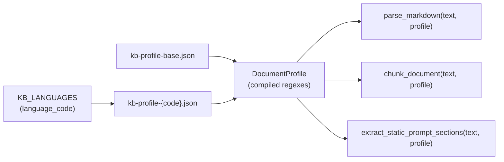

# ETL document profile (multilingual KB mapping)

**English** · [Русский](etl_profile_ru.md)

This document describes how **avia-bot** configures markdown parsing and chunking per knowledge-base language without hardcoding locale-specific patterns in Python.

For the full ETL pipeline (ingest, embeddings, FAISS), see [backend/etl/README.md](../backend/etl/README.md).

---

## Why profiles exist

The KB markdown files (`rag-document-ru.md`, `rag-document-en.md`) share the same **structure** (chapters 00–17, `##` / `###` headings, embedded FAQ blocks). They differ in **locale markers**:

| Element | Russian | English |
|---------|---------|---------|
| FAQ question | `**Вопрос:**` | `**Question:**` |
| FAQ answer | `**Ответ:**` | `**Answer:**` |
| Scenario heading | `## Сценарий 1: …` | `## Scenario 1: …` |
| Retrieval prefix | `[Раздел: …]` | `[Section: …]` |

Instead of branching in `parser.py` / `chunker.py` per language, each KB language loads a **document profile** — a JSON mapping merged from a shared base file and a locale file.

---

## File layout

| File | Purpose |
|------|---------|
| `backend/data/kb-profile-base.json` | Shared structure: section numbers → content types, skip/index policy, static-prompt chapters, token limits, language-neutral regexes |
| `backend/data/kb-profile-ru.json` | Russian labels, FAQ markers, scenario heading regex |
| `backend/data/kb-profile-en.json` | English labels, FAQ markers, scenario heading regex |

Registration in `backend/app/core/config.py` → `KB_LANGUAGES`:

```python
"ru": KbLanguageEntry(code="ru", document_path="data/rag-document-ru.md", ...),
"en": KbLanguageEntry(code="en", document_path="data/rag-document-en.md", ...),
```

Optional override per language: `etl_profile_path` on `KbLanguageEntry` (defaults to `data/kb-profile-{code}.json`).

---

## Profile schema

### Base (`kb-profile-base.json`)

| Field | Description |
|-------|-------------|
| `schema_version` | Profile format version (currently `1`) |
| `section_map` | H1 chapter number (`"00"`…`"17"`) → `ContentType` string (`meta`, `sop`, `faq`, `glossary`, `decision_tree`, `scenario`, `out_of_scope`) |
| `section_keywords` | Fallback rules: if H1 title contains a keyword → content type (used when number alone is ambiguous) |
| `skip_index_types` | Content types **not** embedded in FAISS (e.g. `meta`, `out_of_scope`, `glossary`) |
| `static_prompt_sections` | Chapter numbers injected into the RAG system prompt at runtime (not retrieved) |
| `chunking.sop` | `max_tokens`, `chars_per_token` for SOP split threshold |
| `chunking.decision_tree.split_heading_regex` | Split chapter 16 on `## 16.X. …` headings |
| `chunking.embedded_faq.block_regex` | Locate trailing `---` + `**FAQ**` block inside SOP chapters |

Sections **01–12** are not listed in `section_map`; they default to `sop`.

### Locale (`kb-profile-{code}.json`)

| Field | Description |
|-------|-------------|
| `locale` | Language code (`ru`, `en`) |
| `labels` | Prefix strings: `section`, `type`, `source`, `context`, `question`, `answer` |
| `faq_pair` | `question_marker`, `answer_marker` (literal markdown prefixes) |
| `scenario_split_regex` | Regex for `## Scenario N: …` or `## Сценарий N: …` |

FAQ pair regex is **built in code** from the markers (not stored as raw regex in JSON) to avoid escaping mistakes.

---

## Runtime flow



1. `ETLService.ingest(language_code)` resolves the markdown path and calls `get_document_profile(language_code)`.
2. `chunk_document()` parses and chunks using the compiled profile.
3. `load_kb_static_context(document_path, language_code)` uses the same profile for chapters 00 and 13.

Loader: `etl/profile.py` → `get_document_profile()`, `compile_document_profile()`.

---

## What stays in Python (not JSON)

| In code | Reason |
|---------|--------|
| `ContentType` enum | Domain model |
| Heading split (`#` / `##` / `###`) | Universal markdown structure |
| Strategy dispatch per `ContentType` | Algorithm, not configuration |
| FAQ regex construction from markers | Safer than editable regex in JSON |
| `parent_chunk_index` for split SOP | Linkage logic |

---

## Adding a new KB language

1. Add `backend/data/rag-document-{code}.md` with the same chapter numbering convention.
2. Add `backend/data/kb-profile-{code}.json` with locale labels and FAQ/scenario patterns.
3. Register in `KB_LANGUAGES` in `config.py`.
4. Run `make etl-ingest-all`.
5. Add a unit test asserting chunk count is in line with `ru` (see `test_en_chunk_count_matches_ru`).

If the new language uses different chapter numbers, extend `section_map` in a language-specific base override or fork `kb-profile-base.json` (prefer extending via locale file only when structure matches).

---

## Example locale snippet (English)

```json
{
  "locale": "en",
  "labels": {
    "section": "Section",
    "type": "Type",
    "source": "Source",
    "context": "Context",
    "question": "Question",
    "answer": "Answer"
  },
  "faq_pair": {
    "question_marker": "**Question:**",
    "answer_marker": "**Answer:**"
  },
  "scenario_split_regex": "^## (Scenario \\d+:.+)$"
}
```

---

## Related docs

- [Knowledge base authoring](knowledge_base.md) — how to write markdown chapters
- [Architecture — ETL pipeline](ARCHITECTURE.md#etl-pipeline)
- [Configuration — KB languages](configuration.md#knowledge-base-languages)
- [backend/etl/README.md](../backend/etl/README.md) — parser/chunker implementation details
