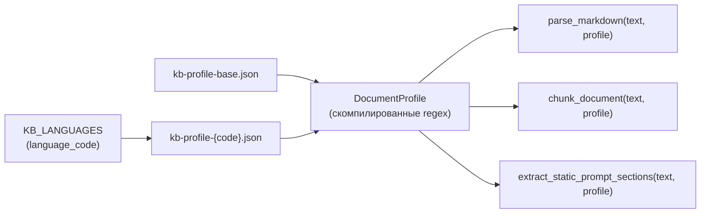

# Профиль ETL-документа (мультиязычный маппинг базы знаний)

[English](etl_profile.md) · **Русский**

В этом документе описано, как **avia-bot** настраивает парсинг и чанкинг markdown-базы знаний для каждого языка без захардкоженных локальных паттернов в Python.

Полный пайплайн ETL (ingest, embeddings, FAISS) — в [backend/etl/README_RU.md](../backend/etl/README_RU.md).

---

## Зачем нужны профили

Файлы базы знаний (`rag-document-ru.md`, `rag-document-en.md`) имеют **одинаковую структуру** (главы 00–17, заголовки `##` / `###`, встроенные FAQ-блоки). Отличаются **языковые маркеры**:

| Элемент | Русский | Английский |
|---------|---------|------------|
| Вопрос FAQ | `**Вопрос:**` | `**Question:**` |
| Ответ FAQ | `**Ответ:**` | `**Answer:**` |
| Заголовок сценария | `## Сценарий 1: …` | `## Scenario 1: …` |
| Префикс retrieval | `[Раздел: …]` | `[Section: …]` |

Вместо ветвления в `parser.py` / `chunker.py` по языку каждый язык KB загружает **профиль документа** — JSON-маппинг из общего base-файла и locale-файла.

---

## Расположение файлов

| Файл | Назначение |
|------|------------|
| `backend/data/kb-profile-base.json` | Общая структура: номера разделов → типы контента, политика skip/index, главы для system prompt, лимиты токенов, языконезависимые regex |
| `backend/data/kb-profile-ru.json` | Русские метки, маркеры FAQ, regex сценариев |
| `backend/data/kb-profile-en.json` | Английские метки, маркеры FAQ, regex сценариев |

Регистрация в `backend/app/core/config.py` → `KB_LANGUAGES`:

```python
"ru": KbLanguageEntry(code="ru", document_path="data/rag-document-ru.md", ...),
"en": KbLanguageEntry(code="en", document_path="data/rag-document-en.md", ...),
```

Опционально на язык: `etl_profile_path` в `KbLanguageEntry` (по умолчанию `data/kb-profile-{code}.json`).

---

## Схема профиля

### Base (`kb-profile-base.json`)

| Поле | Описание |
|------|----------|
| `schema_version` | Версия формата (сейчас `1`) |
| `section_map` | Номер H1-главы (`"00"`…`"17"`) → строка `ContentType` |
| `section_keywords` | Fallback: если в заголовке H1 есть ключевое слово → тип контента |
| `skip_index_types` | Типы, **не** попадающие в FAISS (`meta`, `out_of_scope`, `glossary`) |
| `static_prompt_sections` | Номера глав для system prompt (без retrieval) |
| `chunking.sop` | `max_tokens`, `chars_per_token` для порога разбиения SOP |
| `chunking.decision_tree.split_heading_regex` | Разбиение главы 16 по `## 16.X. …` |
| `chunking.embedded_faq.block_regex` | Блок `---` + `**FAQ**` в конце SOP-глав |

Главы **01–12** не перечисляются в `section_map` — по умолчанию `sop`.

### Locale (`kb-profile-{code}.json`)

| Поле | Описание |
|------|----------|
| `locale` | Код языка (`ru`, `en`) |
| `labels` | Строки префиксов: `section`, `type`, `source`, `context`, `question`, `answer` |
| `faq_pair` | `question_marker`, `answer_marker` |
| `scenario_split_regex` | Regex для заголовков сценариев |

Regex для FAQ **собирается в коде** из маркеров (не хранится сырым regex в JSON).

---

## Поток выполнения



1. `ETLService.ingest(language_code)` резолвит путь к markdown и вызывает `get_document_profile(language_code)`.
2. `chunk_document()` парсит и режет текст с профилем.
3. `load_kb_static_context(document_path, language_code)` использует тот же профиль для глав 00 и 13.

Загрузчик: `etl/profile.py` → `get_document_profile()`, `compile_document_profile()`.

---

## Что остаётся в Python (не в JSON)

| В коде | Причина |
|--------|---------|
| Enum `ContentType` | Доменная модель |
| Разбиение по `#` / `##` / `###` | Универсальная структура markdown |
| Диспетчеризация стратегий по типу | Алгоритм, не конфигурация |
| Сборка FAQ-regex из маркеров | Безопаснее, чем regex в JSON |
| `parent_chunk_index` при split SOP | Логика связей |

---

## Добавление нового языка KB

1. Создать `backend/data/rag-document-{code}.md` с той же нумерацией глав.
2. Создать `backend/data/kb-profile-{code}.json` с метками и паттернами.
3. Зарегистрировать в `KB_LANGUAGES` в `config.py`.
4. Запустить `make etl-ingest-all`.
5. Добавить unit-тест на сопоставимое число чанков с `ru`.

---

## Связанные документы

- [Руководство по базе знаний](knowledge_base_ru.md)
- [Архитектура — ETL](ARCHITECTURE_RU.md#пайплайн-etl)
- [Конфигурация — языки KB](configuration_ru.md#языки-базы-знаний)
- [backend/etl/README_RU.md](../backend/etl/README_RU.md)
