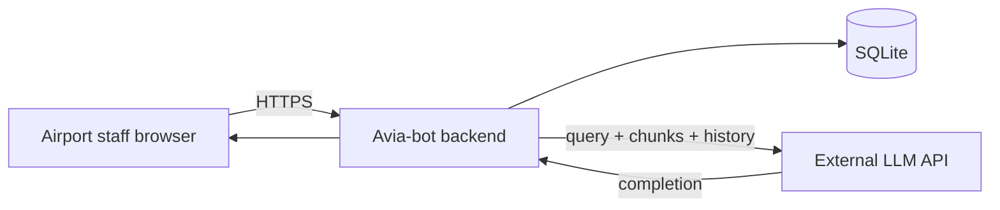

# Privacy and data handling

**English** · [Русский](privacy_ru.md)

How **avia-bot** processes data in the demonstration MVP and what to address before a production pilot. Security controls: [security.md](security.md).

---

## Data categories

| Category | Examples | Stored where | MVP retention |
|----------|----------|--------------|---------------|
| **Chat content** | User questions, assistant answers | SQLite `chat_message` | Until soft-deleted |
| **Chat metadata** | RAG/LLM settings snapshots, trace | JSON in `metadata` column | Same as message |
| **Ratings** | 1–5 stars, comments on answers | `chat_message` | Same as message |
| **Knowledge base** | SOP, FAQ text | `rag-document.md` + chunk tables | Versioned via git + ingest |
| **Technical logs** | Request errors, ETL progress | stdout / log aggregator | Operator-defined |
| **Embeddings** | Vector representations of KB chunks | FAISS file | Tied to KB version |

The demo knowledge base does **not** contain real passenger PII. A production KB must be reviewed for personal data before pilot.

---

## Personal data in pilot context

Potential personal data if staff misuse the system:

| Risk | Mitigation |
|------|------------|
| Passenger names/PNR in chat queries | Usage policy; training; optional input filtering |
| Employee identifiers in chats | Auth + audit; retention limits |
| Chat history exposure | Access control; encryption at rest |

**Recommendation:** define acceptable use policy before pilot (no passenger PII in free-text queries).

---

## Data flows

Data sent to the LLM provider may include user messages, chat history, retrieved KB chunks, and policy text (chapters 00, 13). See [security.md](security.md#llm-provider-considerations).

---

## Legal basis (indicative)

Actual legal basis depends on jurisdiction and employer policies. Typical B2E internal tool framing:

| Processing | Likely basis (EU GDPR example) |
|------------|------------------------------|
| Chat for work assistance | Legitimate interest / employment necessity |
| Quality ratings | Legitimate interest (product improvement) |
| Audit logs (future) | Legal obligation / security |

Consult DPO/legal before pilot — required in [roadmap.md](roadmap.md) phase 1 Go/No-Go.

---

## Data subject rights

| Right | MVP support | Pilot target |
|-------|-------------|--------------|
| Access | Manual DB export | Self-service or admin API |
| Erasure | Soft-delete messages/chats | Hard delete + retention job |
| Rectification | Edit user messages | Same + admin tools |
| Portability | Not implemented | Export endpoint |

---

## Retention

| Data | MVP | Recommended pilot |
|------|-----|-------------------|
| Active chats | Indefinite | 90–180 days |
| Soft-deleted records | Hidden, still in DB | Purge after 30 days |
| Logs | Not defined | 30–90 days |
| KB versions | Git history | Tagged releases |

---

## Cross-border transfer

If the LLM API is hosted outside the employee's country:

- Review provider DPA and Standard Contractual Clauses.
- Prefer EU/on-prem endpoints for EU airports.
- Document subprocessors in privacy notice.

---

## Checklist before pilot

| # | Item |
|---|------|
| 1 | Privacy impact assessment (DPIA) if required |
| 2 | Acceptable use policy for staff |
| 3 | LLM provider DPA signed |
| 4 | Retention and deletion procedure documented |
| 5 | KB reviewed for accidental PII |
| 6 | Incident contact (DPO / security team) defined |

---

## Related documentation

| Document | Content |
|----------|---------|
| [security.md](security.md) | Threat model |
| [PRD.md](PRD.md) | Pilot Go/No-Go criteria |
| [roadmap.md](roadmap.md) | Compliance workstream |
