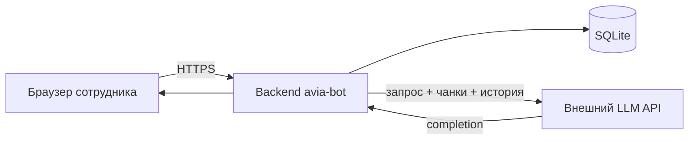

# Конфиденциальность и обработка данных

**Русский** · [English](privacy.md)

Как **avia-bot** обрабатывает данные в демо MVP и что нужно до пилота в продакшене. Меры безопасности: [security_ru.md](security_ru.md).

---

## Категории данных

| Категория | Примеры | Где хранится | Retention MVP |
|-----------|---------|--------------|---------------|
| **Содержимое чатов** | Вопросы, ответы | SQLite `chat_message` | До soft-delete |
| **Метаданные чата** | Снимки RAG/LLM, trace | JSON в `metadata` | Как у сообщения |
| **Оценки** | Звёзды 1–5, комментарии | `chat_message` | Как у сообщения |
| **База знаний** | Текст SOP, FAQ | `rag-document.md` + чанки | Git + ingest |
| **Технические логи** | Ошибки, ETL | stdout / агрегатор | На усмотрение ops |
| **Эмбеддинги** | Векторы чанков KB | FAISS | Привязаны к версии KB |

Демо KB **не содержит** реальных PII пассажиров. Продакшен KB — review на персональные данные перед пилотом.

---

## Персональные данные на пилоте

Риски при неправильном использовании сотрудниками:

| Риск | Митигация |
|------|-----------|
| Имена/PNR пассажиров в запросах | Политика использования; обучение; фильтрация ввода |
| Идентификаторы сотрудников в чатах | Auth + audit; лимиты хранения |
| Утечка истории чатов | Контроль доступа; шифрование at rest |

**Рекомендация:** политика допустимого использования до пилота (без PII пассажиров в свободном тексте).

---

## Потоки данных

Провайдеру LLM могут уходить сообщения, история, чанки KB и текст политики (гл. 00, 13). См. [security_ru.md](security_ru.md).

---

## Правовые основания (ориентир)

Зависит от юрисдикции и политик работодателя. Типично для внутреннего B2E-инструмента:

| Обработка | Основание (пример GDPR) |
|-----------|-------------------------|
| Чат для работы | Законный интерес / трудовая необходимость |
| Оценки ответов | Законный интерес (улучшение продукта) |
| Audit logs (будущее) | Обязанность / безопасность |

Согласование с DPO/юристами до пилота — критерий Go/No-Go в [roadmap_ru.md](roadmap_ru.md).

---

## Права субъектов данных

| Право | MVP | Цель пилота |
|-------|-----|-------------|
| Доступ | Ручной экспорт БД | Self-service / admin API |
| Удаление | Soft-delete | Hard delete + job retention |
| Исправление | Редактирование сообщений пользователя | + admin tools |
| Портативность | Нет | Endpoint экспорта |

---

## Хранение

| Данные | MVP | Рекомендация пилота |
|--------|-----|---------------------|
| Активные чаты | Бессрочно | 90–180 дней |
| Soft-deleted | Скрыты, в БД | Purge через 30 дней |
| Логи | Не задано | 30–90 дней |
| Версии KB | Git | Тегированные релизы |

---

## Трансграничная передача

Если LLM API за пределами страны сотрудника:

- DPA провайдера и SCC.
- EU/on-prem endpoints для EU-аэропортов.
- Subprocessors в privacy notice.

---

## Чеклист перед пилотом

| # | Пункт |
|---|-------|
| 1 | DPIA при необходимости |
| 2 | Политика допустимого использования |
| 3 | DPA с LLM-провайдером |
| 4 | Процедура retention и удаления |
| 5 | Review KB на случайный PII |
| 6 | Контакт при инцидентах (DPO / ИБ) |

---

## Связанная документация

| Документ | Содержание |
|----------|------------|
| [security_ru.md](security_ru.md) | Модель угроз |
| [PRD_RU.md](PRD_RU.md) | Критерии пилота |
| [roadmap_ru.md](roadmap_ru.md) | Compliance |
