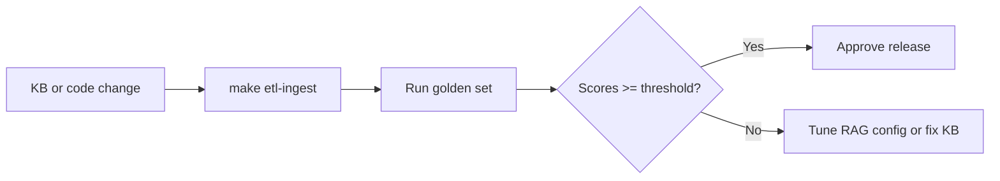

# RAG evaluation methodology

**English** · [Русский](rag_evaluation_ru.md)

How to measure and compare retrieval quality in **avia-bot** before and during pilot deployment. Complements the trace panel and [knowledge_base.md](knowledge_base.md).

---

## Goals

| Goal | Metric |
|------|--------|
| Correct sources retrieved | Lane hit rate, chunk relevance |
| Faithful answers | Manual review vs KB |
| Acceptable latency | End-to-end response time |
| Stable config | Regression after KB or code changes |

---

## Golden question set

Create a spreadsheet or YAML file (recommended location: `backend/tests/data/golden_questions.yaml` — not yet in repo) with:

| Column | Example |
|--------|---------|
| `id` | `faq-baggage-01` |
| `question` | "What is the free baggage allowance for economy?" |
| `expected_lanes` | `faq`, `sop` |
| `expected_chapters` | `03`, `14` |
| `must_contain` | keywords that must appear in answer |
| `must_not_contain` | hallucination red flags |
| `critical` | `true` for safety-related |

**Minimum for pilot:** 50 questions covering SOP, FAQ, decision trees, and out-of-scope refusals.

### Coverage matrix

| Corpus | Min questions | Example topics |
|--------|---------------|----------------|
| SOP (01–12) | 20 | Baggage, documents, delays |
| FAQ (14 + per-chapter) | 15 | Quick factual lookups |
| Decision trees (16) | 10 | Scanner alert, late passenger |
| Scenarios (17) | 5 | Composite situations |
| Out-of-scope | 5 | HR, legal — expect refusal |

---

## Manual evaluation procedure

### 1. Baseline (direct retrieval)

1. Open RAG mode with **all transforms off**, rerank off.
2. Set `top_chunks = 5`.
3. For each golden question, send message.
4. Record in trace panel:
   - Which **lanes** returned hits
   - Top chunk `section` / source label
   - Whether answer cites correct procedure

### 2. Method comparison (A/B)

For each question, repeat with:

| Config | Purpose |
|--------|---------|
| Direct only | Baseline |
| HyDE on | Paraphrase-heavy queries |
| Multi-Query on | Multi-aspect questions |
| Query Rewriting on | Follow-up questions with history |
| + Rerank | Precision on merged candidates |

Use the **same chat** or duplicate settings; compare `metadata.rag_trace` and sidebar message history.

### 3. Scoring rubric (per question)

| Score | Retrieval | Answer |
|-------|-----------|--------|
| **2** | Expected lane in top hits; correct chapter | Fully grounded, actionable |
| **1** | Partial hit (right lane, wrong section) | Mostly correct, minor gaps |
| **0** | Wrong lane or no hit | Wrong, hallucinated, or unsafe |

**Pass threshold (pilot):** ≥ 85% score ≥ 1 on critical questions; ≥ 70% score 2 overall.

---

## Automated checks (future)

| Check | Implementation idea |
|-------|---------------------|
| Lane presence | API test: assert `retrieval.lanes[].hits` contains `content_type` |
| Chapter match | Assert `section` prefix in retrieved chunk metadata |
| Latency budget | `pytest` with timeout on `POST /messages` |
| Embedding regression | Hash manifest `doc_hash` after ingest in CI |

Current suite: `backend/tests/unit/rag/`, `backend/tests/api/test_chat.py` — extend with golden set when file is added.

---

## Decision tree evaluation

Additional criteria for chapter 16 questions:

| Check | Pass |
|-------|------|
| `decision_tree` lane hit | Similarity ≥ 0.30 in trace |
| Operational card shown | `decision_tree_guidance` in metadata |
| Tree excluded from main context | General answer does not mix unrelated SOP |
| Steps are ordered | Manual review of checklist |

---

## Out-of-scope evaluation

Questions that must trigger refusal (ch. 13 topics):

| Expected behavior |
|-------------------|
| Polite decline or redirect to supervisor |
| No fabricated policy |
| `guard_refusal` or clear "not in scope" in answer |

Test with guards **enabled** (default LLM/RAG, no custom prompt).

---

## Regression workflow

Run golden set:

- After every KB merge to main
- After RAG pipeline code changes
- Before pilot Go/No-Go

---

## Reporting template

| Field | Value |
|-------|-------|
| Date | |
| KB `doc_hash` | from `make etl-manifest` |
| RAG config | HyDE / MQ / QR / Rerank / top_chunks |
| Questions run | N |
| Score 2 / 1 / 0 | counts |
| Critical failures | list of ids |
| Avg latency | seconds |
| Recommended config | for pilot |

---

## Related documentation

| Document | Content |
|----------|---------|
| [knowledge_base.md](knowledge_base.md) | KB structure |
| [api.md](api.md) | Trace metadata shape |
| [roadmap.md](roadmap.md) | Pilot quality gates |
