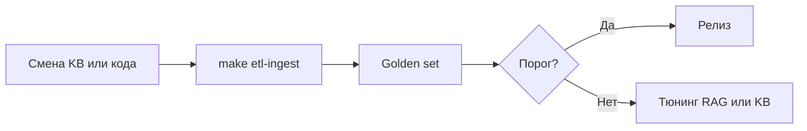

# Методика оценки RAG

**Русский** · [English](rag_evaluation.md)

Измерение и сравнение качества retrieval в **avia-bot** до и во время пилота. Дополняет trace panel и [knowledge_base_ru.md](knowledge_base_ru.md).

---

## Цели

| Цель | Метрика |
|------|---------|
| Верные источники | Hit rate по lane, релевантность чанков |
| Достоверные ответы | Ручная проверка vs KB |
| Приемлемая latency | Время ответа end-to-end |
| Стабильность конфига | Регрессия после смены KB или кода |

---

## Golden set вопросов

Таблица или YAML (рекомендуемое место: `backend/tests/data/golden_questions.yaml` — пока не в репо):

| Колонка | Пример |
|---------|--------|
| `id` | `faq-baggage-01` |
| `question` | «Какая норма бесплатного багажа в экономе?» |
| `expected_lanes` | `faq`, `sop` |
| `expected_chapters` | `03`, `14` |
| `must_contain` | ключевые слова в ответе |
| `must_not_contain` | признаки галлюцинации |
| `critical` | `true` для безопасности |

**Минимум для пилота:** 50 вопросов: SOP, FAQ, decision trees, out-of-scope.

### Матрица покрытия

| Корпус | Мин. вопросов | Темы |
|--------|---------------|------|
| SOP (01–12) | 20 | Багаж, документы, задержки |
| FAQ (14 + по главам) | 15 | Быстрые факты |
| Decision trees (16) | 10 | Сканер, опоздавший |
| Scenarios (17) | 5 | Композитные ситуации |
| Out-of-scope | 5 | HR, юристы — отказ |

---

## Ручная оценка

### 1. Baseline (прямой retrieval)

1. RAG, **все transform выкл**, rerank выкл.
2. `top_chunks = 5`.
3. Для каждого вопроса — отправить сообщение.
4. В trace panel записать:
   - Какие **lanes** дали hits
   - `section` / источник топ-чанка
   - Соответствие ответа процедуре

### 2. Сравнение методов (A/B)

Повторить с конфигами:

| Конфиг | Назначение |
|--------|------------|
| Только direct | Baseline |
| HyDE | Перефразированные запросы |
| Multi-Query | Многоаспектные вопросы |
| Query Rewriting | Уточнения с историей |
| + Rerank | Точность после merge |

Сравнивать `metadata.rag_trace`.

### 3. Шкала (на вопрос)

| Балл | Retrieval | Ответ |
|------|-----------|-------|
| **2** | Ожидаемый lane; верная глава | Полностью по KB, actionable |
| **1** | Частичный hit | В основном верно |
| **0** | Неверный lane / нет hit | Ошибка, галлюцинация, unsafe |

**Порог пилота:** ≥ 85% балл ≥ 1 на critical; ≥ 70% балл 2 в целом.

---

## Автоматизация (будущее)

| Проверка | Идея |
|----------|------|
| Наличие lane | Assert `content_type` в hits |
| Глава | Assert префикс `section` |
| Latency | Timeout в `pytest` |
| Регрессия embed | `doc_hash` в CI после ingest |

Сейчас: `backend/tests/unit/rag/`, `backend/tests/api/test_chat.py`.

---

## Оценка decision trees

Для вопросов по гл. 16:

| Проверка | Pass |
|----------|------|
| Hit в lane `decision_tree` | similarity ≥ 0.30 в trace |
| Карточка процедуры | `decision_tree_guidance` в metadata |
| Дерево не в основном контексте | Общий ответ без смешения SOP |
| Порядок шагов | Ручной review |

---

## Out-of-scope

Вопросы по гл. 13:

| Ожидание |
|----------|
| Вежливый отказ или эскалация |
| Нет выдуманных правил |
| `guard_refusal` или явный «вне scope» |

Guards **включены** (без custom prompt).

---

## Регрессионный процесс

Запускать golden set:

- После каждого merge KB
- После изменений RAG pipeline
- Перед Go/No-Go пилота

---

## Шаблон отчёта

| Поле | Значение |
|------|----------|
| Дата | |
| `doc_hash` KB | `make etl-manifest` |
| RAG config | HyDE / MQ / QR / Rerank / top_chunks |
| Вопросов | N |
| Баллы 2 / 1 / 0 | counts |
| Critical failures | id списком |
| Средняя latency | сек |
| Рекомендуемый config | для пилота |

---

## Связанная документация

| Документ | Содержание |
|----------|------------|
| [knowledge_base_ru.md](knowledge_base_ru.md) | Структура KB |
| [api_ru.md](api_ru.md) | Формат trace |
| [roadmap_ru.md](roadmap_ru.md) | Quality gates пилота |
